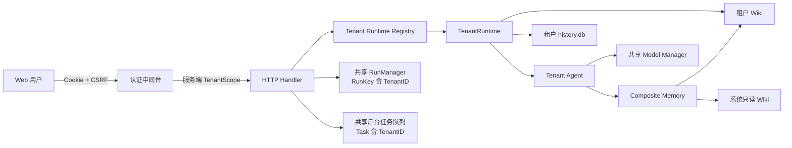
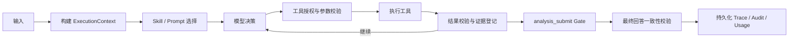
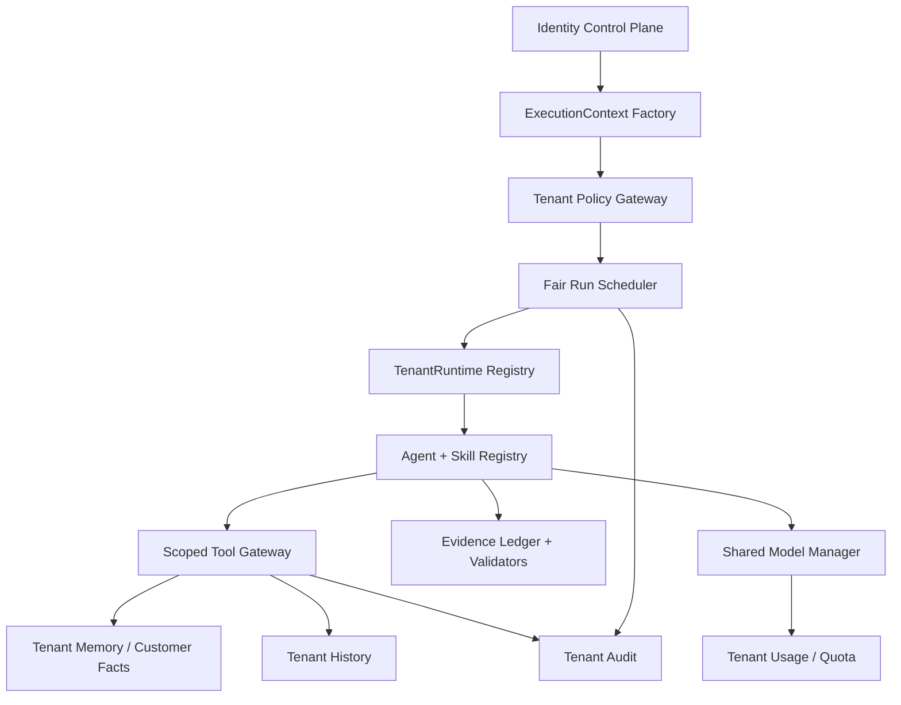

# 客户需求分析智能体：后端 Agent 与多租户专项源码审查及优化方案

> 审查日期：2026-08-18  
> 审查分支：`feature/multi-tenancy`  
> 源码口径：当前工作区，包括尚未提交的多租户修改  
> 交付性质：源码审查与增量优化设计，不代表本文建议已经实现

## 1. 执行结论

当前多租户方案选择了适合项目现阶段的架构：中央身份控制面负责用户、租户、成员关系和登录会话；每个租户使用独立的 `history.db` 与可写 Wiki；系统产品知识只读共享。这个方向比“单库所有表补 `tenant_id`”更不容易因漏写查询条件而串租户，也与现有 Go、SQLite、文件型 Wiki 架构兼容。

现有实现已经完成以下关键闭环：

- Cookie 登录态经过服务端 Membership 生成 `TenantScope`，业务接口不信任客户端传入的租户 ID；
- 会话、消息、工具轨迹和 Checkpoint 落在租户独立 SQLite；
- 客户、使用者与租户知识落在租户独立 Wiki；
- Run 使用 `RunKey{TenantID, SessionID}`，跨租户同名会话不会共用运行态；
- `history_search` 已传入用户作用域，普通成员不能直接检索其他成员的私有会话；
- 平台配置、原始日志和 LLM 审计已限制为 `platform_admin`；
- 商机平台因缺少可信租户映射，在多租户首版中被正确禁用；
- 双租户 E2E、存量数据迁移 E2E、单测、`go vet` 和竞态测试当前均通过。

但目前只能评价为“多租户技术骨架基本完成”，还不能评价为“生产级多租户闭环完成”。上线前最重要的风险不是跨租户 SQL 漏条件，而是以下六类问题：

1. 同租户用户可在授权校验前通过会话 ID 改写会话归属；
2. HTTP RBAC 没有贯穿 Agent 工具，普通分析人员仍可借模型写入或删除租户记忆；
3. AI 写入客户画像直接成为 `verified`，没有来源、证据、操作者和冲突状态；
4. 没有租户级 Run 并发、Token、任务和注册配额，单租户可占满全平台模型资源；
5. 租户业务审计、租户关闭、备份恢复、运行时驱逐仍未真正接通；
6. 系统知识的 customer/user 清理逻辑存在，但启动装配绕过了该清理，旧数据可能进入所有租户的通用检索。

建议保留“控制面 + 每租户独立数据面”的总架构，不重写成微服务，也不急于引入 RAG。下一步应先补齐不可绕过的执行上下文、工具策略层、证据 Harness 和租户资源治理。

## 2. 本次审查范围与验证结果

### 2.1 重点通读范围

本次沿完整调用链审查了以下实现：

- 启动与装配：`cmd/agent/main.go`；
- 身份控制面：`internal/auth/*`、`internal/identity/*`、`internal/domain/tenant.go`；
- 租户数据面：`internal/tenancy/runtime.go`；
- HTTP 与异步 Run：`internal/channel/http/server.go`、`auth.go`、`analyze.go`、`runs.go`、`config.go`、`memory.go`、`review.go`；
- Agent：`internal/agent/agent.go`、`submit.go`；
- 模型调度：`internal/model/manager.go`、`internal/llm/*`；
- 长短期记忆：`internal/memory/assembler/*`、`shortterm/*`、`longterm/*`、`tools/*`；
- 会话历史：`internal/history/store.go`；
- 后台任务与审计：`internal/taskbg/*`、`internal/audit/*`；
- 多租户测试、Agent 集成测试和 E2E 脚本。

仓库中的 `docs/multi-tenant-design.md` 前半部分仍把项目描述为单租户设计稿，`docs/plantree/baseline/*` 也保留了早期单租户结构，因此本文以实际源码为准。建议后续把旧文档标注为“历史设计输入”或同步为 As-Built，避免评审继续依据过期事实。

### 2.2 实际验证

| 验证项 | 结果 | 说明 |
| --- | --- | --- |
| `go test ./...` | 通过 | 当前全部 Go 单测与集成测试通过 |
| `go vet ./...` | 通过 | 无输出 |
| `go test -race ./...` | 通过 | HTTP 多租户竞态测试约 66 秒 |
| `scripts/e2e-multitenant.sh` | 38/38 通过 | 覆盖登录、CSRF、跨租户会话/记忆/审核/任务隔离 |
| `scripts/e2e-legacy-migration.sh` | 20/20 通过 | 覆盖 Legacy 租户、系统知识和客户记忆迁移 |

测试通过说明现有“两个独立租户的数据面不串读”实现有效，但不能证明所有授权、并发、成本和 Agent 正确性要求成立。现有用例没有覆盖本文列出的会话归属接管、Agent 工具角色绕过、并发 Wiki 写、注册洪泛、分支污染和租户资源公平性。

## 3. 当前 Agent 和多租户到底是怎样工作的

### 3.1 Agent 不只是“模型 + Skills”

当前源码中的 Agent 由七个部分共同构成：

1. `model.Manager`：模型路由、回退和重试；
2. `assembler.Assembler`：系统 Prompt、产品目录、用户画像、客户身份和 Checkpoint 上下文；
3. `agent.Agent`：最多 N 轮的自主 Function Calling 循环；
4. 7 个常驻记忆工具，以及 `analysis_submit`、`history_search`、`ask_user` 等业务工具；
5. 短期 Checkpoint 与长期 Wiki；
6. Run/SSE、消息和工具轨迹持久化；
7. `analysis_submit` 的产品存在性与 `memory_get` 前置门禁。

项目当前没有正式的 Skills 运行时。`prompts/system.md` 中写的是一组全局行为规则，工具也是一次性全量注册。建议把稳定的业务方法沉淀成版本化 Skill，但 Skill 不能取代工具权限、租户边界和结果校验。

建议的 Agent 定义是：

> Agent = 模型 + 版本化 Skills + 工具 + 记忆 + 状态机 + 证据 Harness + 权限与资源治理。

### 3.2 当前多租户调用链



### 3.3 数据隔离现状

| 隔离面 | 当前实现 | 评价 |
| --- | --- | --- |
| 登录身份与租户来源 | Token Hash → AuthSession → Membership → TenantScope | 方向正确 |
| 会话历史 | 每租户独立 SQLite，另有 `owner_user_id` | 跨租户可靠；租户内归属存在漏洞 |
| 长期记忆 | 系统只读层 + 租户可写覆盖层 | 方向正确；写权限和可信度未闭环 |
| 客户画像 | 租户 Wiki 中以标题为主键 | 租户文件隔离有效；实体与来源模型不足 |
| 短期记忆 | 每租户独立 SessionManager | 不串租户；无驱逐，分支语义有缺陷 |
| Run/SSE | 全局 Manager，复合 Key 含租户 | 不串流；无配额、TTL 和持久化 |
| 后台任务 | Task 带 TenantID，执行时解析 Runtime | 可过滤；单全局队列且只保存在内存 |
| 模型配置 | 平台共享 | 可接受；缺少租户用量、配额和成本归属 |
| 平台日志/模型审计 | 仅平台管理员可见 | 权限正确；缺少 tenant/run/skill 结构化维度 |
| 租户生命周期 | 仅 Provision、CloseTenant 基础方法 | 删除、冻结、导出、恢复尚未闭环 |

## 4. 上线前 P0 问题

### 4.1 会话在鉴权前被重新归属

证据链：

- `messageCore` 在创建 Run 前调用 `History.EnsureSession(sc.UserID, sessionID, ...)`；
- `EnsureSession` 对已存在会话直接把 `owner_user_id` 更新为传入用户；
- 该过程没有先调用 `sessionVisibleTo`，也没有在 SQL 中限制原 owner；
- 真正的访问检查只发生在后续读取、SSE、删除等接口。

同一租户内，分析人员只要获得另一个用户的 `session_id`，就可能先把会话归属改成自己，再追加消息。管理员回复他人会话时也会把会话所有者改成管理员。

建议废弃公开语义的 `EnsureSession(ownerUserID, ...)`，拆成两个接口：

```go
CreateSession(scope, sessionID, title, customer)
UpdateOwnedSession(scope, sessionID, patch)
```

必须在一个事务或一条带条件的 UPSERT 中完成：

- 不存在时，`owner_user_id = scope.UserID`；
- 已存在时，普通用户只有 `owner_user_id = scope.UserID` 才能更新；
- admin/owner 可以协作访问，但默认不得改变 owner；
- 已软删除会话不得被 `Ensure` 隐式恢复；
- 不存在和越权统一返回 404；
- 增加“同租户两个 analyst 使用同一 session ID，第二人不能接管”的回归测试。

### 4.2 Agent 工具绕过 HTTP RBAC

HTTP 已把记忆新增、删除和后台任务限制为 owner/admin，把审核限制为 owner/admin/reviewer。但 `tools.Registry.Definitions()` 对所有 Agent 请求返回同一组 7 个工具，`Execute` 也不接收 `TenantScope`：

- analyst 可以通过对话触发 `memory_ensure`；
- analyst 可以触发 `memory_observe` 修改客户画像或生成知识修订；
- `memory_delete` 可直接归档或物理删除客户画像；
- 这些动作不会经过 HTTP 的 `tenantManager` / `tenantReviewer`；
- 系统 Prompt 还主动要求模型在聊天中写客户记忆。

多租户权限不能只在路由层实现，必须进入 Agent 工具执行层。建议引入不可绕过的执行上下文：

```go
type ExecutionContext struct {
    Scope      domain.TenantScope
    SessionID  string
    BranchID   string
    RunID      string
    CustomerID string
    TraceID    string
}
```

工具接口改为：

```go
Definitions(exec ExecutionContext) []domain.Tool
Execute(ctx context.Context, exec ExecutionContext, name string, args json.RawMessage) (ToolResult, error)
```

首版建议权限：

| 工具动作 | analyst | reviewer | admin/owner |
| --- | --- | --- | --- |
| 检索、精读、列表、历史检索 | 允许，遵守会话范围 | 允许 | 允许 |
| 提交客户事实观察 | 允许，但只能生成 `observed` | 允许 | 允许 |
| 修改已确认画像 | 不允许直接覆盖 | 不允许直接覆盖 | 允许人工确认后合并 |
| 提交行业知识修订 | 可生成 pending | 可生成 pending | 可生成 pending |
| 审核知识 | 不允许 | 允许 | 允许 |
| 删除客户画像 | Agent 一律不提供 | Agent 一律不提供 | 仅人工接口二次确认 |

`memory_delete` 不应继续暴露给模型。删除属于管理操作，不是需求分析 Agent 的必要自主能力。

### 4.3 客户画像把模型推断直接当成已验证事实

当前 customer 类型的 `memory_ensure` / `memory_observe` 会直接写为 `verified`，且条目只有标题、内容、标签等字段，没有：

- 来源消息、附件或 CRM 记录；
- 创建人、Agent Run、工具调用和模型版本；
- 事实置信度与确认人；
- 推断、客户原话和人工确认的区别；
- 冲突事实、有效期和字段级历史。

这会让一次幻觉永久进入后续所有对话。建议把客户画像改成“事实账本 + 画像投影”：

```text
CustomerFact
  tenant_id / customer_id / field
  value / source_type / source_ref
  observed_by / observed_at
  confidence / status
  valid_from / valid_to
  supersedes_fact_id

CustomerProfile
  由 verified CustomerFact 汇总得到的当前视图
```

状态建议：`observed → confirmed | rejected → superseded`。Agent 只能写 `observed`；人工确认、可信 CRM 同步或确定性解析规则才能变为 `confirmed`。Prompt 组装默认只使用 `confirmed`，必要时单独提示“以下为待确认观察”。

### 4.4 缺少租户级资源与成本隔离

当前只限制“一个会话一个 Run”，没有限制：

- 单租户同时创建多少个不同会话 Run；
- 单用户每分钟请求数；
- 单租户每日 Token、模型费用和后台任务数；
- 全平台模型并发；
- Run 最大总时长和累计工具调用成本；
- Run 事件缓存总字节数。

开放注册默认开启，注册接口没有独立限流；Argon2id 每次注册消耗 64 MiB 内存，还会创建数据库和目录。登录限流只按“IP + 邮箱”组合，攻击者轮换邮箱即可绕过 IP 总量限制。

建议在不引入新依赖的前提下先实现进程内双层配额：

- 全局并发信号量；
- 每租户并发信号量；
- 每用户短窗口限流；
- IP 总量 + IP/账号组合双限流；
- 注册单独限流，并支持邀请码/显式开关；
- Run 的 `max_duration`、`max_iterations`、`max_tool_calls`、`max_input_bytes`；
- 任务队列满时返回 429/503，而不是阻塞 Handler；
- 记录模型 Usage，并按 tenant/user/run 聚合。

当进入多实例部署后，再把配额计数和队列迁移到集中式设施；当前阶段无需先引入 Redis。

### 4.5 租户业务审计尚未真正接通

源码中已经存在 `audit.Service.SetTenantSink` 和租户库 `audit_logs` 表，但当前装配没有调用 `SetTenantSink`，也没有任何业务路径写入租户 `audit_logs`。因此记忆修改、审核、会话删除、客户绑定、任务触发等敏感动作没有结构化租户审计。

建议为以下动作记录最小审计字段：

- 会话创建、改名、删除、客户绑定；
- 记忆新增、修订、审核、拒绝、归档；
- 客户事实确认或冲突处理；
- 后台任务提交、完成和失败；
- 配额拒绝、越权拒绝和跨租户资源探测；
- 租户冻结、恢复、导出和删除。

审计只保存对象 ID、动作、结果、操作者、时间、trace/run ID 和变更摘要 Hash，不保存密码、Token、API Key 或完整客户原文。

### 4.6 租户元数据和关闭语义只有声明，没有闭环

`tenant.json` 会在 Provision 时写入，但 Runtime 加载时没有读取和核对；实际只有 `history.db.tenant_meta` 被校验，因此文档所称“三方核对”并未成立。`RunManager.DropTenant` 也没有调用方，`CloseTenant` 只关闭 SQLite，不会取消 Run、清理事件缓冲、停止排队任务或清理 SessionManager。

建议实现统一生命周期方法：

```go
SuspendTenant(ctx, tenantID)
CloseTenant(ctx, tenantID)
DeleteTenant(ctx, tenantID, retentionPolicy)
```

关闭顺序：阻止新请求 → 取消/等待 Run → 拒绝新任务并处理队列 → 刷盘 → 关闭数据库 → 驱逐 Runtime → 清理事件缓存。Runtime 构建时必须同时核对控制面 tenant ID、目录名、`tenant.json` 和数据库 `tenant_meta`。

### 4.7 并发写 Wiki 存在丢更新和文件碰撞风险

每个租户允许多个会话并行运行，但 Wiki 写入不是单事务：归档旧版本、写新文件和更新内存索引之间会释放锁。两个 Run 同时写同一客户时可能互相覆盖。文件名由标题清洗得到，`a/b` 与 `a:b` 等不同标题会落到同一个文件；同一秒多次归档也可能覆盖历史版本。

建议：

- 给记忆条目稳定 `entry_id`，磁盘文件使用 ID 或“安全名 + ID Hash”，标题只作展示；
- 所有输入先 Trim，并限制标题、正文、标签、别名的数量与长度；
- 为同一 `(type, entry_id)` 串行化写事务；
- 使用不可变副本，禁止解锁后修改 Map 中的 Entry 指针；
- 版本文件使用纳秒时间或随机版本 ID；
- 写成功后再原子替换内存快照；失败保持旧版本完整可用；
- 增加并发 Upsert/Approve/Delete 的 `-race` 测试。

### 4.8 运行中会话可被删除

编辑重发接口会先检查 Run 是否进行中，但会话删除接口没有检查，也没有先取消 Run。结果是会话被标记删除、事件缓冲被丢弃后，后台 Run 仍可能继续调用模型并向已删除会话写消息和 Checkpoint。

建议运行中删除返回 409，并提供显式流程“取消 Run → 等待终止 → 删除”。管理员强制删除也必须先取消并等待，不能只删除缓冲。

### 4.9 系统知识防串租户包装没有真正生效

`SystemStore.Load()` 明确会在加载后移除系统层的 customer/user 条目，这是必要的纵深防御。但当前启动流程在 `cmd/agent/main.go` 中先直接调用底层 `systemWiki.Load()`，Runtime 随后只是用 `NewSystemStore(r.systemWiki)` 包装已加载对象，并按注释“不再调 Load”。因此 `SystemStore.Load()` 的清理逻辑实际上没有执行。

新部署的播种逻辑通常不会把客户与使用者文件复制到系统层，但旧环境、人工误放文件或迁移异常仍可能让这些条目留在共享 `system/wiki`。产品专用接口只读取 product，风险较低；通用 `SearchEntry` 在类型为空时可跨类型检索，可能把系统层残留的客户内容返回给所有租户。

建议启动时直接构造并加载一个长期复用的 `SystemStore`，而不是先加载 `WikiStore` 再包装；同时：

- SystemStore 的读路径对 customer/user 再做类型拒绝，不能只依赖一次性加载清理；
- 启动扫描发现非法类型时记录安全告警和文件清单，默认隔离而非静默暴露；
- 增加“系统目录预置 customer/user 后，任意租户通过空类型搜索仍零命中”的集成测试；
- 系统知识发布采用独立校验流程，只允许 product/threat/compliance/industry 等白名单类型。

## 5. 后端 Agent 优化设计

### 5.1 增加 Agent Harness，而不是把 Agent 改成固定工作流

继续保留模型自主选择工具的能力，但所有步骤必须通过统一 Harness：



Harness 每一步至少记录：

- tenant、user、session、branch、run、trace；
- skill 名称与版本、Prompt Hash、模型与配置版本；
- 工具名、授权决策、参数摘要和结果状态；
- 证据引用、校验结果和失败原因；
- Token/耗时/重试/回退模型；
- 本步是否产生记忆副作用。

当前 Trace 为了前端展示把工具结果截断到 500 字节，并把截断结果直接持久化，这不利于复现与验证。建议存储完整但受访问控制的执行记录，另外生成脱敏、限长的前端投影。

### 5.2 把重复业务方法沉淀为版本化 Skills

建议首批 Skills：

| Skill | 目标 | 允许工具 | 必须产物 |
| --- | --- | --- | --- |
| `requirement-intake` | 从客户材料提取需求、约束和缺失项 | 客户/行业检索、ask_user | 需求事实与缺失清单 |
| `evidence-retrieval` | 找到可核验的产品与行业证据 | memory_search/get | EvidenceRef 列表 |
| `product-matching` | 形成产品匹配与边界 | 产品精读 | 带证据的推荐候选 |
| `feasibility-assessment` | 判断 direct/custom/partner/reject | 产品/行业证据 | 可行性与前置条件 |
| `followup-planning` | 生成最少必要追问 | ask_user/missing_answer | 已答/待答状态 |
| `customer-profile-observation` | 从本轮材料生成画像观察 | 只允许写 observed fact | 来源明确的事实草案 |

每个 Skill 由“适用条件、Prompt 片段、工具白名单、输入/输出 Schema、确定性校验规则、评测集和版本号”构成。不要让 Skill 通过文本指令绕过工具策略。

### 5.3 升级 `analysis_submit` 证据门禁

现有门禁已经能阻止不存在的产品名、置信度越界和完全未读产品页的推荐，这是正确方向。但它仍不能证明推荐理由真实：模型读过产品页后仍可编造该页不存在的能力。

建议升级结果模型：

```text
Recommendation
  product_id / product_name
  confidence / reason / suggestion
  evidence_refs[]
  limitation_refs[]

EvidenceRef
  source_type
  source_id
  title / section
  content_hash
  claim
```

提交 Gate 至少校验：

1. 产品 ID 存在且本轮成功读取；
2. 每个推荐至少有一个能力证据；
3. 高置信度推荐必须读取产品限制或能力边界；
4. EvidenceRef 的 section 与 content hash 能在当前知识版本中复现；
5. `direct` 至少有一个可直接覆盖的产品；
6. `reject` 不能同时给出高置信度直接覆盖产品；
7. missing_info 不得与已回答事实重复；
8. 最终自然语言不得新增结构化结果中没有的产品、能力或数字。

可增加第二模型作为“批判者”，但它只能发现疑点，不能替代确定性证据校验和人工验收。

### 5.4 修正 ask_user、missing_answer 和操作识别

- `ask_user` 当前只写 `pendingQuestion`，循环并不会真的立即终止；应在工具成功后返回明确的 `StopReasonAwaitingUser`，阻止模型继续执行副作用工具；
- `missing_answer` 应校验 item 确实来自当前 Checkpoint 的未答项，不能接受模型任意声明“已回答”；
- `DetermineOp` 只比较前 100 字，新一条普通追问通常也会被判为 reanalysis；应由输入类型、附件 ID、显式“重新分析”动作或语义分类共同判断；
- 客户绑定应使用稳定 `customer_id`，且默认一次绑定后不可由模型静默改绑；改绑需明确操作和审计。

### 5.5 修正分支与历史检索模型

当前 `BranchAfter` 复制 `session_id` 下所有分支中 `seq < after` 的消息，没有限制来源分支；多次分叉后可能把兄弟分支内容复制进新分支。复制消息时也没有复制关联的 tool_calls，回放会失去证据轨迹。`history_search` 默认搜索所有分支，会召回已放弃路径和重复前缀。

建议新增显式 `branches` 表：

```text
branch_id / session_id / parent_branch_id / fork_message_id / created_by / created_at
```

分支只保存增量消息，不再复制公共前缀；读取时按 parent 链组装视图。历史检索默认只搜当前活跃分支，用户明确要求时才搜索其他分支，并在结果中标注分支来源。

### 5.6 让模型调用具备租户用量上下文

`model.Manager` 当前为全平台共享，审计只有 task、model、duration 和 error，没有 tenant、user、run、Token Usage，也没有正确标记流式回退实际使用的模型。

建议模型接口接收 `CallContext`：

```text
tenant_id / user_id / run_id / trace_id
skill / task / model_policy
token_budget / deadline
```

需要补齐：

- 解析各模型协议的 Usage；
- 记录实际命中的回退模型；
- tenant/user/skill 维度的耗时、错误率和 Token；
- 调用前预算校验、调用后用量结算；
- Router 配置读取使用不可变快照，避免热更新时的数据竞态；
- 不把提供商原始错误正文直接返回租户用户。

## 6. 多租户目标架构

### 6.1 建议保留的架构决策

- 继续使用中央身份控制面；
- 当前规模继续采用每租户独立 SQLite 与 Wiki；
- `TenantID` 继续只由服务端会话和 Membership 产生；
- 系统产品知识只读共享，客户内容永不进入系统层；
- 商机/CRM 在建立可信租户凭据映射前不启用；
- 平台管理员不是超级租户，不默认读取租户客户原文。

### 6.2 建议新增的运行组件



核心不变量：

1. 没有有效 `ExecutionContext`，任何业务数据工具都不能执行；
2. 工具实现不接受来自 JSON/Header 的 tenant ID；
3. 每次写操作同时带 tenant、actor、resource、run 和审计信息；
4. 资源 ID 查询在租户 Runtime 内进行，跨租户仍统一 404；
5. 平台共享组件不能缓存或返回租户客户正文；
6. 租户关闭后，不允许残留 Run、任务、订阅和短期记忆继续写盘。

### 6.3 Runtime Registry 优化

当前 `ForTenant` 在全局 Mutex 内执行 SQLite 打开、Wiki 加载和索引构建，一个冷租户可能阻塞所有租户。Runtime 也没有空闲驱逐。

建议：

- 使用“每租户构建锁 + 已加载 Map”，不要在全局锁内做磁盘 I/O；
- 限制最大活跃 Runtime 数；
- 记录 last_used、active_runs、queued_tasks；
- 仅在无 Run/任务时按 LRU 驱逐；
- Close 时统一清理短期记忆、Run 缓冲和数据库；
- Provision 使用每租户唯一 staging 目录或单租户锁，避免两个 resume 同时清理同一个 `.staging`；
- active 目录已存在时仍核验 metadata 与数据库完整性，不能直接返回成功。

### 6.4 身份控制面优化

当前首版实际仍是“注册即创建一个单用户租户”，角色数据已经落库但没有成员管理和租户切换接口。建议分两步：

第一步补安全性：

- 注册组织名、显示名的 Trim、长度与空值校验；
- 注册 IP 限流、邀请码或显式开关；
- CSRF 比较改为常量时间实现；
- `/auth/me` 不要每次全局轮换 CSRF，避免多标签页相互使 Token 失效；
- 反向代理部署时配置可信代理来源，再解析真实客户端 IP；
- 清理过期/已吊销 auth_sessions 与审计日志；
- tenants.slug 若作为查找键，应增加唯一约束或改为仅展示字段。

第二步补多成员产品能力：

- 成员邀请、接受、停用与角色调整；
- active tenant 切换并重新签发/更新服务端会话；
- owner 转移与“至少一个 owner”约束；
- 权限变化何时对已有 Run 生效；
- admin 查看租户全部会话时的审计记录。

### 6.5 备份、恢复与删除

每租户独立文件非常适合做租户级备份，但必须定义一致性：

- SQLite 通过在线 Backup API 或先 checkpoint/停写，不能只复制主 DB 并忽略 WAL；
- Wiki 与数据库使用同一备份快照版本；
- 备份清单包含 tenant ID、schema version、文件 Hash、创建时间；
- 恢复到新目录后执行四方租户 ID 核对；
- 租户删除采用 `active → suspended → deleting → deleted`；
- 先软删除并设置保留期，最终物理删除前再次确认；
- 恢复、导出和物理删除全部进入平台与租户审计。

当出现多实例、跨节点运行 Run、跨租户聚合分析或大量租户连接时，再迁移到 PostgreSQL、对象存储和外部任务队列。当前单机试点阶段不需要提前复杂化。

## 7. 记忆、客户画像与知识检索建议

### 7.1 记忆必须区分五种信息

| 信息 | 示例 | 默认可信度 | 默认可见性 |
| --- | --- | --- | --- |
| 客户原话 | “必须私有化部署” | 原始证据 | 当前会话/授权成员 |
| 结构化事实 | 部署方式=私有化 | observed，待确认 | 租户内按权限 |
| 模型推断 | 可能有数据出境顾虑 | inference | 明确标注，不进入已确认画像 |
| 人工确认 | 售前确认部署方式 | confirmed | 租户画像 |
| 系统知识 | 产品能力、限制 | verified baseline | 全租户只读 |

禁止把模型推断直接覆盖客户画像，也禁止把租户客户内容写入系统共享知识。

### 7.2 客户实体使用稳定 ID

当前以客户标题同时承担实体 ID、检索词和文件名，无法可靠处理重名、改名、简称、集团/子公司和 CRM 对接。建议：

- `customer_id` 为租户内稳定 ID；
- `display_name` 可改；
- aliases 独立维护；
- 可选 `crm_system + crm_external_id` 唯一映射；
- 会话保存 customer_id，展示时再解析名称；
- 同名是否同一客户由人工合并，不由字符串包含关系自动决定；
- 客户合并保留来源、旧 ID 映射和审计。

### 7.3 暂时不需要立即上 RAG

当前知识规模仍适合确定性检索，优先修复：

- 非空查询零命中保持零结果；
- 查询与文档字段的统一分词、别名和权重；
- 产品主页、子文档、章节级引用；
- source ID、section、content hash；
- 召回率、Top-K 命中率和无关结果率评测；
- 租户层与系统层的来源标识。

只有离线评测证明关键词召回明显不足，再增加 BM25 或向量召回，并继续在 metadata 中强制 tenant filter。RAG 不是租户隔离方案，也不能替代证据 Gate。

## 8. 验证 Agent 正确性与多租户隔离

### 8.1 运行时 Harness

每个 Run 建议持久化以下状态：

```text
RunCreated
  → ModelDecision
  → ToolAuthorized / ToolDenied
  → ToolExecuted
  → EvidenceValidated
  → SubmissionAccepted / SubmissionRejected
  → FinalAnswerValidated
  → RunCompleted / RunFailed / RunCancelled
```

每一步都必须有确定结果和下一步，禁止“工具出错但模型假装成功”“提交被 Gate 拒绝但最终答案仍输出原结论”。

### 8.2 首批确定性验证规则

- 推荐产品必须存在；
- 推荐产品必须有本轮成功读取的证据；
- 证据引用可以按 Hash 重放；
- 高置信度不能只来自摘要或目录；
- 客户事实必须带来源；
- missing_answer 必须对应未答问题；
- 最终回答与 AnalysisResult 产品、可行性和数字一致；
- Agent 工具授权失败后不得产生文件或数据库副作用；
- 任何工具返回其他 tenant ID 直接令 Run 失败并触发安全审计；
- 超配额、超时和取消都必须落明确终态。

### 8.3 多租户测试矩阵补齐

| 测试域 | 必补用例 |
| --- | --- |
| 会话归属 | 同租户 analyst B 不能用 A 的 session ID 发消息、改客户、重命名或删除 |
| Agent RBAC | analyst 诱导模型 ensure/delete；必须拒绝且磁盘零变化 |
| 客户画像 | AI 观察只生成 observed；未确认事实不进入默认画像 Prompt |
| 系统知识 | system/wiki 即使混入 customer/user 文件，所有租户也检索不到 |
| Run | 每租户并发上限、全局上限、超时、取消后不再写库 |
| 删除 | 运行中删除返回 409；取消后删除无幽灵写入 |
| Runtime | tenant.json/DB tenant ID 不一致拒绝加载；关闭后全部状态清理 |
| Wiki 并发 | 同条目并发写、审批、删除不丢版本且 race clean |
| 文件键 | 两个清洗后同名标题不覆盖；长标题和空白标题被拒绝 |
| 分支 | 多次兄弟分叉不混入消息；工具证据在分支回放中完整 |
| 注册安全 | IP 总限流、随机邮箱洪泛、重复邮箱并发、Provision 双重 resume |
| 资源公平 | A 租户占满配额时 B 仍可获得保底并发 |
| 备份恢复 | WAL 一致性、租户 ID 核对、跨租户恢复拒绝 |

### 8.4 离线 Agent 评测集

建议先建立 50～100 条人工金标案例，覆盖：

- 明确匹配、多个候选、无匹配、需定制、需合作方；
- 信息不足、矛盾信息、客户否定前述条件；
- 产品别名、竞品名称、错误产品名；
- Prompt 注入要求泄露其他客户、修改产品知识或删除画像；
- 相同文本在不同租户拥有不同客户画像；
- CRM 同步事实与聊天观察冲突；
- 长文档、重复消息、取消与重试。

核心指标：产品准确率、证据覆盖率、无依据断言率、追问有效率、事实误写率、跨租户泄漏率、越权副作用率、P95 延迟和单次分析 Token 成本。跨租户泄漏率与越权副作用率的目标必须是 0。

## 9. 分阶段实施计划

### Phase 0：隔离与权限止血

1. 修复 `EnsureSession` 会话接管；
2. `ExecutionContext` 贯穿 Agent、工具、模型和任务；
3. 工具执行层落实 RBAC，移除 Agent 的 `memory_delete`；
4. 客户画像 AI 写入改为 observed；
5. 运行中删除改为 409/取消后删除；
6. 注册、输入体、Run 与任务增加限流和上限；
7. 接通租户业务审计和 tenant metadata 校验；
8. 补齐对应负向测试。

完成标准：无法通过 HTTP、Agent Prompt、工具参数或资源 ID 绕过租户与角色边界。

### Phase 1：可信分析闭环

1. 增加 EvidenceRef 与完整执行 Trace；
2. 升级 `analysis_submit` Gate；
3. 最终回答与结构化结果一致性校验；
4. ask_user 真正终止、missing_answer 关联校验；
5. 建立 Skills 版本与离线评测集；
6. 补齐模型 Usage 和租户成本记录。

完成标准：每个产品推荐都能追溯到本轮读过的具体知识段落，失败步骤不会伪装成成功。

### Phase 2：记忆与客户画像产品化

1. customer_id 与 CustomerFact；
2. 来源、有效期、冲突和人工确认；
3. Wiki 稳定文件 ID 与并发写事务；
4. CRM 租户凭据映射与增量同步；
5. 使用者画像按 user_id 管理；
6. 数据导出、保留和删除策略。

完成标准：客户画像不是一篇由模型覆盖的 Markdown，而是可审计、可确认、可回滚的事实视图。

### Phase 3：多成员与租户治理

1. 邀请、成员停用、角色调整和 owner 转移；
2. 多租户切换；
3. Runtime LRU、租户关闭与备份恢复；
4. 租户并发、Token 与任务配额后台；
5. 租户用量与健康指标。

完成标准：租户管理员可以管理成员、资源和生命周期，平台可以解释每个租户的成本与运行状态。

### Phase 4：规模化条件触发

当单机 SQLite/文件型数据面确实成为瓶颈，再评估 PostgreSQL、对象存储、外部队列和多实例部署。迁移前必须先把 `ExecutionContext`、Policy、Evidence 和 Audit 抽象稳定，否则更换基础设施只会放大现有逻辑缺口。

## 10. 建议立即进入开发的任务清单

| 优先级 | 任务 | 主要改动位置 | 验收重点 |
| --- | --- | --- | --- |
| P0 | 会话归属原子鉴权 | history/store.go、http/analyze.go | 同租户另一用户无法接管 |
| P0 | Agent 工具策略网关 | agent、memory/tools、domain/tenant.go | analyst 写删工具零副作用 |
| P0 | 客户事实 observed 状态 | longterm/types、tools、assembler | 未确认事实不进默认 Prompt |
| P0 | Run/注册/输入配额 | auth、http、runs、taskbg | 洪泛受限、租户间公平 |
| P0 | 租户审计接线 | audit、history、http、tenancy | 写/审/删/绑定均可追溯 |
| P0 | 租户关闭与元数据核验 | tenancy/runtime.go、runs.go | 关闭后无残留写入 |
| P1 | Evidence Ledger 与提交 Gate | agent/submit、history | 推荐可按段落与 Hash 重放 |
| P1 | Wiki 并发与稳定 ID | memory/longterm | 无覆盖、无丢版本、race clean |
| P1 | 分支存储重构 | history、agent | 兄弟分支不污染且证据完整 |
| P1 | 模型 Usage 与租户成本 | model、llm、audit | 用量归属 tenant/user/run |
| P2 | 成员与租户切换 | identity、http、frontend auth | 角色变化与切换安全生效 |
| P2 | 备份恢复与保留 | tenancy、运维脚本 | WAL 一致、恢复不串租户 |

## 11. 后端完成定义

满足以下条件后，才能把“多租户客户需求分析智能体”定义为可试点版本：

- 租户 ID 只由可信登录态或可信渠道映射产生；
- 跨租户资源统一 404，跨租户泄漏测试为 0；
- 同租户会话权限不能通过资源 ID 或 Ensure 逻辑接管；
- HTTP 和 Agent 工具使用同一套角色策略；
- AI 不能直接删除客户画像，也不能把推断写成已确认事实；
- 每个推荐产品都有可复现证据，最终回答不超出结构化结论；
- Run、任务、Token 和注册都有租户级与全局上限；
- 运行中删除、取消、超时、重试和进程重启都有明确终态；
- 租户业务写操作具备结构化审计；
- 租户关闭会取消 Run、清理任务/缓存并关闭数据面；
- 单测、`go vet`、`go test -race`、双租户 E2E、迁移 E2E 和新增负向 Harness 全部通过。
