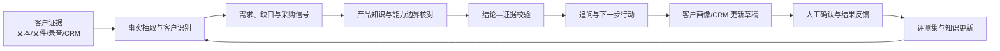
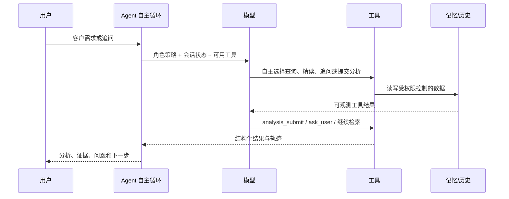
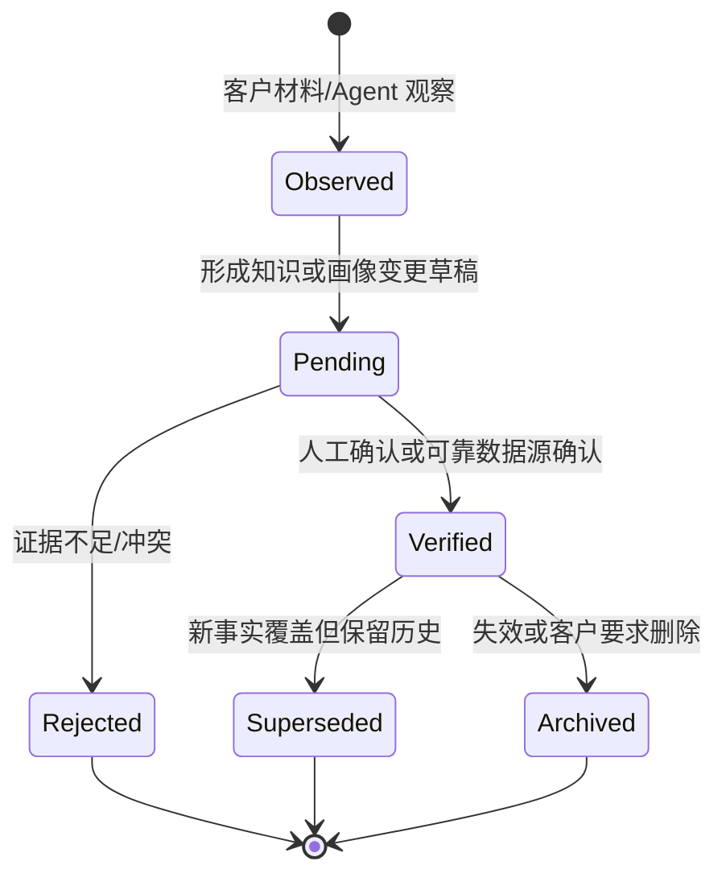
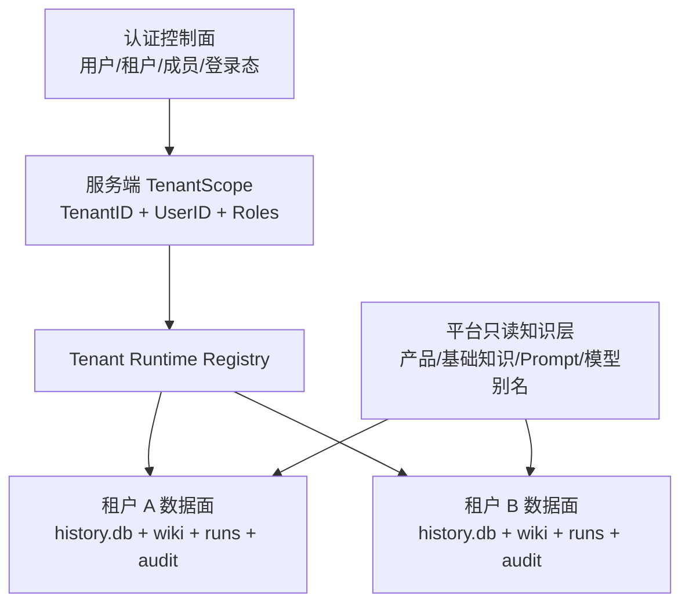
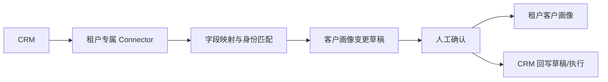
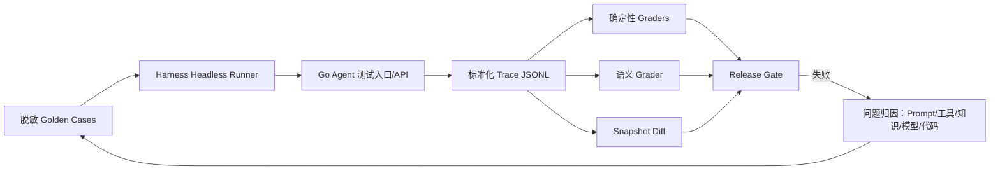

# 客户需求分析智能体专家意见优化方案

> 文档定位：针对专家评审意见的产品、技术、验证与 Demo 一体化改进方案  
> 适用项目：`customer-demand-agent`  
> 更新日期：2026-08-18  
> 状态：方案稿，按阶段出口验收后推进

## 1. 执行结论

专家认可当前完成度和记忆管理，但项目现在面临的主要问题不是“少几个功能”，而是以下三件事还没有讲清、做实：

1. **Agent 的自主闭环没有被明确表达**。当前项目已经具备“模型自主选择工具—读取记忆—提交结构化分析—追问—持续记忆”的 Agent 形态，但对外容易被理解为“模型加了几个工具”。
2. **结论可信度还依赖人工兜底**。现有工具轨迹提供了可观测性，但“调过工具”不等于“结论有证据”，还缺少逐条结论与客户原文、产品知识之间的可验证关系。
3. **Demo 从功能出发，没有从业务价值出发**。演示了会话、记忆和工具，却没有突出“它替销售/售前减少了什么工作、避免了什么错误、沉淀了什么组织资产”。

因此，下一步不建议立即横向堆叠多模态、QA、CRM、RAG。正确顺序是：

> **先完成“有证据的需求分析”可信闭环和价值 Demo，再验收多租户安全底座，然后接多模态与 CRM，最后根据检索指标决定是否引入 RAG。**

产品定位统一为：

> **把会议纪要、聊天、录音、文件和 CRM 中零散的客户信息，转化为有原文证据、有产品依据、有边界说明、能主动追问、可持续沉淀并可回写 CRM 的售前需求判断。**

它不是一个“生成分析报告的聊天机器人”，而是一套“客户需求证据到销售行动”的智能闭环。

## 2. 专家意见逐项回应

| 专家问题 | 当前事实 | 暴露的问题 | 优化动作 |
| --- | --- | --- | --- |
| Agent 体现在哪里，是模型 + Skills 吗 | 当前已有模型、自主循环、系统策略、工具、短期/长期记忆、结构化分析提交 | 对外缺少统一能力模型；当前没有正式的可插拔 Skills 层 | 用六层 Agent 模型解释现状；第二阶段把领域流程封装为版本化 Skill 包 |
| 记忆库文件来自哪里 | 仓库 `wiki/` 是种子库，首次运行复制到数据目录；当前共 377 个文件，约 4.1 MB | 页面缺少来源、版本、有效期和引用关系，容易让人质疑“文章从哪来” | 为每条知识增加来源元数据和证据引用；区分官方知识、人工知识、客户事实和 Agent 观察 |
| 7 个工具怎么分 | 7 个是长期记忆工具，不是 Agent 全部工具 | 记忆工具、业务工具、交互工具、外部工具混在一起讲；`memory_recall` 名称易造成已接 RAG 的误解 | 按“发现、精读、学习、治理”分组，单独展示其他业务工具；修正文案 |
| 下一步做什么 | 已有文本对话、记忆、追问、客户绑定、商机工具基础 | 功能路线没有依赖顺序 | 先可信闭环，再多租户，再多模态、CRM/画像、QA，RAG 按指标触发 |
| 多租户如何做 | 主干基线是单租户；当前工作区已有多租户改造代码和详细设计稿，尚应通过独立验收门禁 | 不能把“正在改”当作“已安全完成” | 采用认证控制面 + 每租户独立数据面 + 系统只读知识层；做跨租户攻击测试 |
| 目前未接 RAG，知识库不大 | 属实；确定性关键词检索适合当前规模 | `memory_recall` 的描述会让人误以为已有语义召回 | 当前明确定位为确定性检索；先做检索评测和引用，达到触发条件再上混合检索 |
| 如何验证正确、降低幻觉 | 当前主要靠人工和工具轨迹 | Agent 不能只靠“再想一遍”证明自己正确 | 建立结论—证据矩阵、规则校验、独立验证器、人工门禁和 Harness 回归闭环 |
| 价值表达不清、Demo 未体现价值 | 当前展示偏功能和执行轨迹 | 用户看到了“怎么做”，没有看到“为什么值得用” | 重写价值主线与演示脚本，用真实工作前后对比和可量化指标收口 |

## 3. 价值重塑

### 3.1 目标用户与关键任务

首要用户是销售、售前、安全顾问和销售管理者。其关键任务不是“跟 AI 聊天”，而是：

- 快速从客户原话中识别真实问题、已有条件、采购信号和信息缺口。
- 判断公司现有产品是否覆盖，明确直接满足、需组合、需定制或暂不匹配。
- 给出下一轮应该问什么、带什么材料、找谁协同、是否值得继续推进。
- 在不同销售、不同会话之间保留客户上下文，避免重复询问和经验丢失。
- 让管理者能追溯推荐依据，而不是只看到一段“像是正确”的生成文本。

### 3.2 三个核心价值点

| 价值 | 用户可感知结果 | 产品应展示的证据 |
| --- | --- | --- |
| 提效 | 把原始沟通材料快速转成结构化需求和下一步行动 | 从输入到首版分析的耗时、减少的人工整理步骤 |
| 降错 | 产品推荐必须能回到客户原文和官方产品能力/边界 | 每条结论的来源、冲突提示、无依据时的主动降级 |
| 沉淀 | 单次沟通形成客户画像和组织可复用知识 | 跨会话画像更新、变更记录、人工审核和 CRM 草稿 |

一句话表达可使用：

> **不是替销售写一份总结，而是帮销售形成一份可追溯、可追问、可持续更新的客户需求档案。**

### 3.3 价值闭环



### 3.4 应建立的业务指标

现阶段不要虚构“节省 80% 时间”等数据，应先埋点取得基线。建议按以下指标验证价值：

- **首次有效分析时间**：从材料提交到形成可用需求卡的时间。
- **事实证据覆盖率**：分析中的事实性结论有可定位来源的比例。
- **产品主张支持率**：产品能力和边界结论被已验证知识支持的比例。
- **关键信息补全率**：Agent 提出的高价值追问中，得到回答并进入后续分析的比例。
- **人工修正率**：售前对需求、产品匹配、可行性和画像字段的修改比例。
- **下一步采纳率**：用户复制、确认或写回 CRM 的建议动作比例。
- **跨会话复用率**：新会话中成功使用既有客户画像且未发生重复询问的比例。

## 4. Agent 到底体现在哪里

### 4.1 Agent 不等于“模型 + Skills”

更准确的定义是：

> **Agent = 模型推理 + 行为策略 + 自主循环 + 工具行动 + 记忆状态 + 校验治理。**

模型负责判断和选择，工具负责与真实世界交互，记忆提供连续状态，校验层限制和验证结果。Skills 是把某类目标所需的提示、工具、输出契约和评测用例组合成可复用能力包，不是 Agent 的全部。

### 4.2 当前六层能力图

| 层 | 当前实现 | 当前完成度判断 | 下一步优化 |
| --- | --- | --- | --- |
| 模型层 | 模型管理器、模型路由、流式调用 | 已具备 | 增加生成模型与验证模型的可分离配置 |
| 策略层 | System Prompt、角色和工具使用规则 | 已具备 | 规则拆分、版本化，并记录每轮使用版本 |
| 自主循环层 | 最多 15 轮，模型自主决定何时查记忆、调用工具或结束 | 已具备，是 Agent 的核心体现 | 增加步骤状态、超时、失败原因和可观测门禁 |
| 工具层 | 7 个记忆工具，以及分析、追问、历史、客户绑定、商机等工具 | 已具备 | 分层注册、权限白名单、输入输出 Schema 校验 |
| 记忆层 | Checkpoint、历史消息、文件型长期记忆、客户/使用者画像 | 当前亮点 | 补来源、版本、租户、冲突和有效期治理 |
| 校验层 | 结构化参数校验、人工审核、工具轨迹 | 部分具备 | 增加证据校验、独立验证器、评测集和 Harness 回归 |

当前 Agent 的真实运行闭环是：



### 4.3 建议增加正式的 Skills 层

当前项目没有独立的可插拔 Skills 运行时。领域能力主要散落在 Prompt、工具和代码里。建议逐步封装以下能力包：

| Skill | 职责 | 允许使用的主要工具 | 标准输出 |
| --- | --- | --- | --- |
| 客户材料接入 | 解析文本、文件、录音并生成统一证据 | 文件解析、ASR、客户绑定 | `EvidenceDocument` |
| 需求分析 | 提取事实、需求、约束和采购信号 | 记忆检索、历史检索 | `DemandAnalysisV2` |
| 产品匹配 | 用产品能力和边界验证推荐 | `memory_search/get` | 产品候选、依据、边界 |
| 主动追问 | 识别高价值缺口并形成最少问题集 | `ask_user`、`missing_answer` | 问题、原因、答案状态 |
| 客户画像 | 合并已确认事实，处理冲突和时效 | 客户记忆、CRM 读取 | 画像变更草稿 |
| QA | 回答产品、客户和分析结果相关问题 | 知识检索、历史检索 | 答案、引用、不确定性 |
| 可信校验 | 检查结论是否被证据支持 | 只读证据与规则工具 | 支持/冲突/证据不足 |

每个 Skill 必须包含：版本号、输入 Schema、输出 Schema、工具白名单、失败/降级策略和对应评测集。这样专家问“Agent 能力在哪里”时，可以清楚区分：

- 模型是推理引擎；
- Skill 是可复用的业务能力；
- Tool 是 Skill 执行动作的接口；
- Memory 是跨轮次和跨会话状态；
- Harness/Eval 是能力是否可靠的验收平面。

## 5. 记忆库文件来源与治理

### 5.1 当前来源事实

- 仓库内 `wiki/` 是提交版种子知识库，首次启动复制到运行数据根下的 `wiki/`。
- 运行目录优先级为 `CDA_DATA_DIR` 环境变量、`config.json` 的 `data_dir`、XDG 默认目录。
- 2026-08-18 盘点为 **377 个文件，约 4.1 MB**：363 个产品记忆、12 个行业记忆、2 个用户记忆。
- 产品文档主要由官方产品资料导入并维护；威胁、合规、行业内容包含人工种子知识和后续观察。
- 客户画像可由对话事实、Agent 观察、人工维护产生，后续还会接入 CRM。
- 使用者画像当前由管理员维护，Agent 只读。

需要特别处理：种子库中的演示客户和演示使用者不能进入未来的系统共享知识层，应迁移到专用 Demo 租户。

### 5.2 来源分类

| 分类 | 示例 | 权威性 | 写入规则 |
| --- | --- | --- | --- |
| 平台官方知识 | 产品能力、限制、部署文档 | 高 | 平台管理员发布，Agent 只读 |
| 人工审核知识 | 威胁、合规、行业经验 | 中到高 | 专家或管理员维护；Agent 新增内容先待审核 |
| 客户一方证据 | 会议原话、文件、录音、邮件、CRM 字段 | 事实来源，但可能过期或冲突 | 只能写入对应租户和客户；保留原始定位 |
| Agent 观察 | 推断的痛点、模式、可能需求 | 非事实 | 明确标记为观察，不得覆盖已确认事实 |
| 使用者偏好 | 销售关注点、表达偏好 | 个体数据 | 租户内按用户隔离，管理员或本人维护 |

### 5.3 必补的来源元数据

每条知识或证据至少增加：

```yaml
source_type: official_doc | manual | conversation | upload | audio | crm | agent_observation
source_id: 稳定的来源 ID
source_uri: 可选的内部定位
source_version: 来源版本或内容哈希
tenant_id: 平台知识为空，租户数据必填
customer_id: 客户相关数据必填
created_by: user_id 或 agent
ingested_at: 接入时间
observed_at: 客户事实发生时间
verified_by: 审核人
verified_at: 审核时间
valid_from: 生效时间
valid_to: 失效时间
confidence: 仅用于排序，不能替代证据
```

文件和录音还要支持页码、段落、时间码、说话人等 `source_locator`，保证用户能从结论回到原文。

### 5.4 记忆生命周期



客户画像尤其不能“最后写入覆盖一切”。当 CRM、会议原话和历史画像冲突时，应展示冲突来源，由用户确认后再更新主画像。

## 6. 7 个记忆工具怎么分

这 7 个工具只属于“长期记忆域”，可按四组解释：

| 分组 | 工具 | 作用 | 使用要求 |
| --- | --- | --- | --- |
| 发现 | `memory_search` | 确定性关键词搜索，返回摘要和候选 | 默认首选 |
| 发现 | `memory_list` | 按类型分页浏览完整目录 | 不知道搜什么、需要枚举时使用 |
| 精读 | `memory_get` | 按类型和标题读取完整内容、章节或分页正文 | 正式推荐产品或引用细节前必须调用 |
| 召回兜底 | `memory_recall` | 当前实现是更宽松的关键词/别名/摘要匹配 | 当前不是向量语义检索，不应对外称已接 RAG |
| 学习 | `memory_ensure` | 创建或更新完整记忆页 | 产品和使用者不可由 Agent 写；部分类型进入待审核 |
| 学习 | `memory_observe` | 追加轻量观察，不直接重写完整知识 | 推断必须标记为观察 |
| 治理 | `memory_delete` | 归档或删除客户记忆 | Agent 仅能处理客户类型，默认软删除 |

权限口径：

| 记忆类型 | Agent 读 | Agent 写 | Agent 删 | 治理方式 |
| --- | --- | --- | --- | --- |
| 产品 | 是 | 否 | 否 | 平台人工维护 |
| 威胁/合规/行业 | 是 | 是 | 否 | Agent 写入后待审核 |
| 客户 | 是 | 是 | 是 | 租户内权限和审计；默认归档 |
| 使用者 | 是 | 否 | 否 | 管理员或本人维护 |

Agent 还有其他工具，不应混入“7 个记忆工具”统计：

- **业务提交**：`analysis_submit`；
- **追问闭环**：`ask_user`、`missing_answer`；
- **上下文**：`history_search`、`session_bind_customer`；
- **外部业务**：可选的商机检索、详情和统计工具。

建议在产品设置页新增“能力地图”，按记忆工具、业务工具、交互工具、外部连接器展示，避免专家和客户把工具数量误认为 Agent 能力数量。

## 7. 暂不接 RAG 是否合理

结论：**合理，但必须把“未接 RAG”和“没有检索能力”区分开。**

当前知识库规模约 4.1 MB，产品条目高度结构化，确定性关键词、别名、标题和章节精读具备以下优势：结果可复现、维护成本低、引用路径清楚，适合当前阶段。现阶段更重要的是先验证“能否找到正确文档”和“结论是否引用正确”，而不是先加入向量数据库。

### 7.1 当前应先做

- 建立 50～100 条真实检索问题及期望文档的检索评测集。
- 分别统计 Top-1、Top-3 命中率、零结果率、错误产品召回率。
- 修正 `memory_recall` 的产品文案，明确其当前是关键词兜底。
- 为 `memory_get` 输出增加稳定知识 ID、版本和章节定位。
- 产品推荐必须先精读候选产品的能力边界，不能只依据搜索摘要。

### 7.2 引入 RAG 的触发条件

满足以下任一条件，再引入混合检索，而不是仅按文件数量决定：

- 真实评测中关键词检索 Top-3 命中率持续不能达到业务要求。
- 用户大量使用自然语言、同义词和跨文档综合问题。
- 文档扩展到大量长文、附件、录音转写和 CRM 活动，人工别名维护成本明显上升。
- QA 需要跨多个知识条目进行回答，当前章节精读无法控制上下文。
- 零结果率、误召回率或用户重新搜索率持续偏高。

目标形态应是“关键词/BM25 + 向量候选 + 重排 + 强制引用”的混合检索。RAG 负责找候选，不负责证明结论为真；产品能力边界仍要由权威知识记录和规则验证。

## 8. 多租户目标架构

详细方案见 [多租户设计文档](./multi-tenant-design.md)。本优化方案只保留决策摘要和验收门禁。

### 8.1 三层架构



- **认证控制面**：中央 `identity.db` 保存账号、租户、成员关系和登录会话。
- **租户独立数据面**：每个租户独立的历史数据库、可写 Wiki、客户画像、短期记忆、Run/SSE、任务、审核和审计。
- **系统只读层**：产品和平台基础知识可共享，但任何客户、使用者或租户观察数据不得进入此层。

### 8.2 安全原则

- 注册创建“租户 + Owner 用户”，登录态使用 HttpOnly Cookie，业务接口不信任客户端传入的 `tenant_id`。
- 请求先由服务端生成不可伪造的 `TenantScope`，所有 Handler、Agent、工具和后台任务只接收该 Scope。
- 资源 ID 属于其他租户时返回 `404`，避免泄露资源存在性。
- 会话、消息、Checkpoint、客户画像、记忆、审核、任务、SSE 缓冲、日志导出和浏览器缓存都必须作用域化。
- CRM 或商机系统在没有可信的“连接器实例—租户”映射前，不得对普通租户开放。
- 当前工作区存在多租户改造代码，但必须以测试结果而非文件存在来宣告完成。

### 8.3 多租户验收门禁

- 两个租户创建同名客户、同名会话和同名记忆，读写删互不影响。
- 使用租户 A 的 Cookie 访问租户 B 的所有资源 ID，均为 `404` 或拒绝，且无时序/标题泄露。
- `history_search`、7 个记忆工具、客户绑定、Checkpoint 恢复和后台任务只返回当前租户数据。
- Run 取消、SSE 重连和事件回放不能通过同名 `session_id` 越权。
- 浏览器退出并登录另一租户后，草稿、最近客户和 UI 状态不串租户。
- 日志、模型审计、错误返回、导出和备份不包含其他租户内容。
- 在开启 Go race 检测和并发请求时，Tenant Runtime 不串用、不重复初始化。

## 9. 多模态、QA、CRM 与客户画像

### 9.1 统一证据模型是共同地基

文件、录音、CRM 和 QA 不应分别建立四套上下文。先定义统一的 `EvidenceDocument`：

```json
{
  "document_id": "doc_uuid",
  "tenant_id": "tenant_uuid",
  "customer_id": "customer_uuid",
  "session_id": "session_uuid",
  "source_type": "text|file|audio|crm",
  "source_name": "会议录音.m4a",
  "content_hash": "sha256:...",
  "segments": [
    {
      "segment_id": "seg_001",
      "text": "客户原话",
      "page": null,
      "start_ms": 10500,
      "end_ms": 18200,
      "speaker": "客户技术负责人"
    }
  ]
}
```

所有事实、需求、推荐和画像字段都只引用 `document_id + segment_id`，从源头解决“这句话从哪来”。

### 9.2 多模态接入顺序

1. **文件上传**：先支持 PDF、DOCX、TXT、Markdown，完成文件类型/大小校验、内容哈希、解析失败提示、页码引用和租户目录隔离。
2. **录音上传**：支持常见音频格式，经 ASR 转写为带时间码的证据片段；说话人区分可后置，但原音频与转写必须同租户保存。
3. **表格和图片**：在真实需求明确后扩展 XLSX、PPTX 和 OCR，不把“支持上传”误认为“内容已被正确理解”。

多模态完成的标准不是文件能传上去，而是分析卡中的每个事实能跳转到对应页码或音频时间码。

### 9.3 QA 的产品定义

本文暂把“接 QA”理解为面向销售/售前的知识问答；如果专家指软件质量保证系统，应单独调整范围。

QA 不另建一套机器人，复用同一证据和权限层，支持：

- 对当前材料提问；
- 对客户历史和画像提问；
- 对产品能力、边界、部署和竞品信息提问；
- 对已有分析追问“为什么推荐、证据在哪、还缺什么”。

QA 输出也必须包含引用、知识版本、不确定项和无法回答时的降级提示。

### 9.4 CRM 与客户画像

CRM 采用连接器架构，首阶段只读：



- 连接器凭据必须属于租户，并加密存储、最小权限、可撤销。
- 先接客户、联系人、商机、活动记录的读取，再做写回。
- CRM 客户与本地客户用稳定 ID 映射，禁止仅按客户名称自动合并。
- Agent 生成的是“画像变更草稿”，展示新增、修改、冲突和来源；用户确认后再入库。
- 回写必须有幂等键、字段白名单、操作审计和人工确认，高风险字段不自动修改。

客户画像建议分为：基础信息、组织/角色关系、业务现状、技术环境、痛点与需求、已有能力、预算/时间/采购流程、产品匹配、沟通时间线、未确认观察。每个字段保留来源和时效。

## 10. 正确性、幻觉与 Harness 闭环

### 10.1 Agent 能不能自己校验

可以辅助校验，但不能只靠自己证明自己正确。让同一个模型“再检查一遍”会出现相关性错误：生成时误解的内容，复核时可能继续误解。

可信结果需要五层共同作用：

1. **结构校验**：字段、枚举、必填项和状态流是否合法。
2. **证据校验**：事实结论必须引用存在且属于当前租户的原文片段。
3. **知识校验**：产品能力、限制和合规主张必须引用已验证、未过期的知识版本。
4. **独立验证**：由独立验证 Prompt/模型只看输入证据和候选结论，判断支持、冲突或证据不足。
5. **人工门禁**：高风险、低置信度、证据冲突和 CRM 写回由用户确认。

### 10.2 输出从“答案”升级为“结论—证据矩阵”

建议在现有 `AnalysisResult` 上增加兼容的 V2 字段：

```json
{
  "claims": [
    {
      "claim_id": "claim_01",
      "type": "customer_fact|demand|product_capability|recommendation",
      "text": "客户核心诉求",
      "evidence_refs": ["doc_01#seg_03"],
      "knowledge_refs": ["product:leichi@v12#capability-cc"],
      "verification": "supported|conflict|insufficient",
      "confidence": 0.91
    }
  ],
  "missing_information": [],
  "limitations": [],
  "next_actions": [],
  "overall_verification": "pass|needs_review|blocked"
}
```

置信度只是提示。没有证据的高置信度结论仍必须降级为“待确认”，不能显示绿色可信标识。

### 10.3 每一步形成可验收产物

不要验证模型的隐藏推理文本，应验证可观察的输入、工具调用、结构化产物和真实结果：

| 步骤 | 产物 | 自动门禁 | 失败处理 |
| --- | --- | --- | --- |
| 材料接入 | 标准化证据片段 | 来源可读、哈希稳定、租户匹配 | 阻止分析并提示重传/修复 |
| 事实抽取 | 客户事实和约束 | 每条事实有原文引用 | 标记证据不足，不写画像 |
| 知识检索 | 候选知识及版本 | 引用存在、状态已验证、未跨租户 | 换检索策略或不推荐 |
| 需求判断 | 需求、缺口、采购信号 | 与事实不冲突，关键缺口已列出 | 进入追问状态 |
| 产品匹配 | 推荐、边界、可行性 | 产品存在，能力与边界都有依据 | 降级为组合/定制/不匹配 |
| 验证 | Claim 级验证结果 | 不支持主张为 0，冲突已暴露 | `needs_review` 或 `blocked` |
| 行动输出 | 追问、下一步、画像/CRM 草稿 | 高风险动作需确认、写回可审计 | 仅保存草稿 |

### 10.4 Harness 的正确角色

首阶段建议：**现有 Go Agent 继续作为生产运行面，DeepSeek Harness 作为离线评测、可重放测试和 CI 回归平面。** 不为引入 Harness 重写整套 Agent。

Harness 已具备以下适合本项目的能力：

- Session Log 驱动的可重放行为记录；
- keyless snapshot 对预期输出、协议和持久化日志做稳定差异比较；
- real-API e2e 验证真实模型和工具链；
- “model-visible 等于 logged”的可追溯原则；
- 对真实入口和外部世界状态进行验证，而不是相信 Agent 自报成功。

建议集成方式：



不应直接把真实客户会话原文提交为测试夹具。进入 Harness 前必须脱敏，租户 ID、客户名、联系人、密钥和业务数据替换为稳定占位符。

### 10.5 评测集与 Grader

首批建立 30～50 条由售前标注的匿名 Golden Cases，覆盖：

- 典型明确需求；
- 信息不足、必须追问；
- 多产品组合；
- 产品能力不匹配，应明确拒绝；
- 客户陈述与历史画像冲突；
- 产品知识中明确有限制；
- 同义词、模糊表达和错误产品名；
- 提示词注入、越权读取和跨租户资源 ID；
- 文件解析失败、录音转写不完整、CRM 数据过期。

每个用例包含：输入证据、期望事实、允许的产品候选、必须引用的知识、禁止出现的主张、必须追问项、租户作用域和期望状态。

Grader 分层：

- **确定性 Grader**：Schema、引用存在性、租户一致性、产品白名单、知识状态、工具顺序、最大轮次、写回审计。
- **规则 Grader**：产品能力边界、合规禁语、低证据时必须降级、禁止自动 CRM 写回。
- **语义 Grader**：需求覆盖度、推荐理由相关性、问题质量。它只能作为辅助分，不能覆盖确定性失败。
- **人工抽检**：售前判断是否可用、表达是否可行动，并记录修改原因。

首批建议发布门槛：跨租户泄露和无依据产品主张必须为 0；所有确定性门禁 100% 通过；语义指标达到团队确认的基线且不得较已发布版本回退。

### 10.6 每阶段的 Harness 出口

每完成一个能力都必须按以下顺序闭环：

1. 先写 Golden Case 和失败预期；
2. 实现或调整 Prompt、工具、知识和代码；
3. 运行单元/集成测试；
4. 运行 keyless snapshot，审查 Trace 和输出差异；
5. 运行真实模型 e2e；
6. 外部读取真实状态验证文件、画像或 CRM 草稿确实正确；
7. 人工抽检后固化为回归样本；
8. 当前阶段出口通过，才开始下一阶段。

## 11. Demo 重新设计

### 11.1 演示原则

- 先讲客户和售前的工作痛点，再打开系统。
- 不以“我们有 7 个工具、15 轮循环”作为开场价值。
- 不把模型原始思考过程当作可信度证明，重点展示证据、工具结果和边界。
- 当前功能和未来能力必须明确标识，不能用设计稿冒充已上线功能。

### 11.2 现有能力即可完成的 6～8 分钟 Demo

| 时段 | 演示内容 | 要证明的价值 |
| --- | --- | --- |
| 0:00～0:40 | 展示一段混乱客户沟通，说明人工整理、产品核对和追问的成本 | 价值起点 |
| 0:40～1:30 | 输入客户原话，Agent 自主识别真实需求而非固定模板回复 | Agent 有目标判断能力 |
| 1:30～2:30 | 展开 `memory_search → memory_get` 轨迹，展示查到的产品能力和边界 | 推荐有知识依据 |
| 2:30～3:30 | 展示 `analysis_submit` 结果卡：需求、匹配、可行性、缺失信息 | 原始材料变成可行动结构 |
| 3:30～4:30 | Agent 用 `ask_user` 提出一个关键问题，回答后用 `missing_answer` 闭环 | 会主动补全而非只做总结 |
| 4:30～5:30 | 绑定客户，展示客户画像/观察更新和审核状态 | 单次沟通沉淀为组织资产 |
| 5:30～6:30 | 新会话通过客户画像或 `history_search` 延续上下文 | 不重复问、跨会话复用 |
| 6:30～7:30 | 展示可观测轨迹和一条失败/降级案例 | 能解释，也知道何时不应推荐 |
| 7:30～8:00 | 用三个指标收口：提效、证据覆盖、知识沉淀 | 价值重点 |

建议主讲句：

> “输入不是一段文字，输出也不只是一份 AI 总结。系统把客户原话、产品知识、信息缺口和下一步行动连成一个可追溯闭环，并在下一次沟通继续使用。”

### 11.3 目标版 Demo

目标版增加一条端到端故事：

1. 进入租户 A，选择 CRM 中的客户和商机；
2. 上传会议录音和方案文件；
3. Agent 展示带时间码/页码的事实抽取；
4. 基于产品知识形成匹配、边界和缺口；
5. 验证器标记一条“证据不足”，Agent 主动追问；
6. 用户回答后分析更新，形成客户画像和 CRM 写回草稿；
7. 用户确认写回；
8. 切换到租户 B，证明客户、会话和材料完全不可见；
9. 展示该场景已通过 Harness Golden Case 回归。

## 12. 分阶段路线与出口标准

路线不以日历日期承诺，而以“本阶段可验收、失败可归因”为推进条件。

### M0：价值与可信基线

交付：

- 统一产品定位、Agent 六层能力图、7 个记忆工具口径；
- `AnalysisResult V2` 的 Claim—Evidence 契约；
- 知识来源元数据和稳定引用 ID；
- 30～50 条匿名 Golden Cases；
- Go Agent Trace 标准化导出与 Harness keyless snapshot/real-API e2e；
- 用现有功能重录价值导向 Demo。

出口：现有核心场景能稳定重放；无依据产品主张为 0；所有产品主张可追溯到知识版本；Demo 能清楚说明提效、降错和沉淀。

### M1：多租户安全底座

交付：注册、登录、退出、TenantScope、租户独立历史和 Wiki、租户化 Run/Task/审核/审计、前端登录态和本地缓存隔离。

出口：跨租户正向、反向、并发、SSE、历史、记忆、画像和浏览器缓存测试全部通过；未建立租户映射的外部连接器关闭。

### M2：多模态材料接入

交付：统一 `EvidenceDocument`、PDF/DOCX/TXT/Markdown 解析、音频 ASR、页码/时间码引用、解析任务状态和失败恢复。

出口：每条事实可定位原始文件或音频；解析失败不产生画像和产品推荐；材料全链路属于当前租户。

### M3：客户画像与 CRM 只读

交付：稳定客户 ID、画像字段与来源、冲突检测、CRM 租户连接器、客户/联系人/商机/活动只读同步、画像变更草稿。

出口：同名客户不误合并；CRM 断开或过期时可降级；任何画像字段可追溯来源；无自动写回。

### M4：QA 与 CRM 受控写回

交付：证据化 QA、分析解释问答、CRM 写回草稿、人工确认、字段白名单、幂等和审计。

出口：QA 无证据时明确拒答或追问；重复写回不产生重复活动；高风险字段无法被 Agent 直接修改。

### M5：按指标引入混合 RAG

只有检索评测触发条件成立才启动。交付混合召回、重排、租户过滤、引用和离线对比评测。

出口：相较关键词基线，真实问题 Top-K 命中与最终回答质量有统计显著提升，且延迟、成本、越权风险在可接受范围。

## 13. 立即执行清单

按依赖顺序，下一批只做以下事项：

1. 冻结 10 个最常见客户需求场景和 5 个必须拒绝/降级场景，完成售前标注。
2. 定义 `EvidenceDocument`、`Claim`、`VerificationResult` 三个稳定 Schema。
3. 给产品知识增加来源、版本和章节 ID；把演示客户/使用者迁出系统共享层。
4. 调整 `memory_recall` 文案，明确当前不是向量召回。
5. 给分析结果增加“证据、知识依据、限制、不确定项、下一步”五个区域。
6. 输出标准化 Trace，接入 Harness snapshot 和真实模型 e2e。
7. 对当前工作区的多租户改造执行隔离测试和安全门禁，测试通过后再标记完成。
8. 按现有能力重录一版价值 Demo，不等待多模态和 CRM。
9. M0、M1 出口通过后，才进入文件上传和录音接入。

## 14. 需要产品负责人确认的事项

- “QA”是知识问答，还是软件质量保证/人工质检流程。
- 首批 CRM 是现有商机平台、Salesforce、HubSpot，还是企业自研 CRM。
- 客户原始文件和录音的保存期限、删除要求和是否允许进入第三方 ASR/模型服务。
- 注册是开放注册、邀请码，还是管理员开通。
- 租户内普通分析人员能否查看其他同事的会话；本文默认不能，但共享客户画像。
- 哪些产品推荐属于高风险，必须由售前负责人审批后才能对客户输出。

这些事项不阻塞 M0 的价值与可信基线，但会影响 M1～M4 的权限和连接器设计。
