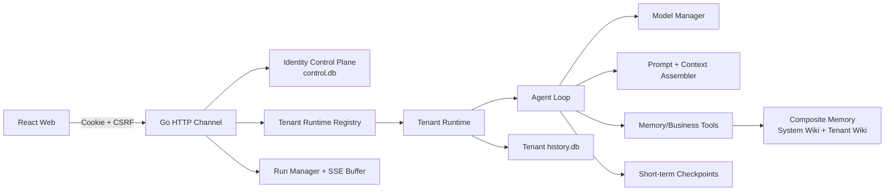
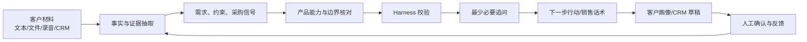
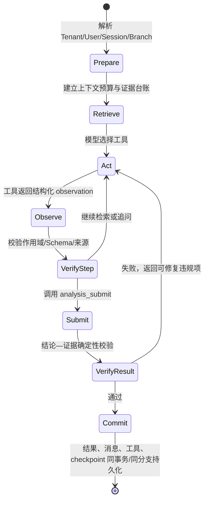
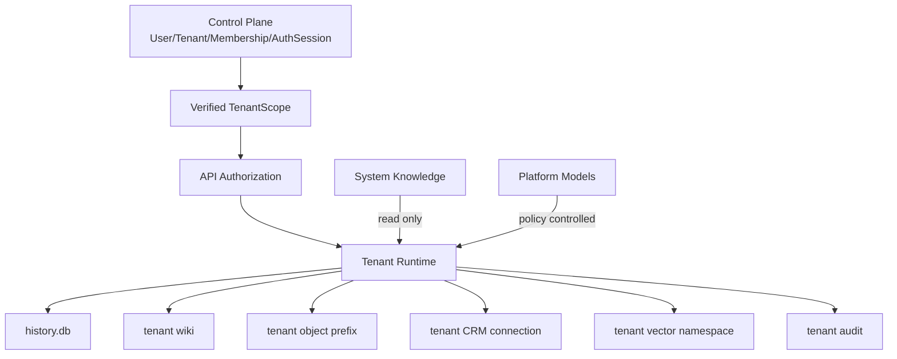
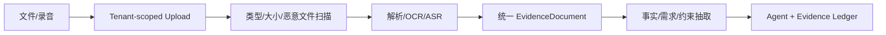

# 客户需求分析智能体：最新源码全栈优化审查与演进方案

> 项目：`customer-demand-agent`  
> 审查对象：2026-08-18 当前工作区源码，分支 `feature/multi-tenancy`  
> 覆盖范围：前端交互、HTTP/SSE、Agent 自主循环、工具、记忆、可信校验、多租户、CRM、多模态与工程门禁  
> 文档性质：源码审查与优化设计，不代表文中建议已经实现

## 1. 执行结论

项目已经不是简单的聊天 Demo。当前源码具备模型路由、流式自主工具循环、7 个长期记忆工具、5 个 Agent 业务工具、Checkpoint、历史回放、人工审核、服务端 Run、多租户注册登录和每租户独立数据面，工程完成度较高，记忆管理确实是明显加分项。

但它目前更适合定义为“可继续验证的单机试点版本”，还不宜直接定义为“可信、可规模化的多租户售前 Agent”。最重要的原因不是缺少 RAG，而是以下闭环尚未做实：

1. **结论没有逐条绑定证据**。`analysis_submit` 只校验少量字段，不校验产品是否存在、是否读过产品详情、能力主张是否有依据，也不校验置信度范围。
2. **确定性检索存在反向误导**。非空关键词零命中时，当前实现会返回该类型的默认条目，而不是返回 0 条，这会把无关知识伪装成命中，是当前最大的幻觉放大器。
3. **多租户物理隔离基本落地，但租户内权限没有闭环**。Agent 的跨会话 `history_search` 绕过了用户级会话可见性；记忆写入、审核、后台任务也没有按 owner/admin/analyst/reviewer 做路由授权。
4. **编辑重发/分支在前后端都不完整**。前端切换分支不触发加载；后端只有 user 消息进入分支，assistant、tool call、checkpoint 和 Agent 上下文仍在主线。
5. **价值展示仍以“功能与思考过程”为中心**。用户真正需要的是“客户证据 → 需求判断 → 产品边界 → 下一步行动 → 客户画像/CRM 回写”，当前结果卡和 Demo 没有把这条价值链呈现出来。
6. **测试门禁覆盖了编译与基础回归，但没有覆盖业务正确性**。现有 Go 测试和 race 测试全绿，仍然可以同时存在上述检索、分支和授权问题；前端尚无组件或端到端自动化测试。

建议的总体顺序是：

> **先修正确性与隔离 P0 → 建立结论—证据 Harness → 重做价值型结果页和 Demo → 补齐租户 RBAC/成员生命周期 → 接多模态 → 接租户级 CRM → 依据检索评测决定是否引入 RAG。**

## 2. 本次审查口径与代码基线

### 2.1 事实来源

本报告以当前工作区的运行代码、路由、测试和构建结果为准。`PRODUCT.md`、模块地图和部分 README 仍含“单租户、一期无登录、认证延期”等历史描述，而源码已经进入多租户全栈阶段，因此这些文档不能继续作为现状依据。

当前核心实现：

| 领域 | 当前源码事实 |
| --- | --- |
| 前端 | React 18、Vite 5、TypeScript、React Router；页面级懒加载；手写 CSS 与组件 |
| 身份 | 注册、登录、退出、改密、HttpOnly Cookie、CSRF、登录限流 |
| 多租户 | 中央身份控制面 + `tenants/<tenant_id>/history.db + wiki/` 独立数据面 |
| Agent | 模型流式调用 + 最多 15 轮自主工具循环 + Prompt/上下文拼装 + 结构化提交 |
| 记忆 | System Wiki 只读基线 + Tenant Wiki 覆盖层 + Checkpoint + 原始会话历史 |
| 运行态 | POST 创建 Run，SSE 支持 replay/live，RunKey 使用 tenant + session 复合键 |
| 外部数据 | Leads/商机代码存在，但多租户主程序明确将其禁用，避免系统 Token 导致跨租户泄漏 |
| 多模态 | 当前没有上传、附件、录音、ASR、OCR 或文档解析链路 |
| RAG | 当前没有向量检索；`memory_recall` 实际仍是关键词检索 |

### 2.2 当前运行架构



### 2.3 现有工程验证结果

| 检查 | 本次结果 | 说明 |
| --- | --- | --- |
| `go test ./...` | 通过 | 包括当前多租户和历史相关测试 |
| `go vet ./...` | 通过 | 无输出 |
| `go test -race ./...` | 通过 | 未检测到现有测试路径上的数据竞争 |
| `npx tsc --noEmit` | 通过 | `package.json` 没有 `typecheck` 脚本，需直接调用 |
| `npm run lint` | 通过，19 个 warning | 主要是 hooks 依赖和 fast-refresh 结构告警 |
| `npm run build` | 通过，有大包告警 | `MarkdownView` 约 961 KB，Mermaid 相关分包最高约 691 KB |
| `npm run format:check` | 失败 | `pnpm-lock.yaml`、`TocRail.tsx`、`index.css`、`AppLayout.tsx` 未通过 |
| `golangci-lint run ./...` | 未执行 | 当前机器未安装该命令；CI 中配置了对应 Action |

测试全绿不能证明 Agent 结论正确。它只能证明被编写出来的断言通过。当前测试对“租户覆盖内容是否真的覆盖系统内容”“分支续写的 assistant/tool/checkpoint 是否也在分支”“Agent 跨会话搜索是否遵守用户可见性”等关键契约没有形成断言。

## 3. 对专家问题的直接回答

### 3.1 Agent 部分体现在哪里，是“模型 + Skills”吗

不是。对本项目更准确的表达是：

> **Agent = 模型路由 + 行为 Prompt + 自主循环 + 工具行动 + 记忆状态 + 运行控制 + 校验治理。**

当前代码中的 Agent 组成如下：

| 层 | 当前实现 | 源码位置 |
| --- | --- | --- |
| 推理引擎 | 多模型注册、任务路由、fallback、流式协议 | `internal/model`、`internal/llm` |
| 行为策略 | 角色、目标、约束、工具使用原则 | `prompts/system.md`、`internal/memory/assembler` |
| 自主循环 | 模型自行决定调用什么工具、调用顺序和何时结束 | `internal/agent/agent.go` |
| 工具行动 | 记忆、分析提交、追问、历史搜索、客户绑定、可选商机工具 | `internal/memory/tools`、`internal/agent/submit.go`、`internal/leads` |
| 状态与记忆 | Checkpoint、历史消息、客户/使用者画像、系统和租户知识 | `internal/memory`、`internal/history` |
| 运行控制 | Run、停止、SSE replay/live、恢复 | `internal/channel/http/runs.go`、`analyze.go` |
| 治理 | 人审、审计、后台 Lint | `internal/review`、`internal/audit`、`internal/taskbg` |

当前项目**没有正式的可插拔 Skills 运行层**。业务能力主要散落在 Prompt、Tool Schema 和 Go 代码中。后续可以把“客户材料接入、需求分析、产品匹配、主动追问、客户画像、可信校验、CRM 回写”封装为版本化 Skill，但 Skill 是业务能力包，不是 Agent 的同义词。

### 3.2 记忆库文件来自哪里

当前仓库 `wiki/` 是提交版种子库，主程序首次启动时把产品和行业目录复制到平台 System Wiki；租户 Wiki 用于客户、使用者和租户新增知识。源码盘点为：

| 类型 | 文件数 | 当前来源判断 |
| --- | ---: | --- |
| 产品 | 363 | 16 个左右产品主页 + 347 个关联子文档，主要来自产品资料导入 |
| 威胁 | 6 | 人工种子 |
| 合规 | 3 | 人工种子 |
| 行业 | 3 | 人工种子 |
| 客户 | 1 | Demo 客户画像 |
| 使用者 | 1 | Demo 使用者画像 |

`scripts/import_chaitin.py` 证明项目存在从产品资料模板导入 Markdown 的路径，但该脚本仍指向旧的 `~/.pi/...` 输入路径和 `data/wiki/...` 输出路径，与当前运行布局不完全一致。更关键的是，大部分 Wiki frontmatter 没有 `source_type/source_uri/source_version/content_hash/verified_by/verified_at`，目前的 `verified` 更像导入状态，不能向用户证明“由谁、基于哪版官方资料验证”。

### 3.3 7 个工具怎么分

7 个工具只属于长期记忆域，不是 Agent 的全部工具：

| 分组 | 工具 | 真实语义 |
| --- | --- | --- |
| 定位 | `memory_search` | 确定性关键词定位，返回摘要 |
| 精读 | `memory_get` | 按 type + title 读取完整条目、章节或正文窗口 |
| 浏览 | `memory_list` | 按类型分页列出条目 |
| 模糊召回 | `memory_recall` | 当前仍是更宽口径关键词匹配，不是向量语义检索 |
| 完整写入 | `memory_ensure` | 新建或覆盖长期记忆；部分类型进入待审核 |
| 轻量观察 | `memory_observe` | 向条目追加观察，或新建观察条目 |
| 生命周期 | `memory_delete` | 客户画像归档/删除，默认归档 |

Agent 还注册了 5 个业务/交互工具：`analysis_submit`、`missing_answer`、`history_search`、`ask_user`、`session_bind_customer`；商机接入启用后还会增加 `leads_search/get/stats`。前端应按“知识检索、客户记忆、分析提交、交互追问、外部系统”分组展示，不应把十几个工具都称作“7 个工具”。

### 3.4 下一步准备做什么

下一步不应同时铺开多模态、QA、RAG、CRM 和多租户成员管理。建议依赖顺序：

1. 修复检索、分支、权限和记忆审核的 P0 正确性问题。
2. 让分析结论带证据，并在 `analysis_submit` 前后做确定性 Harness 校验。
3. 重构对话结果卡和价值 Demo，证明“降错、提效、沉淀”而不是展示模型思考。
4. 补齐多租户 RBAC、成员邀请/切换、配额、审计、备份与生命周期。
5. 建立文件/录音统一证据接入层，再扩展多模态。
6. 用租户级凭据接 CRM，形成客户画像读取和回写草稿。
7. 做检索评测；只有关键词/FTS 无法达到指标时，再引入混合 RAG。

### 3.5 多租户怎么做，当前架构到哪一步

当前工作区已经实现注册登录和“中央控制面 + 每租户独立 SQLite/Wiki”的主体架构，不应再描述为单租户。但是它目前只完成了**组织级隔离底座**，还没有完成完整 SaaS 多租户能力：

- 注册会创建 tenant 和 owner，但没有邀请、成员管理、租户切换。
- 数据面按租户物理隔离，但租户内 analyst/reviewer/admin 的路由授权未闭环。
- 会话 HTTP 查询有用户级可见性，Agent 内部历史搜索却绕过了它。
- 本地 SQLite、文件 Wiki、内存 Run/Task 适合单实例试点，不支持水平扩容和故障转移。
- CRM/商机尚无租户级连接配置，因此主程序正确地将其禁用。

### 3.6 没有 RAG 是否是问题

现阶段不是首要问题。当前语料总量不算企业级大库，确定性检索、结构化产品主页和 FTS 足以支撑第一阶段，而且更容易解释和验证。

当前真正要先解决的是：零命中语义错误、来源缺失、检索评测缺失、产品主页质量不一、命中结果没有证据引用。先把这些做好，再用指标决定 RAG。`memory_recall` 应立即改名或在 UI 明示“模糊关键词召回”，避免误导。

### 3.7 如何验证对不对、降低幻觉

智能体可以校验，但不能让同一个生成过程只靠“再想一遍”自证。正确方案是四层组合：

1. **生成前约束**：工具白名单、Schema、租户作用域、Prompt 注入防护。
2. **提交时确定性校验**：产品存在、工具证据存在、置信度范围、来源状态、结论与限制一致。
3. **提交后独立验证**：规则验证器为主，可选独立模型做语义支持度判定。
4. **离线 Harness + 在线人工反馈**：固定用例、回归阈值、人工修正回流。

“调过工具”不等于“答案正确”；“展示思考过程”也不等于“答案可信”。可信度必须来自可定位证据和可重复校验。

## 4. 源码问题清单与优先级

### 4.1 P0：进入下一轮 Demo 或多租户试点前必须修复

| ID | 问题与影响 | 源码证据 | 修复与验收 |
| --- | --- | --- | --- |
| P0-01 | **非空检索零命中返回默认条目**。无关条目会被模型当成命中，放大产品幻觉；近期零命中 Lint 也很难真实触发 | `internal/memory/longterm/retriever.go:543-559` | 仅 `query==""` 可返回全量；非空 query 无得分必须返回 `count=0`。增加中文、英文、非法产品名测试 |
| P0-02 | **`analysis_submit` 没有证据门禁**。可提交不存在产品、未读详情、越界 confidence 或无能力依据的推荐 | `internal/agent/submit.go:28-91` | 把它改为可拒绝的提交 Gate；校验产品、0..1、当轮 `memory_get`、来源状态和证据引用，失败结果回填模型修正 |
| P0-03 | **Agent 跨会话历史搜索绕过用户可见性**。同租户普通分析人员可能通过 Agent 搜到其他人的会话 | `internal/tenancy/runtime.go:309-312` | `Agent.Message` 的 actor scope 必须传入 history callback；`SearchMessages(&scope,...)`。做同租户 user A/B 隔离测试 |
| P0-04 | **编辑重发分支只实现了一部分**。用户消息写分支，assistant/tool/checkpoint 写主线，Agent 仍使用未分叉短期记忆 | `internal/channel/http/analyze.go:55-109`、`runtime.go:299-302`、`history/store.go:1003-1074` | TurnContext 增加 branch；消息、工具、checkpoint 全部写同一 branch；按 branch 恢复上下文。端到端断言完整路径 |
| P0-05 | **租户覆盖条目合并顺序写反**。`mergeEntries` 先写 tenant 后写 system，system 会覆盖同键 tenant，与注释和产品目标相反 | `internal/memory/longterm/composite.go:299-323` | 首次写入胜出或 system 先、tenant 后；测试不仅断言去重数量，还断言 `Content/Summary/Status` 来自 tenant |
| P0-06 | **租户内 RBAC 没有落到业务路由**。任何登录用户都可人工写删记忆、审批、触发 consolidate/lint | `internal/channel/http/server.go:191-227` | 增加 tenant role middleware；analyst 只分析/读，reviewer 审核，admin/owner 管理；每条修改路由做 401/403/404 矩阵测试 |
| P0-07 | **审核门禁可被 `memory_observe` 绕过**。对已验证的 threat/compliance/industry 追加观察时保持 verified，不重新进入待审 | `internal/memory/tools/tools.go:491-533` | AI 对受控知识的任何实质修改都生成 draft/revision pending；原 verified 版本继续生效，批准后原子替换 |
| P0-08 | **Agent 工具参数可触发 goroutine panic**。`memory_list` 的负 offset 最终进入切片；Run goroutine 没有 panic recovery | `retriever.go:300-319`、`runs.go:76-126` | 所有工具参数做范围校验；Run goroutine加 recover 并发出 error/done。Fuzz `offset/limit/body_offset` |
| P0-09 | **注册 Provision 失败后邮箱已被占用**。用户/tenant/membership 已提交，返回却提示“请重试”，同邮箱无法真正重试 | `internal/identity/service.go:133-212` | 增加 resume-provision 流程或补偿事务；`provisioning_failed` 用户登录后进入修复页；故障注入测试磁盘满/权限失败 |

### 4.2 P1：可信闭环和核心体验优化

| 领域 | 当前问题 | 建议 |
| --- | --- | --- |
| 对话分支 | 前端按钮只 `setCurrentBranch`，加载 effect 只依赖 `routeSid` | 分支进入 URL 或显式 query cache key；切换必须重拉并显示当前分支名称 |
| 草稿 | 无草稿的新会话不会清空上一会话输入；cleanup 捕获旧 input | 用 `useDraft(scope, sessionId)`，切换时先 flush 旧 key 再把新 key 的值（含空值）写入 state |
| SSE | 订阅无自动重连/退避，流自然 EOF 没有明确完成态；解析失败静默丢事件 | 建立 `idle/connecting/running/reconnecting/completed/failed/cancelled` 状态机；Last-Event-ID 重连；限制事件大小并记录协议错误 |
| 错误语义 | `sessionRunning`、`sessionsSearch` 等把异常吞成 false/空数组 | 区分“确实为空”和“服务失败”；全局 toast/inline retry；不要让网络错误伪装成业务空态 |
| 乐观消息 | POST 失败时用户气泡仍保留，没有失败标记或一键重试 | 消息增加 `sending/failed/sent`；失败保留原文和“重试”按钮 |
| 主动追问 | `ask_user` 注释称轮次终止式，但代码仍继续交给下一轮模型；选项可重复点击 | 调用后设置强制终止状态，或明确允许模型生成一句结束语；选项提交后锁定并显示已选值 |
| 结果卡 | 只展示需求、可行性、产品置信度、追问，缺少原文证据、产品依据、边界和行动 | 升级为 `事实/需求/推荐/边界/待确认/下一步`，每条带 source chip；降低无依据百分比的视觉权重 |
| 执行轨迹 | 直接展示 raw reasoning；核心业务工具缺中文语义化展示 | 默认展示“执行摘要 + 证据”，不要把私有推理当可信依据；补齐 get/history/ask/bind/missing 的元数据 |
| 审核体验 | 对话内 ReviewCard 与全局 8 秒轮询 review-strip 重复；后者会显示本租户所有待审项 | 当前 Turn 只显示本轮草稿；全局审核进入独立 Review Inbox；错误可见、忽略状态持久化 |
| 历史列表 | 页面只取前 50 条却文案称全部；搜索状态不结束；选择集跨搜索保留 | 后端返回 total/cursor；分页或无限滚动；查询变化清理/求交选中项；异步搜索支持取消和错误态 |
| 记忆列表 | 一次加载 2000 条；“全库搜索”实际默认只搜当前类型；批量操作直接物理删除 | 服务端分页与 total；明确“当前类型/全部类型”；批量默认归档，物理删除只给 owner 且二次确认 |
| 记忆详情 | 归档 ConfirmDialog 和错误条重复渲染两遍；产品显示编辑按钮但后端拒绝写产品 | 删除重复节点；按来源和角色控制编辑；系统产品知识由平台知识发布流维护 |
| 记忆表单 | 可选择全部 6 类、编辑时可改类型/标题；无来源、冲突和未保存保护 | 创建/编辑按角色和层级限制；稳定 ID 与显示名分离；加入 provenance、冲突预览、离开保护 |
| 客户画像 | 以 title 字符串作为主键和会话绑定；AI ensure 覆盖时可能丢失原结构化字段 | 引入稳定 `customer_id`、别名和外部引用；字段级合并，不允许整页最后写入覆盖 |
| 登录态 | `/auth/me` 每次轮换 CSRF，多标签页会互相使 Token 失效；后端不可达被前端当未登录 | CSRF 在会话期稳定或使用版本兼容轮换；前端增加 service-unavailable 页面 |
| 注册安全 | 注册没有限流/邀请码/邮箱验证，组织名和姓名仅前端 required | 后端长度/字符校验；注册限流、配额和可选邀请码；生产默认关闭开放注册 |
| 商机页 | 多租户主程序已禁用 Leads，但所有租户仍看到 Dashboard 和“去设置配置系统 Token”文案 | 未配置租户连接时隐藏或显示租户连接申请；不要引导普通租户去平台设置 |
| 知识发布 | System Wiki 目录只要非空便永远跳过新版种子同步 | 使用 manifest/version/content hash 做可审计的增量发布，不覆盖租户层 |
| Runtime | 加载租户时持全局锁做磁盘 IO；runtime 缓存无上限 | per-tenant singleflight；LRU/空闲关闭；连接数、内存和租户启动耗时指标 |

### 4.3 P2：可维护性、性能与可访问性

- `Conversation.tsx` 约 955 行，同时负责路由加载、SSE 协议、Run 状态、消息 reducer、草稿、分支、滚动、TOC 和审核。拆成 `useConversationSession`、`useAgentRun`、`useDraft`、`useBranch`、`useToc` 和纯展示组件。
- `Settings.tsx` 约 947 行，平台模型配置、租户安全视图、控制台和商机配置混在一起。按权限和领域拆路由，不要给普通租户显示大段 disabled 的平台配置。
- `index.css` 超过 3300 行，移动端规则仍引用不存在的 `.newchat-wrap/.side-nav/.side-section/.sidebar .bottom`，实际组件使用 `.newchat/.conv-list/.side-bottom`。需要按页面拆分并清理失效选择器。
- `MarkdownView` 静态导入 Mermaid，导致普通对话也承担大型图表依赖。检测到 Mermaid 代码块时再动态 import；对 KaTeX/图表同样按需加载。
- `ConfirmDialog` 缺少初始焦点、焦点陷阱、关闭后焦点恢复；busy 时 Esc/遮罩仍能取消 UI。补齐对话框可访问性契约。
- 记忆卡和文档卡使用 clickable `div`，键盘不可达；侧栏更多按钮主要靠 hover；TOC 在移动端直接消失。改为 button/link 语义并补 focus-visible。
- 增加 `prefers-reduced-motion`，覆盖 cursor、pulse、平滑滚动和 TOC 动画。
- 统一使用 npm 锁文件；当前同时存在 `package-lock.json` 和新出现的 `pnpm-lock.yaml`，会造成依赖来源不确定。
- `go test ./...` 当前还扫描到了 `frontend/node_modules/flatted/golang/pkg/flatted`，应避免前端依赖进入 Go 包发现范围。

## 5. 产品价值与前端交互重构

### 5.1 重新定义价值起点和价值终点

价值起点不是“用户输入一段话”，而是：

> 销售手里有会议录音、聊天、文件和 CRM 记录，但信息零散、产品边界不熟、下一轮不知道该问什么。

价值终点不是“生成一份好看的回答”，而是：

> 形成一份可追溯的客户需求档案，明确已有事实、产品匹配和边界、关键缺口、下一步动作，并在确认后沉淀客户画像或回写 CRM。

建议统一产品表述：

> **把零散客户沟通转成有原文证据、有产品依据、有边界说明、可持续更新并可回写 CRM 的售前需求判断。**

### 5.2 价值闭环



### 5.3 信息架构建议

| 一级入口 | 面向对象 | 说明 |
| --- | --- | --- |
| 需求分析 | analyst/owner | 默认首页，输入材料、生成分析、追问和下一步 |
| 客户 | tenant member | 稳定客户档案、相关会话、画像冲突、CRM 状态 |
| 会话历史 | tenant member | 本人会话；管理员按权限查看团队会话 |
| 知识库 | tenant member | 系统知识只读、租户知识分层、来源/版本可见 |
| 审核中心 | reviewer/admin/owner | 待审记忆、画像变更、CRM 回写草稿 |
| 集成 | owner/admin | CRM、对象存储、ASR 等租户级连接 |
| 平台运维 | platform_admin | 模型、系统知识发布、日志和平台审计 |

商机 Dashboard 不应无条件成为所有租户的固定入口。只有租户已经配置 CRM/商机连接时才显示真实业务面板，否则放在“集成”中完成接入。

### 5.4 对话页目标布局

建议把当前右侧大面积留白改为“主对话 + 证据/结果检查器”：

```text
┌──────────────┬──────────────────────────────────┬──────────────────────┐
│ 会话/客户导航 │ 材料栏：客户 · 文件 · 录音 · CRM  │ 本轮状态             │
│              ├──────────────────────────────────┤ - 已识别事实          │
│ 最近会话      │ 对话与最少追问                    │ - 证据 8/9            │
│ 客户快捷入口  │                                  │ - 1 条冲突            │
│              │                                  │ - 待确认 3 项         │
│              ├──────────────────────────────────┤ - 下一步 / 回写草稿   │
│              │ 输入框 + 上传 + 录音              │                      │
└──────────────┴──────────────────────────────────┴──────────────────────┘
```

交互重点：

- 输入前先选择/识别客户；绑定后显示稳定客户 ID 对应的名称和 CRM 状态。
- 文件、录音和 CRM 记录作为“本轮证据”展示处理状态，不直接把全文塞进 textarea。
- 流式阶段显示“正在读取材料 / 核对产品 / 校验结论”等可理解状态，详细 Tool Trace 默认折叠。
- 结果卡中的每条事实、产品能力、边界和行动都可点击回到客户原文页码、录音时间码或 Wiki 章节。
- 追问卡一次只突出最关键问题，并解释“不确认会影响什么判断”。
- 生成失败不丢用户输入和已抽取证据，提供“从失败步骤重试”。

### 5.5 `AnalysisResultV2` 前端结构

结果不再以百分比为中心，建议包括：

| 模块 | 内容 |
| --- | --- |
| 客户事实 | 原话、环境、已有能力、约束、采购信号；每项有证据 |
| 需求判断 | 显性需求、隐含需求、推断与不确定性分开 |
| 推荐方案 | 产品、覆盖能力、适用条件、能力边界、证据 |
| 可行性 | direct/custom/partner/reject + 决策依据 |
| 冲突与风险 | 客户材料与 CRM/历史画像的冲突、知识过期或证据不足 |
| 待确认 | 问题、重要性、建议选项、回答状态 |
| 下一步 | 下次沟通问题、所需材料、内部协同、CRM 更新草稿 |

## 6. 后端 Agent 目标设计

### 6.1 从“工具循环”升级为“有证据的受控循环”



每轮建立不可变 `TurnContext`：

- `tenant_id/user_id/roles/session_id/branch_id/run_id`
- `prompt_version/model_route_version`
- `input_evidence_ids`
- `retrieved_evidence_ledger`
- `tool_budget/token_budget/deadline`
- `customer_id`

所有工具只接收业务参数，租户和用户作用域由服务端隐式注入，禁止模型传入或覆盖。

### 6.2 `analysis_submit` 必须成为 Gate

当前工具只是把模型参数保存到 `turnState`。目标实现应按以下顺序：

1. JSON Schema 完整校验：必填、枚举、长度、数组上限、`additionalProperties=false`。
2. 每个 `matched_product.name` 必须存在于系统产品主页。
3. 每个推荐产品必须在本轮成功执行过 `memory_get(product, title)`。
4. 推荐能力和限制必须引用 `evidence_id`，且来源状态为 verified、未过期。
5. `confidence` 必须在 `[0,1]`；对外更建议使用“高/中/低 + 原因”，不显示伪精确百分比。
6. `missing_info` 不得重复已通过 `missing_answer` 闭环的问题。
7. feasibility 与产品列表、限制、客户约束不能明显冲突。
8. 校验失败时返回机器可读 violations 给模型，允许有限次数修正；仍失败则输出安全降级结果，不伪造完整分析。

### 6.3 Skills 的落地方式

后续可以在现有轻量框架上增加 Skill Registry，无需先引入大型 Agent 框架。每个 Skill 包含：

```text
skill_id / version
input_schema / output_schema
prompt_fragment
allowed_tools
preconditions / postconditions
failure_policy
eval_suite
```

首批建议 Skill：

- `intake.normalize`：文本、文件、录音、CRM 统一成证据文档。
- `demand.extract`：区分事实、推断、需求、约束和采购信号。
- `product.match`：读取产品主页和边界，形成有依据的候选。
- `question.plan`：选择信息增益最高的最少追问。
- `customer.profile-draft`：生成字段级画像变更草稿。
- `answer.qa`：基于已验证证据回答产品/客户/历史问题。
- `result.verify`：确定性规则 + 可选独立模型验证。

### 6.4 模型层优化

- `ChatStream` 的审计当前始终记录 primary 模型，不能反映实际 fallback；应记录每次尝试、首字节、token、终止原因和真实模型。
- `ModelConfig.ContextWindow`、`MaxRetries` 等字段没有完整进入调度策略。建立统一的 RouteSnapshot，避免运行中读取可变 router。
- 流式解析器使用 `bufio.Scanner` 默认 64 KB 行限制，且 JSON 解析失败会静默跳过。设置合理 buffer 上限，协议错误必须可观测。
- OpenAI Response 的 reasoning summary 不应混入最终 content；内部推理与用户答案需要严格分流。
- 为不同 Skill 配置“生成模型”和“验证模型”是可选优化，但确定性规则必须先于模型裁判。

## 7. 记忆、客户画像与检索优化

### 7.1 五类状态必须分开

当前 Wiki 同时承担产品知识、行业知识、客户画像和用户画像，后续应在概念上拆为：

1. **Source/Evidence**：原始会话、上传文件、录音转写、CRM 对象，不可静默改写。
2. **Curated Knowledge**：产品、威胁、合规、行业，带来源、版本和发布状态。
3. **Customer Profile**：字段化的客户当前视图，由多来源事实合并而成。
4. **User Preference**：当前销售/售前的表达偏好和专业度，按用户隔离。
5. **Episodic Memory**：会话、分支、工具、checkpoint 和反馈。

### 7.2 来源元数据

所有新知识至少支持：

```yaml
source_type: official_doc | manual | conversation | upload | audio | crm | agent_observation
source_id: stable-id
source_locator: page:12 | paragraph:8 | time:00:03:21-00:03:38
source_uri: internal-reference
source_version: v1.2.3
content_hash: sha256:...
tenant_id: empty-for-system-knowledge
customer_id: optional
created_by: user-or-agent-id
ingested_at: RFC3339
observed_at: RFC3339
verified_by: user-id
verified_at: RFC3339
valid_from: RFC3339
valid_to: RFC3339
```

源码中的 `FilePath` 不能作为 API 来源返回；它是服务器内部实现细节。前端只展示稳定 source reference。

### 7.3 当前不接 RAG 的优化路径

阶段一先做：

1. 修复非空零命中返回全量的语义错误。
2. 统一 exact title/alias、中文 bigram、英文 token 和过滤规则。
3. 使用 SQLite FTS5 或等价确定性全文索引覆盖正文，保留字段权重。
4. 将 `search` 和 `list` 语义分离；任何零分结果不得作为命中。
5. 检索结果返回 `score/reason/source/version/status`，并记录零命中查询。
6. 建立 100~300 条真实查询评测集，测 Recall@K、MRR、无关命中率和延迟。

满足任一条件再引入混合 RAG：

- 语料达到数千篇且同义表达导致关键词 Recall@5 持续低于目标。
- 文件/录音正文增长后，全文搜索无法稳定定位段落。
- QA 评测中“知识存在但找不到”的失败占主要比例。

引入时应采用“结构化过滤 + BM25/FTS + 向量召回 + rerank”，而不是用向量检索替代产品主页和权限过滤。System Knowledge 与 Tenant Knowledge 必须使用不同 namespace，任何向量查询都由服务端注入 tenant filter。

### 7.4 客户画像目标模型

客户不能继续只靠记忆标题做身份。建议新增：

```text
customers(id, tenant_id, canonical_name, status, created_at, updated_at)
customer_aliases(customer_id, alias, source_id)
customer_external_refs(customer_id, provider, external_type, external_id)
customer_facts(id, customer_id, field, value_json, source_id, confidence,
               observed_at, valid_to, status, created_by)
customer_profile_revisions(id, customer_id, patch_json, status, reviewer_id)
```

画像展示是 `customer_facts` 的已确认当前投影；Agent 只能创建 field-level draft，不能把整页正文直接覆盖 verified 画像。CRM、会议原话和历史画像冲突时，应并列显示来源与时间，由用户裁决。

## 8. 多租户目标架构与补齐项

### 8.1 当前架构评价

当前“控制面共享、数据面按租户物理分离”的方案适合本项目早期单机部署，优点是隔离边界直观，即使业务 SQL 漏写 tenant 条件，也不容易直接跨到另一个租户数据库。应保留这一方向完成试点，而不是为追求架构统一立即迁移数据库。

当前需要补齐的是作用域贯穿和运营能力，而不是重新设计登录：



### 8.2 权限矩阵

| 能力 | owner | admin | analyst | reviewer | platform_admin |
| --- | --- | --- | --- | --- | --- |
| 创建/管理本人会话 | 是 | 是 | 是 | 可选 | 仅作为租户成员 |
| 查看团队会话 | 是 | 是 | 否 | 否 | 默认否 |
| 读系统/租户知识 | 是 | 是 | 是 | 是 | 仅系统知识运维 |
| 提交画像/知识草稿 | 是 | 是 | 是 | 是 | 否 |
| 批准/拒绝租户知识 | 是 | 是 | 否 | 是 | 否 |
| 管理成员和集成 | 是 | 是 | 否 | 否 | 否 |
| 删除租户/转移所有权 | 是 | 否 | 否 | 否 | 平台流程，不直接读业务数据 |
| 管理模型/System Wiki | 否 | 否 | 否 | 否 | 是 |

平台管理员不是“超级租户”。需要客户支持访问时，应走短时授权、原因、工单、显式租户许可和完整审计。

### 8.3 首版必须增加的数据与接口

- 邀请、成员、角色变更、停用、所有权转移。
- 用户可加入多个租户后的 tenant list/switch；AuthSession 记录 active tenant，并在切换时轮换会话或 CSRF。
- tenant plan/quota：会话、存储、Run 并发、文件、ASR 分钟、LLM token。
- tenant audit：memory/review/customer/integration/member/export/delete 等业务修改。
- tenant lifecycle：provisioning、active、suspended、deleting、deleted、repairing。
- 备份、恢复和删除证明；每租户恢复演练。
- tenant runtime 逐租户加载锁、空闲关闭和资源统计。

### 8.4 文件、缓存、任务与外部系统的隔离不变量

- 对象存储 Key 只由服务端生成：`tenants/<tenant_id>/attachments/<id>`。
- Redis/缓存使用结构化复合键，不能接受客户端 tenant id。
- Queue payload 必含服务端签发的 tenant/user/resource scope；worker 重新校验 membership 或使用受限 service identity。
- CRM token、ASR key、自带模型 key 进入 Secret Store/KMS，业务数据库只存 credential reference。
- 日志、指标和 trace 带 tenant hash/ID，但不得默认记录客户正文、Cookie、Token 或 API Key。
- 导出必须异步、审计、短时下载 URL，并再次校验当前租户和用户。

### 8.5 从单机试点到生产 HA

| 阶段 | 建议 |
| --- | --- |
| 试点 | 保留每租户 SQLite/Wiki；单实例；限制租户数；做备份与资源上限 |
| 多实例 | Run/任务迁移到持久队列；对象存储替代本地附件；Session/事件游标共享 |
| 规模化 | Control Plane 和业务元数据迁 PostgreSQL；可选 shared schema + RLS 或企业租户独立 schema/database |
| 检索扩展 | System 与 Tenant namespace 分离；tenant filter 由服务端强制注入；隔离测试进入 CI |

## 9. 多模态、QA 与 CRM 方案

### 9.1 文件和录音统一接入层

不要分别在对话页临时实现“上传按钮”和“录音按钮”，应建立统一 Evidence Ingestion：



数据对象建议：`attachments`、`ingestion_jobs`、`evidence_documents`、`evidence_segments`。每段保留页码、时间码、说话人、文本 hash 和解析器版本。

前端交互：

- 上传前显示格式、大小、隐私提示；上传后显示扫描、解析、可用、失败状态。
- 录音显示权限、计时、暂停/重录、波形和上传进度。
- ASR 文本允许发送前编辑，原始转写和人工修订分版本保留。
- 长文件先抽取结构化事实和证据索引，不把全文直接塞进单轮 Prompt。
- 上传内容视为不可信数据，任何“忽略系统指令”等文本不得改变 Agent 策略。

### 9.2 QA

如果“接 QA”指知识问答能力，复用同一个证据层，不另建无引用聊天入口：答案必须带来源、版本和“未找到依据”状态；问题可限定“产品知识/当前客户/当前会话/全部本人会话”。

如果指测试团队验收，则使用第 10 节 Harness 产出的固定用例、追踪记录和失败复现包作为 QA 入口，避免只靠人工自由聊天验收。

### 9.3 CRM

CRM 必须按租户连接，不能恢复当前全平台单 Token 方案。建议：

```text
integration_connections(id, tenant_id, provider, base_url, credential_ref,
                        scopes, status, created_by, verified_at)
integration_sync_cursors(connection_id, object_type, cursor, updated_at)
external_objects(tenant_id, provider, object_type, external_id, payload_ref, etag)
integration_jobs(tenant_id, connection_id, type, status, idempotency_key)
```

Agent 工具按最小权限注册：

- `crm_customer_search/read`
- `crm_contact_read`
- `crm_opportunity_read`
- `crm_update_draft`
- `crm_update_commit` 仅在用户确认后执行

所有读写工具从 TurnContext 获取 tenant 和 actor；写回采用 diff 预览、字段级确认、幂等 key 和审计。手机号、邮箱、录音等 PII 进入模型前应有租户级脱敏/出境策略。

## 10. Harness：让每一步形成可验证闭环

### 10.1 运行时 Step Harness

每一步统一记录：

```text
Goal/Claim -> Preconditions -> Action/Tool -> Observation/Evidence
           -> Deterministic Verification -> State Commit or Repair
```

建议新增结构：

- `EvidenceRef`：source type/id/locator/version/status/tenant。
- `Claim`：claim id/text/type/evidence refs/support status。
- `ToolObservation`：工具输入摘要、结果引用、作用域和错误分类。
- `Violation`：code/severity/path/message/repair hint。
- `TurnEvaluation`：groundedness、policy、completeness、latency、cost。

### 10.2 首批确定性规则

| 规则 | 目标 |
| --- | --- |
| `TENANT_SCOPE_MATCH` | 所有 evidence/tool/resource 的 tenant 与 TurnContext 一致 |
| `SESSION_VISIBILITY` | actor 对 session/history 有权限 |
| `PRODUCT_EXISTS` | 推荐产品存在于系统产品主页 |
| `PRODUCT_GET_REQUIRED` | 正式推荐前本轮成功读取该产品完整页 |
| `CLAIM_HAS_EVIDENCE` | 事实性和产品能力主张至少有一条可定位证据 |
| `EVIDENCE_VERIFIED` | 关键产品主张不能只依赖 pending/archived/expired 条目 |
| `LIMITATION_CHECKED` | 产品主页有 limitation 时结果必须体现相关边界 |
| `CONFIDENCE_RANGE` | 置信度合法且高置信结论证据充分 |
| `MISSING_NOT_ANSWERED` | 待追问项未在已回答链中闭环 |
| `BRANCH_CONSISTENT` | 本轮消息、工具、checkpoint 和结果都属于同一分支 |
| `WRITE_REQUIRES_REVIEW` | 受控知识修改只生成 pending revision |
| `EXTERNAL_WRITE_CONFIRMED` | CRM/删除/导出等外部副作用有用户确认和幂等键 |

### 10.3 离线评测集

至少覆盖：

- 直接覆盖、需定制、外部整合、拒绝四类需求。
- 不存在的产品、相似产品名、产品能力边界、知识冲突和知识过期。
- 信息不足、追问得到回答、重复追问、客户切换。
- 同租户 user A/B、跨租户 A/B、同名客户、伪造 session/branch/attachment ID。
- 无命中检索、工具超时、格式损坏、SSE 断线、模型 fallback。
- 文件中的 Prompt Injection、CRM 脏数据、录音转写错误。
- 编辑重发、分支切换、进程重启恢复、取消后部分结果。

建议门禁指标：

| 指标 | 发布门槛建议 |
| --- | ---: |
| 跨租户/越权泄漏 | 0 |
| 不存在产品推荐率 | 0 |
| 无证据产品能力主张率 | 0 |
| 结构化结果 Schema 通过率 | 100% |
| 关键结论证据覆盖率 | ≥ 95% |
| 检索无关命中率 | ≤ 2% |
| 必要追问召回率 | 由专家标注基线后持续不下降 |
| 回归集通过率 | 100% 阻塞用例 + 非阻塞评分不下降 |

### 10.4 测试补齐清单

后端新增：

- `search_non_empty_miss_returns_zero`
- `composite_list_tenant_content_wins`
- `agent_history_search_respects_actor_scope`
- `branch_turn_persists_all_artifacts_to_branch`
- `analysis_submit_rejects_unread_or_unknown_product`
- `observe_verified_knowledge_creates_pending_revision`
- `register_provision_failure_can_resume`
- `memory_tool_args_fuzz_no_panic`
- 全业务路由 RBAC table test

前端新增 Vitest/Testing Library 与 Playwright 关键路径：

- 草稿在会话切换时不串。
- 分支切换会发正确请求并刷新消息。
- SSE 断线重连、旧 Run 过滤、EOF 异常状态。
- 普通租户看不到平台操作，analyst 看不到审批动作。
- 上传/录音状态机、失败重试、来源跳转。
- ResultCard V2 的证据、冲突和确认交互。

## 11. 分阶段实施路线

### Phase 0：正确性止血与文档对齐

目标：消除会直接造成幻觉、越权、分支错误和不可恢复注册的缺陷。

- 完成 P0-01 ~ P0-09。
- 删除重复 UI、修草稿和分支切换。
- 更新 `PRODUCT.md`、README、模块地图和多租户文档的现状状态。
- 把上述缺陷全部转成自动测试。

出口：P0 用例全绿；跨租户和同租户跨用户泄漏均为 0；格式/静态门禁全绿。

### Phase 1：可信分析与价值 Demo

目标：让用户看到“为什么可信、接下来做什么”。

- Evidence Ledger、Claim、`AnalysisResultV2`。
- `analysis_submit` Gate 和首批确定性验证规则。
- 对话页结果检查器、来源跳转、冲突/边界/下一步。
- 建立第一版专家标注评测集和回归报告。

出口：不存在产品和无依据能力主张均为 0；关键结论证据覆盖率达到门槛；Demo 可回到原文证据。

### Phase 2：多租户产品化

目标：从“每个注册账号一个租户”升级到可运营的组织工作空间。

- 成员邀请、角色、租户切换、停用和所有权转移。
- 业务路由 RBAC、tenant audit、quota、备份恢复、删除流程。
- runtime 资源回收和注册修复流程。
- 安全测试：IDOR、跨租户缓存/SSE/任务/文件/导出。

出口：权限矩阵自动化 100% 通过；备份恢复演练成功；平台管理员默认无法读租户正文。

### Phase 3：多模态材料接入

目标：把文件和录音变成有定位的证据，而不只是把文本拼进 Prompt。

- Tenant-scoped 附件、对象存储、扫描、解析、OCR/ASR。
- EvidenceDocument/Segment 和处理状态 UI。
- 长文上下文预算和引用定位。

出口：文件页码、录音时间码可回跳；上传/解析/取消/失败/删除全状态可测；跨租户附件不可见。

### Phase 4：CRM 与客户画像闭环

目标：读取客户上下文，生成画像和 CRM 更新草稿，经确认回写。

- 稳定 customer_id、external refs、字段级事实与冲突。
- 租户级 CRM 连接、加密凭据、同步游标和幂等写回。
- 客户 360 页面和回写 diff 审批。

出口：同名客户不串；CRM 写回必须确认；字段可追溯到会话/文件/CRM 来源。

### Phase 5：按指标决定混合 RAG

目标：只解决已经被检索评测证明的问题。

- 先上线 FTS/BM25 基线和检索仪表盘。
- 达到触发条件后增加 embedding namespace、rerank 和引用。
- 用同一评测集对比关键词、FTS、混合 RAG 的准确率、延迟和成本。

出口：新方案必须显著提升 Recall/MRR，且不能降低 tenant isolation、引用覆盖和可解释性。

## 12. 推荐 Demo 脚本

不要从“这是 7 个工具”开始。建议用一条真实销售工作链讲价值：

1. 进入某租户，选择已从 CRM 同步的客户。
2. 上传会议纪要并补一段现场录音，系统显示解析完成和来源定位。
3. Agent 抽取客户现状、痛点、环境、约束和采购信号，明确标出事实与推断。
4. Agent 发现一个会改变方案的关键信息，用选项式追问；用户一键回答。
5. Agent 检索并精读产品能力与限制，结果卡展示“为什么匹配、哪里不能承诺”。
6. Harness 拦住一条无证据主张并自动修正；用户看到校验结果而不是 raw reasoning。
7. 输出下次沟通问题、推荐话术和内部协同动作。
8. 生成客户画像和 CRM 更新 diff，用户确认后写回。
9. 切到另一个租户展示同名客户、会话和画像完全独立，作为安全附加演示。

Demo 最后用指标收口，而不是用功能数量收口：分析耗时、证据覆盖、人工修改、追问闭环、CRM 采纳、跨会话复用和零越权。

## 13. 建议立即进入开发的首批任务

按依赖排序：

1. 修复 `genericSearch` 的非空零命中语义，并补回归用例。
2. 修复 `CompositeStore.mergeEntries` 覆盖顺序，并验证内容而非只验证数量。
3. 把 actor scope 和 branch 放入 `TurnContext`，修复 history_search 与全链路分支持久化。
4. 为 memory/review/task 路由增加 tenant RBAC。
5. 修复 `memory_observe` 的 revision/review 语义和工具参数 panic 面。
6. 解决注册 provisioning 失败的可恢复性和多标签页 CSRF。
7. 定义 `EvidenceRef/Claim/AnalysisResultV2/Violation`，把 `analysis_submit` 改造成校验 Gate。
8. 前端先完成 ResultCard V2 和证据检查器，再做视觉微调。
9. 建立 30 条最小 Harness 阻塞集，随后扩到 100~300 条。
10. 修复格式门禁、统一 npm lock、加入前端关键路径测试。

## 14. 完成定义

这轮优化完成的标准不是“页面更多、工具更多”，而是同时满足：

- 用户能清楚说明 Agent 如何自主行动，而不是只看到模型回答。
- 每条关键需求和产品主张都能回到客户证据或已验证知识。
- Agent 无依据时会返回“证据不足”，不会用无关检索结果补齐答案。
- 会话、分支、记忆、客户画像、附件、任务和外部连接都遵守同一 TenantScope/RBAC。
- 客户画像是可追溯、可冲突、可审核的事实投影，而不是可被整页覆盖的 Markdown。
- 工程测试、业务 Harness、安全隔离和人工评审共同形成发布门禁。
- Demo 能从客户工作痛点开始，以下一步行动和 CRM/画像沉淀结束。

