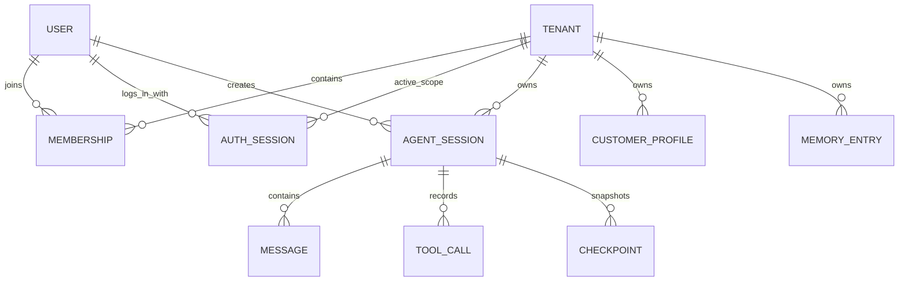
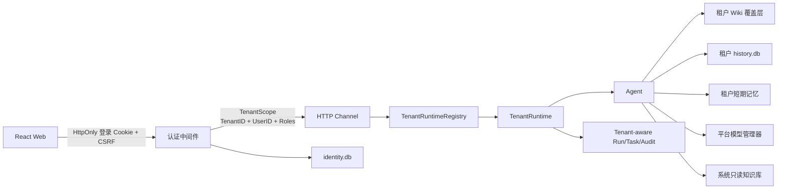
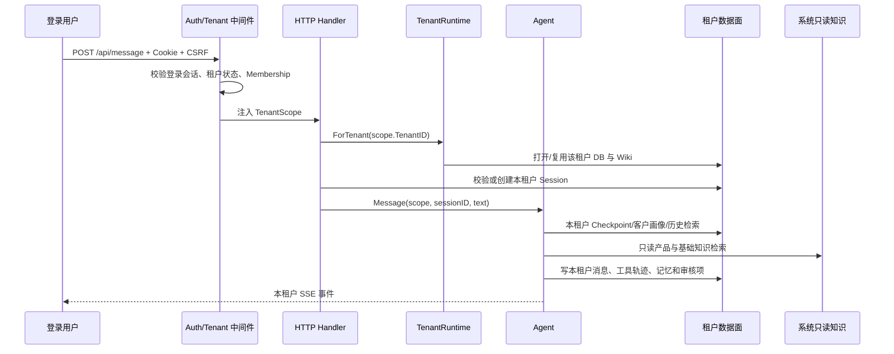

# 客户需求分析智能体多租户设计文档

> 文档状态：V1.1 As-Built 设计（已落地）
>
> 适用项目：`customer-demand-agent`
>
> 目标版本：多租户 V1.1（注册登录、数据隔离、成员协作、RBAC、平台 CRUD）
>
> 更新日期：2026-08-19

## 1. 结论摘要

当前项目已经完成多租户 V1.1：中央身份控制面管理 User、Tenant、Membership 和 AuthSession；每个租户拥有独立的 `history.db` 与可写 Wiki；服务端从登录会话推导 `TenantScope`。同一全局用户可以加入多个租户，并通过受校验的工作空间切换进入不同数据面。

本次不能简单恢复旧版 `X-Tenant-ID` 方案。旧方案允许客户端自行声明租户，没有注册、登录和成员关系校验，也没有隔离 Wiki 记忆、运行中事件、后台任务、日志、商机数据等非会话数据，不能满足“会话、记忆、客户画像等数据一定隔离”的要求。

当前 As-Built 架构遵循以下约束：

1. **租户表示一个组织或工作空间，用户表示登录身份**。首版注册时自动创建一个租户，并把注册用户设为租户所有者。
2. **租户身份只从服务端登录态和成员关系推导**。业务接口不接受客户端传入的 `tenant_id`，也不信任 `X-Tenant-ID`。
3. **采用“认证控制面 + 租户独立数据面”的混合隔离**：账号、租户、成员关系和登录会话存放在中央身份库；每个租户拥有独立的历史 SQLite 数据库和独立的可写 Wiki 目录。
4. **系统产品知识只读共享，所有客户产生或租户可修改的数据严格隔离**。产品知识、系统 Prompt 和平台模型配置属于平台数据；会话、消息、工具轨迹、Checkpoint、客户画像、使用者画像、租户新增行业记忆、审核队列、后台任务和审计日志属于租户数据。
5. **Agent 每一轮都携带不可伪造的 `TenantScope`**。HTTP、未来即应/钉钉渠道、Agent 工具、历史检索、记忆检索、客户绑定、SSE、后台任务和观测接口必须使用同一个租户作用域。
6. **平台管理员与租户角色分离**。`platform_admin` 可以管理用户、租户和目标租户 Membership，但不会因此获得目标租户的业务 `TenantScope`。
7. **租户内协作数据共享读、分级写**。会话、客户画像和租户记忆在同一租户内共享读取；普通成员只能改写本人会话，owner/admin 可维护本租户全部会话。

文件上传、录音、CRM、SSO、找回密码、计费和配额仍不纳入当前闭环；可选的“邀请—接受/拒绝”流程后续补充，但已有账号复用与显式工作空间切换已经可用。

## 2. 已确认需求、合理假设与边界

### 2.1 已确认需求

- Agent 定位为“客户需求分析智能体”。
- 系统需要支持多租户。
- 首阶段采用注册、登录形式识别用户。
- 不同租户的会话、记忆、客户画像等数据必须隔离。
- 方案应基于当前 Go、React、SQLite、文件型 Wiki 和自主 Agent 架构规划，而不是另起一套无关系统。

### 2.2 首版合理假设

- **租户语义**：一个租户代表一个组织或工作空间，而不是一个浏览器、一个会话或一个 HTTP Header。
- **注册语义**：用户注册时创建新租户并成为 owner；平台管理员也可创建租户并指定已有或新建用户为 owner。
- **成员语义**：一个全局用户可拥有多个 active Membership；登录确定性选择首个可用工作空间，之后通过服务端校验接口显式切换。
- **租户内可见性**：客户画像、租户记忆和 Agent 会话在租户内共享读；普通成员只写本人会话，租户管理员可维护本租户全部会话。
- **系统知识**：产品、基础威胁、基础合规和基础行业知识是平台只读基线，可供所有租户检索；租户新增、修改或观察得到的知识只写入本租户覆盖层。
- **模型配置**：首版继续使用平台统一的 LLM 网关配置，不允许租户用户读取或修改全局 API Key。
- **客户同名**：不同租户可以存在完全相同名称的客户画像，互不覆盖、互不可见。

### 2.3 待确认但不阻塞设计的事项

- 是否允许开放注册，还是需要邀请码或管理员开关。本文默认支持配置 `registration_enabled`，生产环境建议默认关闭开放注册或增加邀请码。
- 是否要求邮箱验证和自助找回密码。它们依赖邮件服务；首版可以先交付注册、登录、退出、修改密码，找回密码暂由平台管理员处理。
- 产品知识是否也必须为每个租户复制一份。本文默认产品知识属于平台只读数据；若要求连平台知识都物理独立，可在租户开通时复制完整 Wiki，但当前 377 个 Wiki 文件中有 363 个产品文档，这会显著增加副本、升级和一致性成本。
- 即应渠道如何映射租户。本文把它列为第二阶段，启用前必须建立可信的“渠道安装实例 → 租户”绑定。

### 2.4 首版暂不纳入

- SSO、OAuth、企业微信、钉钉登录。
- 邀请确认、复杂组织部门树。
- 计费、套餐、Token 配额。
- 跨租户客户共享、跨租户知识共享、平台运营代登录。
- 数据库级透明加密和每租户独立加密密钥。
- 多实例、高可用和跨地域部署；达到该阶段时应迁移至 PostgreSQL，并使用行级安全策略或独立 Schema/数据库。

## 3. 改造前基线与隔离缺口（历史）

本章记录实施前的风险基线，用于解释为什么采用“控制面 + 独立数据面”；不代表当前源码状态。当前实现状态以第 1、4、5、10、16 章为准。

### 3.1 现有技术与数据链路

| 层次 | 现状 | 多租户影响 |
| --- | --- | --- |
| Web 前端 | React 18 + Vite 5 + TypeScript | 无登录页、无用户上下文、无受保护路由 |
| HTTP 后端 | Go `net/http`，单一 `Server` 实例 | 所有路由公开，任意人可访问业务、配置和观测接口 |
| 会话历史 | 单个 `history.db` | 查询和写入不按租户过滤；`tenant_id` 兼容列不参与业务 |
| 长期记忆 | 单个 `WikiStore`，启动时全量加载 | 客户画像、使用者画像、行业记忆和审核队列全局共享 |
| 短期记忆 | `SessionManager.sessions[sessionID]` | 只按会话 ID 分组，没有租户或用户作用域 |
| Run/SSE | `RunManager` 按 `sessionID` 保存运行态和事件缓冲 | 运行状态、取消、SSE replay 都缺少租户键 |
| Agent | 单个 Agent、工具注册表和 Assembler | `default_user` 是全局配置，所有用户共用同一使用者画像 |
| 后台任务 | 单个串行 `TaskRunner`，任务只带字符串 `Detail` | 固化、Lint、标题和任务列表没有租户归属 |
| 审核 | 单个 `review.Service` | 任意用户能看到并审批所有待审核记忆 |
| 配置/观测 | 全局设置、日志流、LLM 审计公开 | 租户用户可看到平台级配置、日志和其他租户运行元数据 |
| 商机平台 | 一个系统级 Token，全员共用 | 如果外部接口返回跨组织商机，将直接破坏隔离承诺 |
| 即应渠道 | 会话 ID 来自外部 conversation，无账号绑定 | 无法证明消息属于哪个租户 |

### 3.2 当前代码中的关键事实

- `internal/history/store.go` 在业务查询中只使用 `session_id`，`sessions.tenant_id` 仅在兼容迁移时出现。
- `internal/memory/longterm.WikiStore` 持有一套全局 `entries/customers/users` Map，文件路径没有租户层级。
- `internal/memory/assembler.New(wikiStore, cfg.DefaultUser)` 把全局 `default_user` 固定为当前销售，无法按登录用户选择使用者画像。
- `internal/memory/tools.Registry` 在构造时绑定唯一 WikiStore，Agent 的七个记忆工具天然访问全局记忆。
- `internal/channel/http.RunManager` 的 `runs/buffer/lastSeq/subs` 都以 `sessionID` 为 Key。
- `internal/taskbg.Task` 没有 `tenant_id`、`actor_user_id` 或结构化资源引用。
- `internal/channel/http/logs.go` 保存全进程纯文本日志，无法按租户安全过滤。
- 前端草稿使用 `draft-${sessionId}` 等 `localStorage` Key。同一浏览器先后登录不同账号时，未作用域化的草稿和 UI 状态可能被后一个账号读取。
- 当前 SQLite DSN 开启了 WAL 和 busy timeout，但没有显式启用 `foreign_keys=ON`；SQLite 外键默认不是自动强制执行，目标实现必须在每个连接上显式开启并启动自检。

### 3.3 旧版租户实现为什么不能直接恢复

仓库历史中的旧实现从 `X-Tenant-ID` 或 Query 参数读取租户，并在缺失时使用默认租户。它只覆盖部分会话查询，没有真实身份验证，调用者只要修改 Header 就可以冒充其他租户。同时客户画像被定义为组织级共享数据，这与本次“客户画像也必须隔离”的要求冲突。

可复用的只有两点：

- `sessions.tenant_id` 兼容列和部分历史迁移经验；
- Channel → Agent 的适配边界，适合承载新的服务端 `TenantScope`。

旧版 Header 解析、中间件和默认租户机制不得复用为安全边界。

## 4. 租户、用户与权限模型

### 4.1 核心对象



- **Tenant**：组织或工作空间，是数据隔离和生命周期管理的根。
- **User**：可登录身份，邮箱在平台范围内唯一。
- **Membership**：用户与租户的成员关系及角色。业务请求必须同时满足用户有效、租户有效、成员关系有效。
- **AuthSession**：Web 登录态，保存当前活跃租户，不等同于 Agent 会话。
- **AgentSession**：一次客户需求分析对话，必须属于一个租户，并记录创建人。
- **CustomerProfile**：租户内共享的客户画像；不同租户的同名客户是不同对象。
- **MemoryEntry**：租户长期记忆覆盖层中的条目，包括客户、使用者和租户新增行业知识。

### 4.2 角色

| 角色 | 数据范围 | 主要能力 | 明确限制 |
| --- | --- | --- | --- |
| 平台管理员 `platform_admin` | 全平台控制面元数据 | 用户/租户 CRUD、任意目标租户成员管理、全局配置与日志 | 不因平台角色获得目标租户客户、记忆或会话读取权 |
| 租户所有者 `owner` | 本租户全部数据 | 管理租户资料、全部成员角色、记忆、审核和全部会话 | 不能访问其他租户或平台 API Key；最后可用 owner 受保护 |
| 租户管理员 `admin` | 本租户全部数据 | 管理 analyst/reviewer、租户资料、记忆、审核和全部会话 | 不能授予/移除 owner 或 admin |
| 分析人员 `analyst` | 本租户共享读 + 本人会话写 | 创建分析、管理本人会话、读取团队会话与客户画像 | 不能改写他人会话、管理成员、写记忆或审批 |
| 审核人员 `reviewer` | 本租户共享读 + 本人会话写 | 创建分析、管理本人会话、审批或拒绝租户记忆 | 不自动获得成员、记忆维护或平台权限 |

注册用户默认为 `owner`。成员页面与平台管理页已经支持新建账号、复用已有账号、改角色和移除成员；前端隐藏仅用于体验，HTTP 中间件和 Service 层均再次鉴权。

### 4.3 默认拒绝原则

- 未登录访问业务接口返回 `401`。
- 已登录但不具备功能权限返回 `403`。
- 请求指定了一个不属于当前租户的资源 ID 时统一返回 `404`，避免泄露资源是否存在。
- 任何数据库、Wiki、运行态或后台任务访问都必须先解析服务端 `TenantScope`，不得在 Handler 中临时读取 Header 作为租户来源。
- 平台管理员与租户管理员是两类权限，不允许把“平台管理员”默认变成可浏览全部客户内容的超级租户。

## 5. 数据分级与隔离矩阵

| 数据 | 所有者 | 首版隔离方式 | 租户内可见性 |
| --- | --- | --- | --- |
| 用户账号、密码 Hash | 平台控制面 | 中央身份库，严格服务层访问 | 用户本人；平台安全服务 |
| 租户、成员关系 | 平台控制面 | 中央身份库 | 当前租户成员；平台管理员看必要元数据 |
| 登录会话 | 用户 | 中央身份库，Opaque Token 只存 Hash | 用户本人 |
| Agent 会话、标题、客户绑定 | 租户 | 每租户独立 `history.db` + 冗余 `tenant_id` | 租户成员共享读；本人或管理员写 |
| 消息、System Prompt、工具参数/结果 | 租户 | 每租户独立 `history.db` | 租户成员共享读；跟随会话写权限 |
| Checkpoint、分支、Run 事件缓冲 | 租户 | 租户数据库 + 内存复合 Key | 租户成员共享读；副作用跟随会话写权限 |
| 客户画像 | 租户 | 每租户独立 Wiki 覆盖层 | 租户内共享 |
| 使用者画像 | 租户 + 用户 | 每租户独立 Wiki，关联 `user_id` | 用户本人；租户管理员可维护 |
| 租户新增威胁/合规/行业记忆 | 租户 | 每租户独立 Wiki 覆盖层 | 租户内共享 |
| 待审核记忆与历史版本 | 租户 | 租户 Wiki + 租户审计记录 | 本租户 reviewer/admin/owner |
| 产品和基础知识 | 平台 | 只读系统 Wiki，所有租户共用 | 所有租户只读 |
| 模型、路由、平台 API Key | 平台 | `config.json` 或后续 Secret Store | 仅平台管理员；租户只看可用模型别名 |
| 商机数据、商机 Token | 待定 | 未完成租户映射前禁用给普通租户 | 必须由外部 ACL 或租户专属凭据保证 |
| 后台任务、LLM 审计 | 租户或平台 | 记录 `tenant_id`、`actor_user_id` 并按权限过滤 | 本租户任务；平台任务另域 |
| 原始进程日志 | 平台 | 仅平台运维可见，内容脱敏 | 不向租户开放 |
| 浏览器草稿和偏好 | 用户 + 租户 | Key 前缀含 `user_id/tenant_id`，退出清理敏感项 | 当前浏览器当前用户 |

这里的“系统只读共享”不包含任何客户名称、客户沟通文本、租户观察结论或使用者画像。使用者画像由租户成员身份自动生成并绑定 `user_id`；旧版无 `user_id` 的“张三”等演示画像不再展示、不会注入 Agent。

## 6. 目标架构

### 6.1 总体架构



### 6.2 文件与数据库布局

```text
<CDA_DATA_DIR>/
├── control/
│   └── identity.db                 # 用户、租户、成员关系、登录会话
├── system/
│   ├── wiki/                       # 产品/基础知识，只读运行副本
│   └── prompts-snapshots/          # 平台 Prompt 快照
└── tenants/
    └── <tenant_uuid>/              # 只使用服务端生成 UUID，不使用租户名拼路径
        ├── history.db              # 会话、消息、工具、checkpoint、租户审计
        ├── wiki/                   # 客户/使用者/租户知识覆盖层
        │   ├── 用户记忆/客户/
        │   ├── 用户记忆/使用者/
        │   └── 行业记忆/...
        ├── exports/                # 后续导出，首版可不创建
        └── tenant.json             # tenant_id、schema_version；不放密钥
```

目录权限建议为 `0700`，数据库和租户元数据文件为 `0600`。创建目录时必须使用服务端 UUID，并在 `filepath.Join` 后验证结果仍位于 `tenants` 根目录内，禁止使用邮箱、租户名称或请求参数直接拼接路径。

### 6.3 为什么选择每租户独立数据面

| 方案 | 优点 | 风险 | 结论 |
| --- | --- | --- | --- |
| 单 SQLite + 所有表 `tenant_id` | 改动相对小、统一查询方便 | 任一查询漏写 `WHERE tenant_id=?` 就可能泄漏；Wiki 仍要另做隔离 | 不作为本项目首选 |
| 每租户独立 SQLite + 独立可写 Wiki | 物理文件边界清楚；备份、导出、删除和恢复可按租户执行；贴合现有技术栈 | 需要统一迁移器、连接池和运行时生命周期管理 | **首版推荐** |
| 每租户独立进程/容器 | 隔离最强 | 运维成本高，当前规模不匹配 | 合规客户的部署选项 |
| PostgreSQL + RLS/独立 Schema | 适合多实例、规模化和复杂统计 | 需要数据库迁移和新基础设施 | 中长期演进方向 |

每租户文件并不构成对“服务器被完全攻陷”的密码学隔离；它解决的是应用层误查、误写、备份和生命周期串租户问题。若未来要求强合规隔离，应增加租户独立加密密钥、数据库透明加密或独立部署单元。

### 6.4 TenantRuntime

新增 `TenantRuntimeRegistry`，按租户懒加载并缓存：

```go
type TenantRuntime struct {
    TenantID  string
    History   *history.Store
    Wiki      longterm.Store       // 系统只读层 + 租户覆盖层
    Tools     *tools.Registry
    Sessions  *shortterm.SessionManager
    Review    *review.Service
    Agent     *agent.Agent
}
```

- 平台模型管理器和系统只读 Wiki 只创建一次。
- 每个租户的 History、Wiki 覆盖层、工具注册表、短期记忆和审核服务独立。
- Runtime 可以按空闲时间 LRU 驱逐；驱逐前确认没有运行中的 Run，并关闭 SQLite。下次访问从 Checkpoint 恢复。
- 首版租户数较少时可以先不做复杂 LRU，但必须提供 `CloseTenant` 和优雅关闭能力，避免文件描述符持续增长。

### 6.5 复合记忆视图

租户 Agent 使用 `CompositeMemoryStore`：

1. 产品记忆只从系统只读层读取，租户不能写入或删除。
2. 客户和使用者记忆只从租户覆盖层读取，绝不回退到系统示例数据。
3. 威胁、合规、行业检索合并“系统基线 + 当前租户覆盖层”；同类型同标题时当前租户覆盖层优先。
4. `memory_ensure/observe/delete` 永远写当前租户覆盖层。
5. `PendingReviews/Approve/Reject/History` 只操作当前租户覆盖层。
6. 任何工具调用结果不得返回文件绝对路径、其他租户 ID 或平台密钥。

## 7. 认证与登录设计

### 7.1 注册流程

首版注册字段：组织名称、姓名、邮箱、密码、确认密码、同意条款。

流程：

1. 校验注册开关、限流、邮箱格式、密码规则和重复提交。
2. 规范化邮箱用于唯一性判断；错误响应避免泄露不必要的账号存在性。
3. 使用 Argon2id + 每用户随机 Salt 生成密码 Hash，保存 PHC 格式参数，便于未来升级成本参数。
4. 在控制库创建 `user`、`tenant(status=provisioning)` 和 `membership(role=owner)`。
5. 在临时目录创建租户数据库和 Wiki 覆盖层，运行全部租户数据迁移和完整性检查。
6. 原子重命名临时目录为正式租户目录，再把租户状态更新为 `active`。
7. 生成新的 Opaque 登录 Token，只把 Token 的 SHA-256 Hash 存入数据库，把原始 Token 写入安全 Cookie。
8. 返回用户、租户和角色的最小视图，前端进入 Agent 工作台。

若文件初始化失败，租户保持 `provisioning_failed` 并清理临时目录；不得出现账号可登录但租户数据面不存在的半成功状态。

### 7.2 登录流程

1. 对 IP 和规范化账号做组合限流，不使用单一 IP 永久锁死策略。
2. 用统一错误文案处理账号不存在、密码错误和账号停用，避免账号枚举。
3. 校验密码 Hash；如果参数低于当前基线，在本次成功登录后重新 Hash。
4. 校验用户状态、租户状态和成员关系状态。
5. 废止旧的同设备登录会话或按策略保留有限数量，生成全新 Token，防止会话固定。
6. 更新 `last_login_at`，记录不含密码和 Token 的安全审计。

### 7.3 Cookie 与会话

- Cookie 名使用 `__Host-cda_session`；生产必须设置 `Secure`、`HttpOnly`、`Path=/`、`SameSite=Lax`，不设置 `Domain`。
- Cookie 只保存随机会话 Token，不保存用户资料、角色或租户 ID。
- Token 至少 256 bit 随机，数据库只保存 Token Hash。
- 推荐 8 小时空闲过期、7 天绝对过期；每次请求按节流窗口更新 `last_seen_at`，避免每次请求写库。
- 退出登录立即删除服务端登录会话并清 Cookie；修改密码、用户停用或成员移除时废止相关会话。
- 所有修改类请求校验 CSRF Token，并校验 `Origin/Referer`。`SameSite` 是纵深防护，不代替 CSRF 校验。
- 登录和注册成功后轮换 CSRF Token；前端不把登录 Token 放入 `localStorage` 或 JavaScript 可读状态。

### 7.4 密码策略

- 当前实现为 8～16 个字符，且大写、小写、数字、符号四类至少满足三类；注册、新建用户、改密和重置密码复用同一校验器。
- 密码不做可逆加密，不使用 SHA-256 等快速 Hash 直接存储。
- 推荐 `golang.org/x/crypto/argon2.IDKey`，初始参数以部署机器实测约 200～500ms 为目标；参数和 Salt 随 Hash 一起保存。
- 登录限流、失败审计、常量时间 Hash 比较和最大请求体限制必须同时实现。

### 7.5 路由分组

公开路由：

- `POST /api/auth/register`
- `POST /api/auth/login`
- `GET /api/health`

需要登录：

- `POST /api/auth/logout`
- `GET /api/auth/me`
- `PUT /api/auth/password`
- `POST /api/auth/switch-tenant`
- `GET/PATCH /api/tenant`（owner/admin）
- `GET/POST/PATCH/DELETE /api/members/**`（owner/admin，具体角色由 Service 再校验）
- 所有 `/api/message`、`/api/sessions/**`、`/api/memory/**`、`/api/review/**`、`/api/tasks/**` 和租户业务接口。

平台管理员专用：

- 全局模型配置、Prompt、原始日志、系统 Wiki 管理、注册开关和平台 LLM 审计；
- `/api/platform/users/**` 用户查询、新建、修改、停用、重置密码和平台管理员授权；
- `/api/platform/tenants/**` 租户查询、新建、修改、停用/启用、软删除与目标租户成员管理。

当前 `/api/config`、`/api/console/logs`、`/api/console/llm-audit` 不能在增加登录后原样对所有租户开放，应迁移到 `/api/platform/**` 或增加明确的 `platform_admin` 权限。

## 8. 数据模型

### 8.1 中央身份库 `identity.db`

| 表 | 关键字段 | 约束与说明 |
| --- | --- | --- |
| `users` | `id, email_norm, display_name, password_hash, status, last_login_at, created_at, updated_at` | `email_norm` 平台唯一；状态为 active/disabled/locked |
| `tenants` | `id, name, slug, status, created_by, created_at, updated_at` | `id` 为 UUID；slug 只用于展示或 URL，不作为文件路径 |
| `memberships` | `tenant_id, user_id, role, status, created_at` | 组合唯一；每个 active tenant 至少保留一个全局账号也 active 的 owner |
| `auth_sessions` | `id, token_hash, user_id, active_tenant_id, csrf_hash, expires_at, last_seen_at, revoked_at` | Token Hash 唯一；登录态必须指向有效成员关系 |
| `channel_identities` | `tenant_id, channel, installation_id, external_user_id, user_id` | 第二阶段用于即应/钉钉可信映射 |
| `security_audit_logs` | `id, tenant_id?, actor_user_id?, action, object_type, object_id, result, ip, user_agent, created_at` | 不保存密码、Cookie、API Key、完整客户原文 |
| `schema_migrations` | `version, applied_at, checksum` | 控制库迁移记录 |

控制库写操作使用事务。`memberships`、`auth_sessions` 和相关外键必须建索引，并在连接 DSN 中显式启用 SQLite Foreign Key。

### 8.2 租户 `history.db`

保留现有 sessions/messages/tool_calls/checkpoints 语义，但增加防御性租户字段和用户归属：

| 表 | 新增或调整字段 | 关键约束 |
| --- | --- | --- |
| `tenant_meta` | `tenant_id, schema_version, created_at` | 数据库只允许一个 tenant_id；打开时与目录和 Scope 三方核对 |
| `sessions` | `tenant_id, owner_user_id, customer_ref, visibility, deleted_at` | `(tenant_id, session_id)` 唯一；租户内共享读、owner_user_id 控制普通成员写入 |
| `messages` | `tenant_id, session_id, branch_id` | 复合外键指向 `(tenant_id, session_id)` |
| `tool_calls` | `tenant_id, session_id, message_id` | 跟随会话和消息归属，删除/分支操作不得跨租户 |
| `checkpoints` | `tenant_id, session_id, payload_json` | Restore 时再次校验 Session 归属 |
| `customer_refs` | `customer_id, tenant_id, display_name, normalized_name, memory_title, status` | 客户使用稳定 ID；同租户可配置唯一性，跨租户允许同名 |
| `audit_logs` | `tenant_id, actor_user_id, action, object_type, object_id, before_json?, after_json?, created_at` | 只记录必要变更，敏感正文按规则截断或 Hash |
| `schema_migrations` | `version, applied_at, checksum` | 每个租户独立迁移状态 |

即使每个租户使用独立数据库，也保留 `tenant_id` 作为纵深校验。所有 Store 在构造时绑定唯一 TenantID，业务方法不允许调用方临时切换它。

### 8.3 客户画像标识

当前会话只保存客户名称字符串，画像文件也以标题作为唯一标识。多租户改造时应新增稳定 `customer_id`：

- `sessions.customer_ref` 保存 `customer_id`，展示名从 `customer_refs` 或画像读取。
- 客户画像 frontmatter 增加 `customer_id`，文件名可以继续使用可读标题，但重命名不改变引用。
- 同租户 `normalized_name` 重复时提示用户合并或确认创建；不同租户不做任何冲突检查。
- `session_bind_customer` 工具先搜索当前租户客户，再绑定稳定 ID；不得用其他租户搜索结果进行自动补全。

### 8.4 删除与保留

- 删除会话默认软删除并从列表隐藏；租户管理员可按保留策略执行物理清理。
- 删除客户画像前检查关联会话；默认归档画像而不是级联删除历史会话。
- 当前租户删除采用可恢复的软删除：平台管理员把状态标记为 `deleted`、废止活动会话并关闭运行时，但保留 Membership、历史库和 Wiki，不删除目录。
- 平台 UI 提供二次确认；禁止删除平台管理员当前活动租户。物理清理、导出/备份和恢复流程仍作为后续生命周期治理能力。

## 9. TenantScope 与端到端调用链

### 9.1 Scope 定义

建议在叶子包 `internal/domain` 中增加不依赖业务包的作用域类型：

```go
type TenantScope struct {
    TenantID string
    UserID   string
    Roles    []string
    Source   string
}
```

规则：

- HTTP Scope 由认证中间件从登录会话和 Membership 构造。
- Scope 不从 JSON Body、URL Query、`X-Tenant-ID` 或前端状态恢复。
- `InboundMessage` 携带已验证 Scope；Agent 核心不解析 Cookie 或 Header。
- Store 和 TenantRuntime 在入口校验 Scope，不接受空 TenantID。
- 日志使用短租户 ID 或内部 Trace ID，不记录邮箱、密码、Token 和客户原文。

### 9.2 一轮消息流程



### 9.3 Run 与 SSE

当前 RunManager 只按 `sessionID` 建 Key。目标实现必须改为不可混淆的结构化 Key：

```go
type RunKey struct {
    TenantID string
    SessionID string
}
```

- `Start/Running/RunID/Cancel/Subscribe/ReplayAfter/DropSession` 全部接收 `RunKey`。
- Run 内记录 `TenantID`、`UserID`、`SessionID` 和 `RunID`。
- 订阅 SSE 前先校验会话归属和会话内权限；跨租户统一 404。
- 事件缓冲只能被同一 RunKey 的订阅者读取。
- 删除或停用租户时取消该租户全部 Run，清空事件缓冲和短期记忆。

### 9.4 短期记忆

`SessionManager` 至少使用 `(tenant_id, session_id)` 复合 Key。更推荐把它放进 TenantRuntime，使其天然只服务一个租户，然后仍以 `session_id` 分组。Restore 必须从当前 TenantRuntime 的 History 读取，不能从全局 History 回调检索。

### 9.5 后台任务

`taskbg.Task.Detail` 当前承载 `type/title` 或 `sessionID/firstLine` 字符串，不适合作为安全资源标识。改为：

```go
type Task struct {
    ID          string
    TenantID    string
    ActorUserID string
    Type        TaskType
    Resource    TaskResource
    // status/result/timestamps...
}
```

- 固化、Lint、标题任务都通过 `TenantRuntimeRegistry.ForTenant(task.TenantID)` 获取数据。
- 任务列表按 TenantID 过滤；平台任务和租户任务分开。
- Lint 的零命中统计不得再通过暴露 `history.DB()` 直接全库查询，应增加受作用域约束的 Repository 方法。
- 标题任务只更新任务所属租户的 Session。

## 10. API 与前端设计

### 10.1 认证 API

| 方法 | 路径 | 说明 |
| --- | --- | --- |
| `POST` | `/api/auth/register` | 创建用户、租户、owner Membership 和登录态 |
| `POST` | `/api/auth/login` | 登录并签发服务端 Session Cookie |
| `POST` | `/api/auth/logout` | 废止当前登录会话并清 Cookie |
| `GET` | `/api/auth/me` | 返回当前用户、租户、角色和 CSRF Token |
| `PUT` | `/api/auth/password` | 校验旧密码后修改密码并废止其他会话 |
| `POST` | `/api/auth/switch-tenant` | 校验目标 Membership、切换活动租户并轮换 CSRF |

注册请求不允许传角色、tenant_id、用户状态或文件路径。响应不返回密码 Hash、Token Hash、内部目录和平台配置。

### 10.2 RBAC 与管理 API

| 作用域 | 方法与路径 | 权限与语义 |
| --- | --- | --- |
| 当前租户 | `GET/PATCH /api/tenant` | owner/admin 查看、修改当前租户名称与 Slug |
| 当前租户 | `GET/POST /api/members` | owner/admin 列表、复用已有账号或新建成员 |
| 当前租户 | `PATCH/DELETE /api/members/{user_id}/**` | owner 管全部角色；admin 只管 analyst/reviewer |
| 平台 | `GET/POST/PATCH/DELETE /api/platform/users/**` | platform_admin 用户 CRUD；删除为停用，不清历史 |
| 平台 | `GET/POST/PATCH/DELETE /api/platform/tenants/**` | platform_admin 租户 CRUD、状态切换；删除为软删除 |
| 平台 | `GET/POST/PATCH/DELETE /api/platform/tenants/{id}/members/**` | platform_admin 管理目标 Membership，但不形成目标 TenantScope |

所有修改接口同时要求有效登录、CSRF 和对应角色。最后可登录 owner、最后 platform_admin、删除当前活动租户等危险操作由 Service 层拒绝，不能由前端确认框替代。

### 10.3 现有业务 API 的改造规则

- 保持 `/api/message`、`/api/sessions/**`、`/api/memory/**` 等业务 URL，降低前端迁移成本。
- 所有业务 Handler 从请求 Context 读取 Scope，然后获取当前 TenantRuntime。
- `session_id`、客户 ID、记忆标题和任务 ID 都只是资源定位符，不是授权凭据。
- 列表、搜索、详情、编辑、删除、SSE、运行状态和取消必须使用相同的授权函数。
- 跨租户资源一律返回 404；不通过耗时差异或错误文案暴露存在性。
- `/api/config` 拆分为平台配置与租户偏好。租户只能修改本租户允许的行为参数，不能看到平台 API Key、数据目录或其他租户信息。

### 10.4 前端页面

新增：

- `/register`：组织名称、姓名、邮箱、密码、确认密码。
- `/login`：邮箱、密码、登录失败反馈。
- `AuthProvider`：应用启动时调用 `/api/auth/me`，维护登录加载、已登录和未登录状态。
- `ProtectedRoute`：未登录跳转登录页，并在登录成功后恢复原目标页。
- 用户菜单：显示当前租户、用户、角色，提供退出和修改密码。
- 工作空间选择器：多 Membership 用户可以显式切换；成功后整页重载，释放旧租户 SSE、定时器和页面缓存。
- 成员管理页：添加已有账号、新建账号、角色变更、移除成员、编辑当前租户资料。
- 平台用户/租户页：用户与租户 CRUD、状态管理、目标租户成员抽屉。

调整：

- `api/client.ts` 统一发送 `credentials: "same-origin"`；修改类请求自动带 CSRF Header。
- 登录、注册页面不加载会话侧栏、记忆数据或商机数据。
- 路由和按钮根据权限隐藏只是体验优化，服务端仍必须再次校验。
- 设置页对租户用户隐藏模型 Key、数据目录、原始日志和平台 Prompt 编辑能力。
- `localStorage/sessionStorage` Key 使用 `cda:<tenant_id>:<user_id>:` 前缀；退出时清理草稿、handoff 和可能含客户内容的缓存。
- 不把 TenantID 放入可编辑表单作为请求依据。前端显示的租户名和租户 ID 只能用于展示。

### 10.5 页面状态与异常

- 登录态过期：清理本地敏感状态，跳转登录页，并保留安全的原路由，不保留客户原文到 URL。
- 租户被停用：提示联系管理员，禁止继续创建会话或订阅 Run。
- 注册初始化失败：明确提示“工作空间初始化失败”，允许重试，不进入半初始化工作台。
- 并发登录或密码修改导致 Session 被废止：下一次请求返回 401，前端统一处理。
- 无权限：显示无权限页，不把服务端的内部对象 ID 或目录显示给用户。

## 11. 现有代码改造清单

### 11.1 新增模块

| 新模块 | 职责 |
| --- | --- |
| `internal/auth` | 密码 Hash、登录会话、Cookie、CSRF、限流和认证中间件 |
| `internal/identity` | users/tenants/memberships/auth_sessions Repository 与服务 |
| `internal/tenancy` | `TenantScope` 解析辅助、Provisioner、TenantRuntimeRegistry、生命周期管理 |
| `internal/audit` | 结构化安全审计、脱敏规则和租户过滤 |

### 11.2 重点修改文件

| 位置 | 必须改造的内容 |
| --- | --- |
| `cmd/agent/main.go` | 打开 identity.db；初始化系统 Wiki、身份服务和 RuntimeRegistry；不再把一个全局 Wiki/History 注入所有请求 |
| `internal/api/message.go` | InboundMessage 增加已验证 Scope/Actor，不增加可由客户端反序列化的裸 TenantID |
| `internal/channel/http/server.go` | 注册公开、登录、租户业务、平台管理四类路由；增加认证、授权、CSRF 和安全 Header 中间件 |
| `internal/channel/http/analyze.go` | Scope → TenantRuntime；RunKey 复合化；所有会话操作做统一授权 |
| `internal/channel/http/config.go` | 会话查询绑定租户和 owner 范围；平台配置与租户设置拆分 |
| `internal/channel/http/memory.go` | 只操作当前 TenantRuntime 的 CompositeMemoryStore |
| `internal/channel/http/review.go` | 待审、批准、拒绝只操作当前租户并校验 reviewer 权限 |
| `internal/channel/http/runs.go` | Map Key 改为 `RunKey`，Run 记录 Tenant/User，支持按租户清理 |
| `internal/history/store.go` | Store 构造时绑定 TenantID；增加 owner/customer_ref；启用 Foreign Key；去掉不受控 `DB()` 暴露 |
| `internal/memory/longterm` | 抽象 Store 接口；实现系统只读 Store、租户 Store 和 Composite Store；写盘使用临时文件 + rename |
| `internal/memory/tools/tools.go` | 每个 TenantRuntime 独立 Registry；写入和审核带 actor 审计 |
| `internal/memory/assembler/assembler.go` | 不再使用全局 `default_user`；按 Scope.UserID 加载当前租户使用者画像 |
| `internal/memory/shortterm/manager.go` | 放入 TenantRuntime 或使用复合 Key；租户删除/停用时可整体驱逐 |
| `internal/agent/agent.go`、`submit.go` | 客户解析、客户绑定、历史搜索、Checkpoint 回调均从当前 Runtime 获取，不保留全局回调 |
| `internal/review/review.go` | Service 绑定租户 Store，并记录审核人和结果 |
| `internal/taskbg` | Task 增加 TenantID/Actor/结构化 Resource；列表和执行均按租户 |
| `internal/model/manager.go` | LLM Audit 增加 TenantID/UserID/TraceID 并加锁；租户只能读取自己的聚合视图 |
| `internal/channel/jiying` | 在启用前通过 installation/user mapping 解析 TenantScope；禁止只凭 conversation ID 推断租户 |
| `frontend/src/api/client.ts` | Cookie、CSRF、统一 401 处理 |
| `frontend/src/router.tsx`、`main.tsx` | 登录注册路由、AuthProvider、ProtectedRoute |
| `frontend/src/layouts/AppLayout.tsx` | 用户/租户菜单、退出、权限化导航、本地缓存作用域化 |

### 11.3 必须顺手修复的并发与完整性问题

- `model.Manager.audit` 当前无 Mutex，而 HTTP/Agent 会并发读写；多租户改造时必须加锁或改为线程安全 Ring。
- SQLite 每个连接都要显式启用 Foreign Key，并在启动时执行 `PRAGMA foreign_keys` 自检。
- Session ID 和 Run ID 使用至少 128 bit 随机值；随机 ID 不能代替授权校验。
- Wiki 写入、租户配置写入和迁移状态写入使用原子临时文件替换，避免进程中断产生半文件。
- `RunManager.DropSession` 需要处理订阅者关闭和正在运行任务，不能只删除 Map 后遗留 Goroutine。

## 12. 商机平台、配置和外部渠道

### 12.1 商机平台

当前 Lead Manager 使用一个系统级 Token，并说明统计权限跟随 Token 创建人。只要它可能返回多个租户或组织的商机，租户用户就可能通过 Dashboard 或 `leads_*` Agent 工具读到不属于自己的数据。

因此首版必须二选一：

1. 在多租户模式下对普通租户禁用 Dashboard 和全部 `leads_*` 工具；或
2. 为每个租户配置独立凭据，且外部平台能够证明该凭据只能访问该租户数据。

仅在本系统查询结果上增加 `tenant_id` 过滤不足以建立安全边界，因为外部数据本身没有可信租户映射。本文推荐首版先禁用，完成外部 ACL 评估后再启用。

### 12.2 模型与平台配置

- LLM API Key、Endpoint、全局路由和 Prompt 模板属于平台控制面。
- 租户所有者不是平台管理员，不能读取掩码前后的 Key、数据根、原始日志或其他租户运行情况。
- 租户只可以看到“可用模型别名、服务状态、自己的用量/失败统计”等安全视图。
- 如果以后支持租户自带模型 Key，应使用独立 Secret Store 或主密钥加密，不能直接写入租户 Wiki 或前端 LocalStorage。

### 12.3 即应/钉钉等渠道

外部渠道没有 Web Cookie，必须建立可信安装关系：

```text
channel installation/app_id
        ↓ 服务端已配置绑定
tenant_id
        ↓ external_user_id membership mapping
user_id + roles
```

- 一个渠道安装实例只能绑定一个租户，或明确携带平台签名且服务端查表映射。
- 外部用户未绑定本租户成员时拒绝处理，不创建匿名共享会话。
- conversation ID 只能作为租户内 Session 外部引用，不能决定 TenantID。
- 首版只做 Web 注册登录时，建议暂时关闭即应渠道，避免出现两套身份边界。

## 13. 迁移方案

### 13.1 迁移原则

- 先备份、复制验证、再切换，不直接在唯一原库上破坏性改造。
- 当前 `sessions.tenant_id` 曾经历旧租户和 de-tenancy 迁移，不能默认把其中历史值视为可信的新租户归属。
- 默认把当前所有生产数据导入一个“Legacy 租户”，由指定管理员账号接管；如果确实存在可靠的历史租户映射，再通过人工映射表拆分。
- 迁移过程禁止连接不在授权范围内的外部服务，不触发真实 LLM 分析。

### 13.2 迁移步骤

1. 停止写入并备份当前 `history.db`、运行 Wiki、`config.json` 和 Prompt 快照。
2. 创建 `identity.db`，创建 Legacy Tenant、管理员 User 和 owner Membership。管理员初始密码通过一次性安全引导设置，不写入日志或脚本。
3. 在 `tenants/<legacy_id>.staging/` 创建新 history.db，迁移 sessions/messages/tool_calls/checkpoints，补 `tenant_id`、`owner_user_id`、`customer_ref` 和迁移版本。
4. 把现有客户画像、使用者画像和租户产生的行业记忆复制到 Legacy Tenant Wiki。
5. 把平台产品和确认属于系统基线的行业知识复制到 `system/wiki`；删除系统层示例客户和示例用户。
6. 对会话客户字符串建立 `customer_refs`；无法唯一匹配的记录保留原显示值并进入迁移待处理清单，不擅自合并。
7. 验证表行数、每会话消息/工具/Checkpoint 数量、文件数量、文件 Hash、外键完整性和 Wiki 可加载性。
8. 原子重命名 staging 目录，更新 Tenant 状态为 active，切换应用配置到新架构。
9. 运行只读冒烟和跨租户负向测试，再开放写入。
10. 保留旧数据目录只读一段回滚窗口；确认稳定后再按运维流程归档，不自动删除。

### 13.3 回滚

- 切换前保留原二进制、原配置和原数据完整副本。
- 新版本写入开始后，不能简单把新库覆盖回旧库；回滚时应停写并保留新数据，明确是否需要反向导出。
- 迁移工具输出 JSON 报告：源路径、目标租户、表计数、文件计数、Hash、失败项和完成时间。

## 14. 测试与安全验证

### 14.1 最低测试矩阵

建立租户 A、租户 B，分别创建用户、同名客户“某集团”和同 ID 模式的资源，然后覆盖：

| 测试域 | 必测场景 |
| --- | --- |
| 注册 | 并发相同邮箱、并发相同租户名、初始化失败补偿、注册关闭、请求体过大 |
| 登录 | 正确密码、错误密码、未知账号统一文案、停用用户、停用租户、限流、Session 轮换 |
| Cookie/CSRF | 无 Cookie、过期 Cookie、伪造 Cookie、缺 CSRF、错误 Origin、退出后重放 |
| 会话 | A 列表看不到 B；A 用 B 的 session_id 访问详情/搜索/删除/分支均 404 |
| SSE/Run | A 不能订阅、查看 running、取消或 replay B 的 Run；同 session_id 复合 Key 不串流 |
| 历史搜索 | `history_search` 跨会话只检索当前租户，普通用户只检索允许的会话范围 |
| 客户画像 | A、B 同名客户可分别创建；A 的 Agent 不得检索、注入、覆盖或删除 B 的画像 |
| 记忆工具 | search/get/list/ensure/observe/delete/recall 全部做跨租户负向测试 |
| 审核 | A 的 pending 不出现在 B 队列；B 无法 approve/reject A 条目 |
| 后台任务 | 标题、固化、Lint 和任务列表按租户；任务不能拿错 Runtime |
| 配置与观测 | 租户用户看不到 API Key、全局日志、其他租户 LLM 审计和数据路径 |
| 浏览器缓存 | A 退出后 B 登录看不到 A 草稿、handoff、会话侧栏缓存 |
| 文件隔离 | 路径穿越、Unicode/超长租户名、符号链接、非法 UUID 不能跳出租户根 |
| 租户生命周期 | suspend 后阻断新请求；delete 前取消 Run；删除 A 不影响 B |
| 外部渠道 | 未映射 installation/user 拒绝；映射到 A 的事件不能写入 B |

### 14.2 自动化门禁

在现有门禁基础上增加：

```bash
go build ./...
go vet ./...
go test ./...
go test -race ./...
golangci-lint run ./...

cd frontend
npx tsc --noEmit
npm run lint
npm run format:check
npm run build
```

补充一个专用 `scripts/e2e-multitenant.sh`，只使用本地测试数据库和 Mock LLM，至少执行两租户注册、登录、同名客户、会话、记忆、SSE、审核和跨租户 404 断言。任何“只测本租户成功、不测跨租户失败”的测试都不能证明隔离。

### 14.3 可观测与审计

- 每个请求生成 `trace_id`，结构化日志包含内部 tenant_id/user_id/action/result，但不包含消息正文、密码、Cookie、API Key。
- 敏感操作记录：登录成功/失败、密码修改、成员角色变更、记忆审批、客户画像删除、会话批量删除、租户停用/删除、平台配置变更。
- 租户用户只能读取本租户的业务审计；原始进程日志仅平台运维读取。
- LLM 审计记录 TenantID、UserID、SessionID、模型、耗时、Token 用量和结果，不默认保存完整 Prompt 副本；现有历史回放需要保存 System Prompt 时，它只存在于对应租户数据库并跟随会话权限。

## 15. 分阶段实施计划

### 阶段 0：决策与安全基线

- 新建 ADR，正式废止“单租户现状”和“客户端 Header 租户”作为目标方案。
- 确认系统只读知识共享、开放注册策略、Legacy 数据接管人和商机平台首版禁用策略。
- 先补 SQLite Foreign Key、自检、Model Audit 并发锁和结构化错误。

完成门槛：架构决策、数据分级和迁移归属已确认。

### 阶段 1：身份控制面（已完成）

- 实现 identity.db、User/Tenant/Membership/AuthSession。
- 实现注册、登录、退出、`/auth/me`、修改密码、Cookie、CSRF 和限流。
- 前端登录注册、AuthProvider、ProtectedRoute 和退出。

完成门槛：未登录不能访问任何业务数据，登录态无法伪造 TenantID。

### 阶段 2：租户数据面（已完成）

- 实现 TenantProvisioner、TenantRuntimeRegistry、每租户 History 和 Wiki 覆盖层。
- 改造会话、消息、工具、Checkpoint、客户稳定 ID 和历史检索。
- RunManager、Shortterm 和 Session 分支使用租户作用域。

完成门槛：两租户会话、搜索、SSE、取消和分支负向测试全部通过。

### 阶段 3：Agent 记忆全链路（已完成 V1）

- 改造 CompositeMemoryStore、工具 Registry、Assembler 当前用户画像、客户绑定和 Review。
- TaskBackground、Lint、标题和 LLM Audit 增加租户作用域。
- 移除系统层示例客户/用户，补同名客户测试。

完成门槛：Agent 的检索、Prompt 注入、写入、审核和后台任务均不能串租户。

### 阶段 4：权限、前端与外部能力收口（RBAC 已完成，外部能力暂缓）

- 落实 owner/admin/analyst/reviewer 的页面、按钮和接口权限。
- 落实 platform_admin 用户/租户/目标 Membership CRUD，以及多工作空间显式切换。
- 拆分平台设置与租户设置，关闭租户原始日志入口。
- 本地缓存作用域化并在退出时清理。
- 多租户模式下禁用未完成隔离的 Lead Manager 和即应渠道。

完成门槛：权限矩阵和浏览器换号测试通过，无未保护路由。

### 阶段 5：迁移与发布

- 开发幂等迁移工具和迁移报告。
- 演练备份、迁移、校验、回滚和租户删除。
- 执行全量测试、Race、E2E 和人工安全复核。

完成门槛：Legacy 数据完整、跨租户测试零失败、回滚演练成功后再上线。

## 16. 验收标准

1. 用户注册后，系统原子创建用户、租户、owner Membership、独立历史库和独立 Wiki 覆盖层；失败不会留下可登录的半成品租户。
2. TenantID 只由服务端登录态和 Membership 产生；修改 Header、Query、Body 或前端 LocalStorage 不能切换租户。
3. 租户 A 和 B 创建同名客户画像后，各自 Agent 只检索和注入本租户画像，内容互不覆盖。
4. 租户 A 使用租户 B 的 session_id、run_id、task_id、customer_id、记忆标题访问任一详情、搜索、SSE、取消、编辑、删除或审核接口，都得到 404 或权限拒绝，且不会改变 B 的数据。
5. `history_search`、七个记忆工具、客户绑定、Checkpoint Restore、后台标题和 Wiki Lint 都只使用当前 TenantRuntime。
6. 同租户成员可以共享读取团队会话；普通成员不能接管、修改、删除、截断或取消他人会话；任何租户角色都不能读取平台 API Key 和原始全局日志。
7. 退出、密码修改、用户停用、Membership 移除和租户停用都会及时废止对应登录态，并阻断后续 SSE 和修改请求。
8. 同一浏览器先登录 A 再登录 B 时，B 看不到 A 的草稿、handoff、会话侧栏缓存和客户原文。
9. 当前单租户数据可以完整迁移到指定 Legacy Tenant；会话、消息、工具、Checkpoint 和 Wiki 文件计数经校验一致，旧数据保留可回滚副本。
10. owner/admin 的成员管理、platform_admin 的用户/租户/成员 CRUD、跨租户账号复用和工作空间切换均有正向、越权和最后管理员保护测试。
11. `go test -race ./...`、后端门禁、前端门禁和双租户 E2E 全部通过，且跨租户负向用例是发布阻塞项。

## 17. 风险与后续演进

| 风险 | 影响 | 缓解 |
| --- | --- | --- |
| 某条业务路径绕过 TenantRuntime 直接访问全局 Store | 严重数据泄漏 | 不暴露原始 DB；统一 Repository；代码审查和跨租户负向测试 |
| 每租户 SQLite 数量增长 | 文件句柄、迁移和备份成本上升 | Runtime LRU、统一迁移器；规模化后迁移 PostgreSQL |
| 系统只读知识意外混入示例客户数据 | 所有租户看到演示信息 | 系统层只允许批准的知识类型；启动扫描禁止 customer/user 类型 |
| 商机平台 Token 权限过宽 | 外部数据跨租户泄漏 | 首版禁用，直到外部 ACL 或租户独立凭据验证完成 |
| 平台管理员权限过大 | 内部越权 | 平台运维与租户支持分权；访问客户正文需要单独、可审计授权 |
| 文件系统同一服务账号可读取所有租户目录 | 主机攻陷后隔离失效 | 磁盘加密、最小主机权限；高合规场景采用独立容器/数据库/密钥 |
| 开放注册被滥用 | 资源消耗和垃圾租户 | 注册开关、邀请码、限流、邮箱验证或 CAPTCHA（按部署环境启用） |

当系统需要多实例部署、租户数持续增长、跨租户平台统计或强数据库级授权时，演进到 PostgreSQL：控制面仍保留 User/Tenant/Membership，业务表统一携带 `tenant_id`，应用层 Scope 与 PostgreSQL RLS 双重约束。Agent、Channel 和前端的 TenantScope 契约可以保持不变。

## 18. 安全基线参考

- [OWASP Password Storage Cheat Sheet](https://cheatsheetseries.owasp.org/cheatsheets/Password_Storage_Cheat_Sheet.html)
- [OWASP Authentication Cheat Sheet](https://cheatsheetseries.owasp.org/cheatsheets/Authentication_Cheat_Sheet.html)
- [OWASP Session Management Cheat Sheet](https://cheatsheetseries.owasp.org/cheatsheets/Session_Management_Cheat_Sheet.html)
- [OWASP CSRF Prevention Cheat Sheet](https://cheatsheetseries.owasp.org/cheatsheets/Cross-Site_Request_Forgery_Prevention_Cheat_Sheet.html)
- [Go `golang.org/x/crypto/argon2` 文档](https://pkg.go.dev/golang.org/x/crypto/argon2)
- [SQLite Foreign Key Support](https://www.sqlite.org/foreignkeys.html)
- [SQLite Write-Ahead Logging](https://www.sqlite.org/wal.html)
- [MDN Secure cookie configuration](https://developer.mozilla.org/en-US/docs/Web/Security/Practical_implementation_guides/Cookies)
