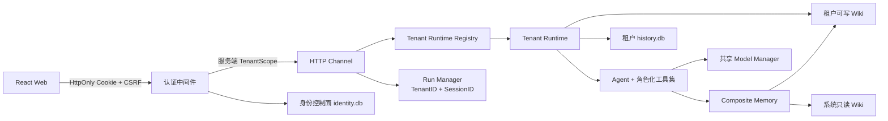
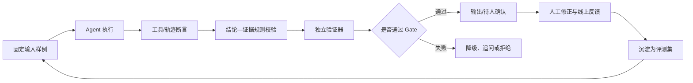

# 客户需求分析智能体统一优化、修复与演进文档

> 更新日期：2026-08-19  
> 源码基线：`feature/multi-tenancy` 当前工作区  
> 文档定位：统一回答专家评审问题，记录当前 As-Built 架构、本轮已修复问题、暂缓范围、下一阶段计划与验收门禁  
> 优先级原则：先保证正确性、隔离性和可验证性，再扩展输入渠道与外部系统

## 1. 执行结论

项目已经具备“客户需求分析 Agent”的主体形态，不是简单的聊天页面：模型会在自主循环中选择工具，读取产品与客户记忆，提交结构化需求分析，主动追问缺失信息，并把消息、工具轨迹、Checkpoint 和客户上下文持久化。

当前最适合的产品定义是：

> **把零散的客户原话转化为可追溯的需求判断、产品匹配、能力边界和下一步行动，并把经确认的事实持续沉淀为租户私有的客户档案。**

现阶段不应继续横向铺开大量能力。本轮已经先修复会直接破坏多租户或数据安全的缺陷；下一阶段应集中完成“结论—证据—校验—人工确认—回归评测”的 Harness 闭环。

### 1.1 当前状态

| 能力               | 当前状态             | 结论                                                                         |
| ------------------ | -------------------- | ---------------------------------------------------------------------------- |
| 自主 Agent 循环    | 已实现并加固         | LLM → tool call → 执行 → 回填 → 无工具收敛；已有预算、缓存、超时和死循环保护 |
| 记忆管理           | 已实现               | System Wiki + Tenant Wiki + Checkpoint + History，属于项目加分项             |
| 注册、登录、多租户 | V1 主体已实现        | 中央身份控制面 + 每租户独立 SQLite/Wiki；本轮补齐关键越权缺陷                |
| 租户内 RBAC        | V1.1 已完成          | 平台/租户双层管理、用户与租户 CRUD、成员复用、工作空间切换及最后管理员保护  |
| 可信校验           | 有基础门禁，未完整   | 已校验产品存在性和 `memory_get` 前置，但尚无逐条结论证据账本与离线 Evals     |
| RAG                | 未接入，当前不需要   | 当前 377 个 Wiki 文件、约 4.1 MiB，确定性检索更适合现阶段                    |
| 文件上传           | **本阶段明确不实现** | 不建占位接口，不把未完成能力放入 Demo                                        |
| 录音/ASR           | **本阶段明确不实现** | 待文本可信闭环稳定后再评估                                                   |
| CRM                | **本阶段明确不实现** | 当前 Leads/CRM 类能力在多租户主装配中保持禁用，避免凭据和数据串租户          |

## 2. 专家问题的统一回答

### 2.1 Agent 体现在哪里：是不是“模型 + Skills”

不能只定义为“模型 + Skills”。当前项目中的 Agent 由以下七层共同组成：

| 层           | 作用                                       | 当前实现                                          |
| ------------ | ------------------------------------------ | ------------------------------------------------- |
| 模型层       | 生成、推理、Function Calling               | `internal/llm`、`internal/model`                  |
| 行为策略层   | 定义角色、边界、何时分析/追问/查证         | `prompts/system.md`、`internal/memory/assembler`  |
| 自主循环层   | 决定下一步调用什么工具并收敛               | `internal/agent`                                  |
| 工具层       | 检索、精读、观察、提交分析、追问、绑定客户 | `internal/memory/tools`、Agent 业务工具           |
| 记忆与状态层 | 长期 Wiki、短期 Checkpoint、完整历史       | `internal/memory/*`、`internal/history`           |
| 运行控制层   | Run、取消、SSE replay/live、迭代保护       | `internal/channel/http/runs.go`、`internal/agent` |
| 治理与验证层 | RBAC、审核门禁、证据校验、Evals            | 已有部分，Harness 是下一阶段重点                  |

项目当前**没有正式的可加载 Skills 运行时**。现有 `system.md` 是全局行为策略，工具是代码注册的能力。后续可以把“需求澄清、产品匹配、可行性判定、下一步建议”等稳定方法沉淀成带版本号的 Skills，但 Skills 不能代替：

- 工具执行层授权；
- 租户作用域；
- 输入输出 Schema；
- 证据与事实校验；
- 人工审核和审计。

推荐对外表达：

> **Agent = 模型 + 版本化业务方法 + 工具 + 记忆 + 状态 + 权限 + 证据 Harness。**

### 2.2 记忆库文件从哪里来

记忆必须区分“种子来源、运行时位置、归属和可信状态”：

| 记忆/数据                    | 来源                                          | 运行时位置                                  | 租户边界                               |
| ---------------------------- | --------------------------------------------- | ------------------------------------------- | -------------------------------------- |
| 产品、基础威胁/合规/行业知识 | 仓库 `wiki/` 种子；人工维护或历史系统知识迁移 | `<data_dir>/system/wiki/`                   | 平台只读共享，不含客户/使用者          |
| 租户行业补充                 | 人工录入或 Agent 观察后审核                   | `<data_dir>/tenants/<tenant_id>/wiki/`      | 租户独占                               |
| 客户画像                     | 当前租户的对话观察、人工编辑                  | 同上                                        | 租户独占；当前仍需补来源字段和冲突状态 |
| 使用者画像                   | 租户成员身份自动生成；本人/管理员维护          | 同上                                        | 租户 + `user_id`；登录时自动解析       |
| 短期记忆                     | 每轮分析生成的结构化 Checkpoint               | 租户 `history.db` + 运行时缓存              | 租户 + 会话 + 分支                     |
| 完整轨迹                     | 用户/Agent 消息、工具调用、分析结果           | `<data_dir>/tenants/<tenant_id>/history.db` | 租户独占；租户内共享读、本人或管理员写 |

后续每一条“可影响结论的知识”应增加以下元数据：

- `source_type`：官方文档、人工录入、客户原话、Agent 观察、系统迁移；
- `source_ref`：消息 ID、会话 ID、文档版本或人工操作者；
- `observed_at` / `valid_from` / `expires_at`；
- `created_by` / `approved_by`；
- `confidence`；
- `status`：observed、pending_review、verified、conflicted、archived。

### 2.3 “7 个工具”怎么分

7 个指的是**长期记忆工具**，不是 Agent 的全部工具。建议对外按四组解释：

| 分组 | 工具                                            | 目的                             | Agent 权限（本轮修复后）                     |
| ---- | ----------------------------------------------- | -------------------------------- | -------------------------------------------- |
| 发现 | `memory_search`、`memory_recall`、`memory_list` | 找候选、回忆相关内容、浏览目录   | 所有已认证租户成员可读                       |
| 精读 | `memory_get`                                    | 读取具体产品能力、边界和画像正文 | 所有已认证租户成员可读                       |
| 学习 | `memory_ensure`、`memory_observe`               | 建立/更新记忆、记录新观察        | 仅 owner/admin 的 Agent 轮次可用             |
| 治理 | `memory_delete`                                 | 删除客户类记忆                   | **不再暴露给模型**；只能通过显式人工管理接口 |

Agent 还有另一组业务与交互工具：

- `memory_get_many`：一次批量读取 1–8 个候选，减少多产品方案的串行取证；
- `analysis_submit`：提交结构化需求分析；
- `missing_answer`：记录已补全的信息；
- `history_search`：在当前用户可见会话内检索历史；
- `ask_user`：主动提出选项式追问并终止当前轮次。

客户归属不再交给模型临场猜测：新会话发送前由前端强制选择已有客户、登记新客户或明确选择“仅产品咨询”；后端只允许创建会话时绑定客户，已有会话不可跨客户改绑。`session_bind_customer` 仅保留历史兼容代码，不再向当前 Agent 暴露。

因此 Demo 中不应说“Agent 一共只有 7 个工具”，而应说“7 个长期记忆工具 + 分析/交互业务工具”。

### 2.4 下一步准备做什么

下一阶段只做四条主线：

1. 建立客户事实账本和结论—证据模型；
2. 建立 Harness/Evals，把每一步做成可自动验收的闭环；
3. 补齐多租户资源配额、备份恢复、运行时回收和可选邀请确认；
4. 重构结果页和 Demo，让价值从“看工具运行”变成“看证据如何形成销售行动”。

本阶段不实现文件上传、录音和 CRM，也不以 RAG 作为默认下一步。

### 2.5 当前为什么不接 RAG

当前知识库规模小、结构清晰，以产品、能力边界、威胁、合规和行业条目为主。确定性关键词/别名检索具有以下优势：

- 结果可解释；
- 容易做命中和零命中断言；
- 产品边界不容易被相似度“模糊带过”；
- 无需新增向量数据库、Embedding 成本和租户过滤风险。

只有离线检索评测证明以下指标持续不达标，才进入混合检索 ADR：

- Top-K 召回率；
- 产品别名/客户口语召回率；
- 零命中率；
- 错误产品召回率；
- 人工修正率。

即使未来引入 RAG，也必须保留 metadata 租户过滤、产品详情精读和证据门禁；RAG 不是隔离方案，也不是事实校验器。

### 2.6 如何验证“Agent 说得对不对”

Agent 不能仅靠“再思考一次”证明自己正确。应采用五层校验：

1. **Schema 校验**：必填字段、枚举、置信度范围、引用格式；
2. **确定性事实校验**：产品是否存在、是否读过详情、能力是否出现在已验证知识中；
3. **证据覆盖校验**：每条客户事实必须引用原始消息，每条产品主张必须引用知识条目；
4. **独立验证器**：使用独立 Prompt/模型检查矛盾、无依据主张和遗漏；验证器只能否决或降级，不能直接把自己的猜测写成事实；
5. **人工门禁**：高风险结论、受控知识修改、客户事实冲突和外部写操作由人确认。

## 3. 价值主线与 Demo 重构

### 3.1 价值起点

销售/售前面对的不是“缺一段 AI 总结”，而是：

- 客户原话分散、表述不专业；
- 产品能力与边界容易记错；
- 信息缺口在后期才暴露；
- 不同销售重复询问，客户上下文无法复用；
- 管理者看不到推荐依据，无法复盘。

### 3.2 价值重点

| 价值   | 用户得到什么                   | 产品如何证明                               |
| ------ | ------------------------------ | ------------------------------------------ |
| 提效   | 原话快速变成结构化需求与下一步 | 展示从输入到可用分析的时间与减少的整理步骤 |
| 降错   | 产品推荐带能力和边界依据       | 每条推荐可点回客户证据与产品知识           |
| 补全   | 主动发现关键缺失信息           | `ask_user` 追问被回答后，分析发生可见变化  |
| 沉淀   | 会话形成持续更新的客户档案     | 展示画像变更、来源和跨会话复用             |
| 可治理 | 管理者能审核、回放和定位问题   | 工具轨迹、证据矩阵、审核记录、评测结果     |

### 3.3 推荐 Demo 脚本

1. 输入一段包含业务目标、现状、模糊需求和缺失条件的真实客户文本；
2. Agent 先查证产品和客户历史，而不是立刻生成长文；
3. 结果页展示“已确认事实 / 推断 / 未知项”，每条可展开证据；
4. Agent 对一个会改变方案的关键未知项主动追问；
5. 用户回答后，只展示“新增事实”和“结论变化”；
6. 展示产品为何匹配、能力边界和不建议承诺的内容；
7. 展示客户画像产生一条待确认变更，而不是静默写入；
8. 最后用“下一步行动”收口：该问谁、补什么材料、是否需要售前介入。

## 4. 多租户 As-Built 架构

### 4.1 核心架构



### 4.2 不可破坏的不变量

- `TenantID` 只从服务端登录会话 + Membership 产生；不信任 Header、Query、Body 或 LocalStorage；
- 每租户有独立 `history.db` 和独立可写 Wiki；
- 系统层只共享产品和基础行业知识，不得包含客户/使用者；
- 所有 Run、任务、SSE、历史检索、工具执行都必须携带已验证作用域；
- 跨租户资源统一按不存在处理，避免泄露存在性；
- 租户内会话、客户画像和记忆共享读取；普通成员只能写本人会话，owner/admin 可维护本租户全部会话；
- 修改类 HTTP 请求校验 CSRF；Agent 工具执行层必须再次授权，不能只依赖前端或工具列表隐藏。

### 4.3 角色矩阵

| 能力                     | owner |        admin        | analyst | reviewer |              platform_admin              |
| ------------------------ | :---: | :-----------------: | :-----: | :------: | :--------------------------------------: |
| 创建分析/写本人会话      |  ✅   |         ✅          |   ✅    |    ✅    |            取决于租户成员身份            |
| 读取本租户全部会话       |  ✅   |         ✅          |   ✅    |    ✅    |           默认不可越入租户数据           |
| 修改/删除他人会话        |  ✅   |         ✅          |   ❌    |    ❌    |           默认不可越入租户数据           |
| 人工维护租户记忆         |  ✅   |         ✅          |   ❌    |    ❌    |           默认不可越入租户数据           |
| Agent 自动观察/写记忆    |  ✅   |         ✅          |   ❌    |    ❌    |         不以平台角色绕过租户角色         |
| 审核待审知识             |  ✅   |         ✅          |   ❌    |    ✅    |           默认不可越入租户数据           |
| 本租户成员管理           |  ✅   | 仅 analyst/reviewer |   ❌    |    ❌    | 可管理任意目标租户成员，但不获得业务 Scope |
| 本租户名称/Slug          |  ✅   |         ✅          |   ❌    |    ❌    |              可管理全部租户              |
| 平台模型、日志、用户 CRUD |  ❌   |         ❌          |   ❌    |    ❌    |                    ✅                    |

### 4.4 成员复用与工作空间切换语义

- 未注册邮箱：owner/admin 可创建账号并直接加入当前租户；
- 已注册邮箱：复用全局身份，只新增目标租户 Membership，不复制密码或用户资料；
- owner 可授予 owner/admin/analyst/reviewer；admin 只能添加、改动或移除 analyst/reviewer；
- 登录响应和 `/api/auth/me` 返回全部可用工作空间；`POST /api/auth/switch-tenant` 在服务端重新校验 Membership 后切换，并轮换 CSRF；
- 停用/删除租户不会出现在工作空间列表；登录会确定性跳过不可用租户；
- 移除成员、停用用户或停用租户立即废止受影响会话；最后可登录 owner 与最后 platform_admin 不可被停用、降级或删除；
- 成员确认邀请仍可作为后续增强，但不再是多 Membership 和安全切换的技术前置条件。

## 5. 本轮已修复问题

| 编号   | 问题                                                     | 修复                                                       | 验证                                   |
| ------ | -------------------------------------------------------- | ---------------------------------------------------------- | -------------------------------------- |
| FIX-01 | 同租户用户可用相同 `session_id` 改写 owner               | 新增原子作用域校验；已有会话绝不重写 owner；不可见统一 404 | History 单测 + HTTP 同租户成员负向测试 |
| FIX-02 | HTTP 有 RBAC，但 Agent 可调用全部 7 个记忆工具           | 工具定义按 `TenantScope` 最小化；执行层二次授权            | analyst 伪造写调用仍失败，manager 可写 |
| FIX-03 | 模型可调用 `memory_delete`                               | `memory_delete` 不再进入 Agent 工具集，执行层也拒绝        | 工具定义与伪造执行测试                 |
| FIX-04 | 运行中删除会话会留下后台写入                             | 活跃 Run 删除返回 409，要求先取消                          | 慢模型 HTTP 测试                       |
| FIX-05 | SystemStore 清理存在但启动绕过；通用检索可能带出示例客户 | 启动经 `SystemStore.Load`；Search/List/Get 增加纵深过滤    | 未调用 wrapper Load 的防御性测试       |
| FIX-06 | 注册没有独立限流；登录组合 Key 可被随机邮箱绕过          | 注册单 IP 限流；登录增加单 IP 总限流                       | 注册 429 测试                          |
| FIX-07 | JSON 请求体无统一上限                                    | 全局 1 MiB Body 限制，超限返回 413                         | HTTP 大 Body 测试                      |
| FIX-08 | 已有账号加入第二租户后无法确定切换                         | 返回工作空间列表；服务端校验切换并轮换 CSRF                | Identity + HTTP 双租户测试             |
| FIX-09 | CSRF 注释称常量时间，实际使用字符串比较                  | 改用 `subtle.ConstantTimeCompare`                          | auth/identity 回归测试                 |
| FIX-10 | 两个多租户 E2E 脚本密码超过后端 16 字符上限              | 统一为符合策略的测试密码                                   | 两个脚本直接运行通过                   |
| FIX-11 | 前端 Prettier 门禁失败，多个 Hook 有依赖告警             | 机械格式化；核心页面 `load` 使用稳定回调                   | format 通过，Hook warning 清零         |
| FIX-12 | 平台只有租户列表，缺少用户/租户/成员写操作               | 补齐平台用户、租户、目标租户成员 CRUD 与软删除             | Service + HTTP CRUD 测试               |
| FIX-13 | 同租户数据“共享”仅覆盖画像，普通成员看不到团队会话       | 会话改为租户共享读；本人或 owner/admin 才可改写             | History + HTTP 共享读/越权写测试       |
| FIX-14 | 停用 owner 仍被最后所有者计数，可能留下无人可管租户       | 最后 owner 只统计全局账号和 Membership 均 active 的用户     | 停用 owner 回归测试                    |
| FIX-15 | 非法角色/状态被管理接口错误映射为 500                    | 增加显式哨兵错误并统一返回 400                              | 平台 HTTP 负向测试                     |
| FIX-16 | 成员被降级/移除后，已启动 Run 仍持有旧角色快照           | Run 记录 actor；角色、账号、租户生命周期变更时主动取消      | RunManager 取消范围测试 + Race         |

### 5.1 底层 Agent 思考与调用优化（2026-08-19）

| 编号     | 优化点           | 运行时语义                                                                                                   |
| -------- | ---------------- | ------------------------------------------------------------------------------------------------------------ |
| AGENT-01 | 思维链保护       | 模型 `reasoning_content` 不再发送到前端或轨迹；只公开“理解需求、核对结论、整理结果”等阶段状态                |
| AGENT-02 | 中间草稿隔离     | 带 `tool_calls` 的模型轮次即使同时输出正文，也先缓冲且不展示，避免未经工具核验的草稿被当成最终结论           |
| AGENT-03 | 提交后冻结       | `analysis_submit` 首次通过后冻结结构化结果；下一次模型请求不再携带任何工具，只能整理最终回答                 |
| AGENT-04 | 终止式追问       | `ask_user` 一经执行，立即停止同一批次剩余工具，避免提问后继续发生写入副作用                                  |
| AGENT-05 | 工具预算         | 单轮最多 8 个、整轮最多 24 个工具调用；单个参数最多 32 KiB；整批先校验再执行                                 |
| AGENT-06 | 执行时间边界     | 单条用户消息总执行上限 5 分钟；单工具上限 20 秒；用户取消继续向下传播                                        |
| AGENT-07 | 只读结果缓存     | `memory_search/get/recall/list` 和 `history_search` 相同参数在本轮直接复用，并在工具轨迹标记“已复用本轮结果” |
| AGENT-08 | 分析不可重复覆盖 | 本轮已有成功分析时，后续 `analysis_submit` 被执行层拒绝                                                      |
| AGENT-09 | 流式调用重试     | 模型在尚未产生可见增量前失败，可按重试策略重试；产生内容后禁止 fallback，防止两份答案拼接                    |
| AGENT-10 | 路由一致性       | 每次调用深拷贝模型路由、fallback map/slice；配置热更新不会让正在执行的一轮中途漂移或产生数据竞争             |
| AGENT-11 | 模型级重试覆盖   | `models[].max_retries` 现在真正覆盖全局重试值，0 继续继承全局策略                                            |
| AGENT-12 | 审计准确性       | 每次流式尝试分别记录实际模型、成功/失败和是否 fallback，不再把备用模型错误记成 primary                       |

上述优化仍保留自主 Agent，而不是改成固定 Workflow：模型继续决定是否检索、精读、观察、追问或提交分析；底层只负责权限、预算、协议、证据门禁和收敛边界。

## 6. 仍需优化的问题

### 6.1 下一阶段 P0：可信分析闭环

1. 建立 `CustomerFact` 事实账本，不再让整份客户画像只有一段无来源 Markdown；
2. `analysis_submit` 输出改为逐条引用 `message_id/fact_id/knowledge_ref`；
3. 区分 `fact`、`inference`、`unknown`，推断不能自动晋升事实；
4. 产品能力与限制使用稳定 ID，不以标题字符串作为唯一证据；
5. 客户事实冲突进入 `conflicted`，由人确认而不是后写覆盖先写；
6. 增加规则校验器和独立验证器；
7. 失败必须可降级：证据不足时输出“不确定 + 需要补充什么”，不能补写幻觉。

建议最小数据模型：

```text
CustomerFact
  fact_id, tenant_id, customer_id, field, value
  source_kind, source_ref, observed_at
  confidence, status, created_by, approved_by

AnalysisClaim
  claim_id, session_id, run_id, kind
  statement, confidence, evidence_refs[]
  validator_status, validator_reasons[]
```

### 6.2 下一阶段 P0：Harness 闭环

每一步都要满足“输入、输出、校验、失败处理、指标、回归样例”六件套：



Harness 至少包含：

| 套件         | 核心断言                                                                 |
| ------------ | ------------------------------------------------------------------------ |
| Agent 自主性 | 闲聊不强制分析；真实需求会查证后提交；追问会终止当前轮次                 |
| 产品正确性   | 推荐产品存在；已读取详情；能力/限制有知识引用；虚构产品被拒绝            |
| 客户事实     | 每条事实有消息来源；推断不落 verified；冲突不静默覆盖                    |
| 工具策略     | 各角色只看到允许工具；伪造工具调用仍被执行层拒绝                         |
| 多租户       | A/B 同名客户、同 session、同标题、同任务不串；同租户普通成员不能互抢会话 |
| 故障恢复     | LLM 超时、工具错误、panic、取消、断线、重试不留脏状态                    |
| 回归基准     | 固定黄金样例比较证据覆盖率、错误主张率、追问质量和人工修正率             |

### 6.3 多租户产品化 P1

- 租户级 Run 并发、Token、后台任务和磁盘配额；
- 全局公平队列，避免单租户耗尽模型资源；
- 租户冻结、导出、备份、恢复、删除状态机；
- Runtime 空闲回收和文件句柄治理；
- 可选邀请确认、成员接受/拒绝与邀请过期策略；
- 审计记录增加 tenant/user/session/run/tool/skill/model/version；
- Wiki 并发写原子化和版本冲突检测；
- PostgreSQL 演进触发条件与 RLS 设计，但当前不迁库。

### 6.4 前端交互 P1

在不增加文件上传、录音和 CRM 的前提下，优先优化：

- 结果页默认展示结论、证据、边界和行动，不默认展示长思考过程；
- “已确认事实 / 推断 / 未知”三栏；
- 每条产品推荐可展开产品能力和限制来源；
- 追问回答后高亮“本轮新增事实”和“结论变化”；
- 客户画像修改展示 diff、来源和确认按钮；
- 403、404、409、429、413 使用不同可操作文案；
- 运行中删除按钮改为“先停止分析”，与后端 409 语义一致；
- 成员页区分“添加已有账号”和“新建账号”，并明确 owner/admin 的可分配角色；
- 大型 Markdown/Mermaid 组件继续按需加载，后续拆分约 961 KiB 的主渲染 chunk；
- 增加前端组件测试和至少一套浏览器 E2E，目前前端没有自动化测试文件。

## 7. 明确暂缓范围

### 7.1 文件上传

本阶段不实现上传 API、附件表、对象存储、解析队列或 UI 占位按钮。重新启动该能力前必须先确定：文件大小/类型白名单、病毒扫描、租户存储配额、解析器沙箱、附件生命周期和证据定位格式。

### 7.2 录音

本阶段不实现录音控件、音频上传、ASR、说话人分离或时间戳对齐。重新启动前必须先验证文本分析 Harness，并设计录音同意、隐私、保留周期和转写证据引用。

### 7.3 CRM

本阶段不实现 CRM OAuth、租户连接、字段映射、自动回写或同步任务。现有 Leads/外部商机能力继续在多租户主装配中禁用。重新启动前必须具备租户专属凭据、外部 ACL、幂等写入、字段级审计和人工确认。

### 7.4 RAG

本阶段不引入向量库。先完成检索评测；只有确定性检索在真实样例上不足，才以 ADR 形式决定是否增加 BM25/向量混合召回。

## 8. 分阶段路线图

### Phase 0：隔离与工程修复（本轮完成）

- 会话接管、Agent 工具 RBAC、模型删除、运行中删除；
- SystemStore 私有类型过滤；
- 注册/登录限流和请求体限制；
- 成员复用、显式工作空间切换、用户/租户/成员 CRUD、CSRF 常量时间；
- 同一登录会话的多标签页稳定 CSRF，切换租户/恢复初始化时才轮换；
- 模型停用开关真实生效，OpenAI Responses 推理摘要与最终答复隔离；
- 配置保存改为“校验 → 原子落盘 → 热切换”，失败不再污染内存 Registry/Router；
- Go 运行时提升到 1.26.6，前端路由/Vite 升级并清零可达依赖漏洞；
- E2E 密码和前端格式/Hook 门禁。

出口：本节第 9 章中的现有自动化验证全部通过。

### Phase 1：可信分析 Harness（下一步）

- CustomerFact 与 AnalysisClaim；
- 逐条证据引用；
- 规则校验器 + 独立验证器；
- 黄金样例集、隔离矩阵、失败降级；
- 证据型结果页和价值 Demo。

出口：产品主张支持率、事实证据覆盖率、错误主张率和人工修正率可自动统计；无证据结论不会进入 verified 输出。

### Phase 2：多租户产品化

- 可选邀请确认、成员接受/拒绝与过期治理；
- 配额、公平调度、审计、生命周期、备份恢复；
- Runtime/Wiki 并发治理；
- 浏览器级跨账号缓存隔离测试。

出口：成员生命周期、资源治理、恢复演练和跨租户攻击矩阵通过后，才称为“可运营多租户试点”。

### Phase 3：扩展能力重新评审

只有 Phase 1、2 达标后，才分别重新立项文件上传、录音和 CRM；三者独立评审、独立验收，不捆绑上线。RAG 由检索指标触发，不按功能清单触发。

## 9. 本轮验证结果

| 验证项                                 | 结果     | 说明                                                                    |
| -------------------------------------- | -------- | ----------------------------------------------------------------------- |
| `go test ./...`                        | 通过     | 包括 Agent、用户/租户/成员 CRUD、工作空间切换、共享读和跨租户负向用例 |
| `go vet ./...`                         | 通过     | 无输出                                                                  |
| `go test -race -count=1 ./...`         | 通过     | Go 1.26.6；HTTP 85 秒、identity 51 秒，无数据竞争                       |
| `golangci-lint v2.12.2`                | 0 issue  | gofmt、staticcheck、unused、errcheck 等全部清零                          |
| `govulncheck v1.7.0 ./...`             | 0 可达   | Go 1.26.6；依赖模块另有 1 条不可达告警                                  |
| `actionlint .github/workflows/ci.yml`  | 通过     | CI Action 与 YAML 语义校验通过                                          |
| `bash scripts/e2e-multitenant.sh`      | 38/38    | 双租户注册、CSRF、会话、记忆、任务和跨租户 404                          |
| `bash scripts/e2e-legacy-migration.sh` | 20/20    | Legacy 租户、身份引导、历史与 Wiki 迁移                                 |
| 浏览器 E2E                             | 通过     | 普通/平台管理员导航、成员、租户、用户、记忆、设置、观测台与路由保护    |
| `npm ci` + TypeScript + ESLint         | 通过     | 使用与 CI 一致的 npm clean install；ESLint 0 error / 0 warning          |
| `npm run format:check`                 | 通过     | 全部文件符合 Prettier                                                   |
| `npm run build`                        | 通过     | React Router 7 + Vite 6；仍有 Mermaid/Markdown 大 chunk 性能告警        |
| `npm audit --audit-level=moderate`     | 0 漏洞   | 原 4 条 Vite/React Router 漏洞已清零                                    |
| 浏览器控制台                           | 0 告警   | 登录、普通租户、平台管理和退出流程均无 warning/error                    |
| `git diff --check`                     | 通过     | 无空白错误                                                              |

注意：`go test ./...` 仍会发现 `frontend/node_modules/flatted/golang/pkg/flatted`，说明 Go 包发现范围受前端依赖目录影响；建议后续把前端依赖移出 Go workspace 扫描路径或在 CI 中显式列出后端包。

### 9.1 新会话客户登记与 Agent 专项回归（2026-08-19）

本轮使用平台管理员在浏览器中连接到独立的数据副本实例，未修改 8080 上的现有运行数据。先验证客户登记链路，再把专家给出的 16 条问题逐条发起真实 Agent 对话；复杂用例按 4 个并发会话分批执行。

已完成的代码修复：

- 新会话发送前强制选择“已有客户 / 登记新客户 / 仅产品咨询”；登记字段包含客户名称、行业、规模、已有安全建设和背景备注；
- 新增租户成员可用的 `POST /api/customers` 最小权限接口：只能在当前租户创建客户、同名返回 409，不能覆盖画像或写其他记忆类型；
- 会话客户只允许首轮绑定；HTTP 客户参数和 Agent 兼容绑定均不能把已有会话改挂到另一客户；
- System Wiki 每次启动同步版本化种子；同名知识冲突时优先产品线深目录权威页，修复旧“谛听=NDR”覆盖新版“谛听=蜜罐/欺骗防御”的问题；
- 新增 `memory_get_many`，并加入查证 Harness：候选定位最多 3 次、详情读取最多 5 次，超限工具会被隐藏/拒绝并要求立即收敛；
- `analysis_submit` 新增可行性一致性门禁：SaaS、全套、免费试用、微信群、多租户、竞品等核心条件仍未证实时，不允许提交 `direct`；
- 友商事故只允许按“据客户反馈的本次个案”表达；具体攻击样本没有复测时必须建议 POC，不得承诺一定拦截；
- 模型单次返回空内容时自动重试一次，修复 MSS 用例直接展示内部错误的问题。

浏览器问题集结论：

| # | 用例 | 复测结论 |
| ---: | --- | --- |
| 1 | 等保三级全套 | 长亭自有产品与测评机构/伙伴边界分开；整体为 `partner`，不再承诺“一家全包” |
| 2 | 长亭蜜罐 | 正确匹配谛听 D-Sensor；明确其为欺骗防御，不是 NDR |
| 3 | 急购 WAF | 匹配雷池；先确认吞吐/部署/20 或 30 系，价格与试用未证实 |
| 4 | MDR 免费试用 | 未发现独立 MDR 与免费试用政策；只给潜在产品组合并要求产品线确认 |
| 5 | 友商 WAF 漏拦 XSS | 匹配雷池，但友商信息标成客户个案；要求用原始 payload 做 POC |
| 6 | AI 代码扫描 | 区分 MonkeyScan、慧鉴、码力三种定位 |
| 7 | 安全运营平台 | 区分万象 SOC/SIEM 底座与万象 AISOC 智能运营能力 |
| 8 | 数据防泄露 | 匹配端点侧 DDR；网络/网关型 DLP 明确为未覆盖/需确认 |
| 9 | AI 研判 + 运营 + 微信群 | 匹配万象 AISOC；微信群只证实到 Webhook，整体降为 `custom` |
| 10 | 现有五产品做 AI 自动研判 | 给出万象 AISOC 建议架构；“拥有产品”不再等同“已经接入联动” |
| 11 | 资产暴露面扫描 | 主推云图 ASM，洞鉴/鉴微作为漏洞检测与运营补充 |
| 12 | MSS 与传统服务对比 | 区分万象 AISOC 平台与 MSS 服务；服务 SLA/驻场口径未证实，判 `custom` |
| 13 | 云上多租户 NDR | 正确匹配全悉 T-ANSWER；多租户隔离、SaaS/计费未证实，判 `custom` |
| 14 | 漏扫不限 IP 次数 | 明确知识库未证实授权口径，不做“不限 IP”承诺 |
| 15 | 主机安全与 RASP | 牧云覆盖主机侧；RASP 无对应产品证据，整体判 `partner` |
| 16 | SaaS 大模型安全围栏 | 守元能力匹配；当前只证实私有化部署，标准 SaaS 需确认，判 `custom` |

该轮浏览器结果的工具调用量为 2–12 次/用例；原 NDR 冲突用例曾达到 15 次并耗时约 2.5 分钟，加入 Harness 后不再无限改写检索词。仍需在 Phase 1 增加逐条 Claim→Evidence 引用和离线黄金集评分，才能把“回答看起来合理”升级为可量化的事实正确率。

## 10. 试点验收标准

只有同时满足以下条件，才能把项目定义为“可信的多租户客户需求分析智能体试点版”：

1. TenantID 只由服务端可信身份产生；
2. 会话、消息、工具、Checkpoint、客户画像、审核、任务和缓存都通过跨租户负向测试；
3. 同租户成员可共享读取团队会话，但普通成员不能接管、修改、删除或取消他人会话；
4. Agent 工具在定义层和执行层都遵守角色策略；
5. 模型不能执行删除类高风险操作；
6. 每条客户事实和产品主张具有可定位证据；
7. 证据不足、冲突或验证失败时系统会追问、降级或拒绝；
8. 注册、登录、请求体、Run、任务和 Token 有明确上限；
9. 关键操作有租户化审计，备份恢复完成演练；
10. Demo 能清楚展示“客户原话 → 需求判断 → 产品依据/边界 → 追问 → 下一步行动 → 可确认沉淀”的价值链。

## 11. 文档治理

本文件作为当前优化工作的统一入口。以下文档保留为详细设计或历史审查输入，不再单独代表当前完成状态：

- `docs/multi-tenant-design.md`：多租户详细设计；
- `docs/backend-agent-multitenancy-optimization-review.md`：后端与多租户源码审查；
- `docs/full-stack-agent-source-optimization-review.md`：前后端全栈审查；
- `docs/expert-feedback-optimization-plan.md`：专家反馈的产品与 Demo 方案；
- `docs/plantree/**`：历史 ADR 和阶段计划，其中旧的 de-tenancy/单租户结论已被当前多租户 V1 替代。

后续每次阶段完成只更新三类状态：本文件的 As-Built、对应 ADR、自动化验收结果，避免“方案写了但代码未实现”或多份文档相互矛盾。
