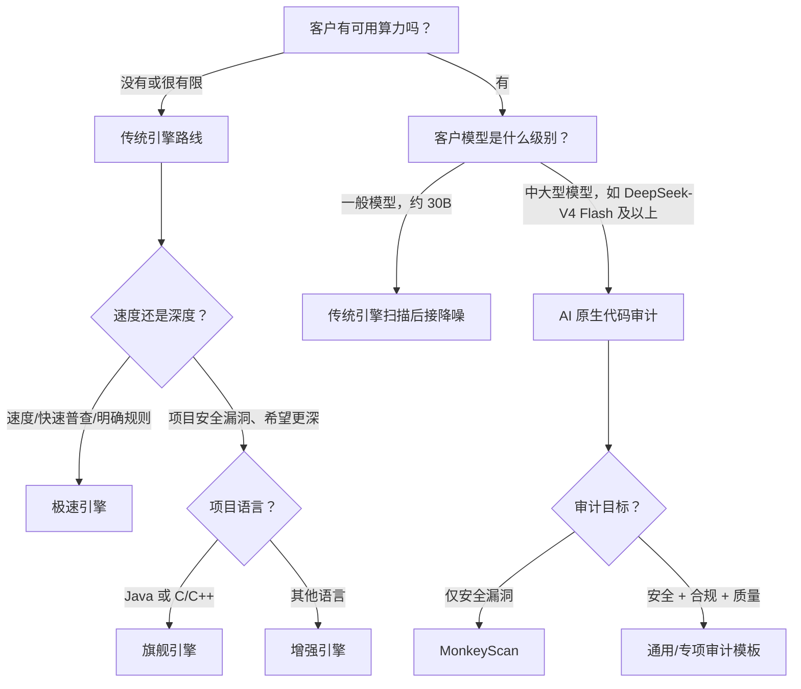

# 慧鉴六大引擎前场选型指南

> 本材料用于售前、销售、渠道和客户交流。核心原则：**先判断客户算力，再判断审计目标，最后结合语言和速度/深度要求选引擎。**

## 先记住这一句话

慧鉴可以按两条并列的能力路线理解：

- **传统引擎**负责建立稳定、规模化、可追溯的 SAST 检测基线：找得快、找得稳、证据清楚。
- **AI 引擎**直接利用模型、上下文和 Agent 能力开展 AI 原生代码审计：既可以独立发现代码问题，也可以在需要时协同传统扫描结果。

其中，**降噪引擎**是 AI 路线中面向已有扫描告警的协同能力；**通用/专项审计引擎**和 **MonkeyScan** 则是直接面向代码开展 AI 原生审计，不以传统 SAST 结果作为前置条件。

## 一、六个引擎分别解决什么问题

| 家族 | 引擎 | 前场定位 | 核心特点 | 最适合的客户问题 |
| --- | --- | --- | --- | --- |
| 传统 | 极速引擎 | 速度优先 | 基于规则匹配和轻量语义，启动快、覆盖广，但深度相对有限 | “我想尽快扫一遍”“我有明确模式要查”“没有完整构建环境” |
| 传统 | 增强引擎 | 均衡深度 | 基于编译技术，对覆盖语言做更深分析，可跟踪数据流 | “我希望多语言项目发现更多、更准的安全漏洞” |
| 传统 | 旗舰引擎 | 深度优先 | 针对 Java 和 C/C++ 做专项优化，结合控制流/数据流进行深度分析 | “这是核心系统，想把复杂漏洞尽量找全、找准” |
| AI | 降噪引擎 | 结果增强 | 扫描之后对 SAST 告警做 AI 验证，降低误报、提升告警可用性，算力要求相对较低 | “传统扫描结果太多，研发不知道哪些真的要修” |
| AI | 通用引擎 / 专项审计引擎 | 范围优先 | 模板驱动、AI 原生；除安全外，还能审合规、开发规范、代码质量等 | “我希望按自己的标准审安全、质量和合规” |
| AI | MonkeyScan 引擎 | 安全深挖 | 面向安全漏洞挖掘做深度 Agent 优化，主动检索和验证业务逻辑 | “我只关注安全漏洞，尤其是传统规则难覆盖的深层问题” |

### 两个容易混淆的区别

**增强 vs 旗舰**：增强是更通用的传统深度分析能力；旗舰是针对 Java、C/C++ 等重点语言做的专项深度优化。语言和工程形态才是第一判断条件。

**降噪 vs AI 原生审计**：降噪以已有 SAST 告警为起点，主要回答“这条告警是真的吗”；通用/专项审计和 MonkeyScan 可以直接读取代码和上下文，主要回答“代码里还有哪些值得关注的问题”。后两者不是传统扫描结果的后处理，而是独立的 AI 原生审计路径。

## 二、前场三问：按这个顺序选

### 第一问：客户有没有算力？

#### 客户没有算力，或者不允许在本地部署模型

优先推荐传统引擎：

1. **速度要求高，或目标非常明确**：选极速引擎，例如检查某个 API、某种配置写法、某类敏感函数是否被使用。
2. **目标是项目级安全漏洞发现**：Java、C/C++ 优先旗舰；其他语言优先增强。

极速引擎还可以配合 AI 生成客户专属规则，再快速扫描多个项目，适合作为“先建立覆盖面”的切入方案。

#### 客户有算力

- **一般模型（例如 30B 左右）**：建议“传统引擎扫描 + 降噪引擎”。传统引擎负责规模化发现，降噪负责对结果二次判定。
- **中大型模型（例如 DeepSeek-V4 Flash 及以上，或同等能力）**：推荐 AI 原生代码审计。它可以直接从仓库上下文、业务流程和跨模块关系中发现深层问题，不需要先有传统引擎告警。

> 模型级别只是沟通时的经验分档，实际效果还取决于显存、并发、上下文长度、代码规模和部署方式，不要仅凭参数量承诺检出率。

### 第二问：客户审计目标是什么？

| 客户目标 | 首选能力 | 典型说法 |
| --- | --- | --- |
| 只想确认已有扫描告警是否真实 | 降噪引擎 | “先把误报压下去，让研发看到的都是更值得处理的告警。” |
| 只关注安全漏洞，尤其是业务逻辑和复杂调用链 | MonkeyScan | “让 AI Agent 围绕安全目标主动找证据、追路径、做验证。” |
| 安全之外，还要检查合规、规范、质量或企业内部要求 | 通用/专项审计引擎 | “把客户自己的审计标准写成模板，模板驱动 AI 原生审计。” |

### 第三问：传统路线下，项目是什么语言？

| 项目情况 | 推荐 | 原因 |
| --- | --- | --- |
| Java、C/C++ 核心项目，追求深度和准确性 | 旗舰引擎 | 专项优化更充分，适合复杂控制流、数据流和框架语义。 |
| Python、Go、JavaScript/TypeScript、C# 等其他语言的项目级安全扫描 | 增强引擎 | 兼顾编译技术、数据流深度和语言覆盖。 |
| 多语言普查、提交门禁、快速反馈、明确规则 | 极速引擎 | 工程准备成本低，反馈速度快，适合先覆盖再深入。 |

## 三、给客户的推荐方案

### 方案 A：无算力客户的传统扫描方案

**基础版：极速引擎**

- 适合快速扫描和多项目普查。
- 适合客户有明确检查目标，需要快速定制规则。
- 适合作为研发提交阶段、日常门禁或首次试用入口。

**深度版：增强/旗舰引擎**

- 适合项目级安全漏洞发现和发布前审计。
- Java、C/C++ 选择旗舰；其他语言选择增强。
- 需要说明：深度分析通常需要更完整的源码、依赖和构建上下文。

### 方案 B：一般模型客户的“传统 + 降噪”方案

1. 用极速、增强或旗舰引擎完成传统扫描。
2. 将扫描结果交给降噪引擎做快速或深度验证。
3. 输出更聚焦的真实风险、误报建议、置信信息和分析说明。

它既可以赋能慧鉴自己的 ASR 结果，也可以对接传统客户已有的 ASR 结果。这里的降噪是“传统扫描 + AI 研判”的组合方案；如果客户要直接让 AI 审代码，应进入下一节的 AI 原生审计方案。

### 方案 C：中大型模型客户的 AI 原生审计方案

**安全漏洞专项：MonkeyScan**

- 目标是提升安全漏洞的检出率和检测深度。
- 重点覆盖传统规则不容易表达的业务逻辑、间接调用、跨模块关系和上下文约束。

**安全、合规、质量一体化：通用/专项审计引擎**

- 先把客户的审计目标写成模板：开发规范、数据保护要求、行业合规条款或内部编码标准。
- 再用模板驱动 AI 原生审计，输出结构化问题、证据、严重性和改进建议。
- 优点是灵活度高，适合需要“按客户标准审”的项目。

## 四、组合打法：两条路线可以并行组合

| 阶段 | 推荐组合 | 价值 |
| --- | --- | --- |
| 提交/日常开发 | 极速引擎 | 快速反馈，尽早拦截常见问题。 |
| 版本基线/安全验收 | 增强或旗舰引擎 | 做更深、更完整的传统安全基线。 |
| 扫描后集中研判 | 降噪引擎 | 优先把告警变得可信、可处理。 |
| 重点系统/疑难问题 | MonkeyScan | 独立读取代码并对安全漏洞做 Agent 深挖。 |
| 合规、质量、企业规范 | 通用/专项审计模板 | 独立读取代码，把客户标准转成可复用 AI 审计资产。 |

> **传统引擎做确定性基线，AI 原生引擎直接审代码；降噪是传统结果与 AI 能力的协同入口。**
>
> 进一步记忆：**极速做广度，增强/旗舰做传统深度，降噪做告警研判，MonkeyScan 做安全深挖，通用审计做标准扩展。**

## 五、前场话术速查

### 客户说“我们没有 GPU，AI 用不了”

> 不影响先落地。先按语言和目标选择极速、增强或旗舰引擎建立传统检测基线；如果后续希望减少误报，再接入低算力的降噪能力，不需要一开始就上完整的 AI 原生审计。

### 客户说“我们有大模型，为什么还需要传统引擎”

> 传统引擎和 AI 原生审计是两条并列路线：传统引擎适合规模化、确定性和可追溯的基线检测，AI 适合直接理解代码上下文并做开放式推理。两者可以组合，但 AI 原生审计本身不依赖传统告警；传统结果主要作为降噪和重点复核的输入。

### 客户说“MonkeyScan 和专项审计有什么区别”

> MonkeyScan 是安全漏洞方向的专用 Agent，目标是把安全漏洞挖得更深；通用/专项审计是模板驱动的通用能力，除了安全，还能审合规、规范和代码质量。一个偏安全深挖，一个偏审计范围和灵活度。

### 客户问“旗舰是不是所有语言都应该选”

> 不是。旗舰的优势在重点语言的专项深度优化。Java、C/C++ 核心项目优先旗舰；其他语言做深度项目扫描时优先增强；如果更看重速度和覆盖面，则优先极速。

## 六、边界与承诺口径

- 不要把极速引擎说成“只做关键字搜索”；更准确的说法是规则匹配和轻量语义分析，但不要承诺它等同于旗舰引擎的完整工程语义。
- 不要把降噪说成“重新扫描全仓库”，它的首要职责是对已有 SAST 结果做 AI 研判。
- 不要把 AI 原生审计说成“必然发现所有业务漏洞”。应强调它对上下文、模板、模型能力和代码可读性敏感，适合重点系统和深度审计。
- 不要只用模型参数量承诺效果；应同时确认部署算力、并发、上下文窗口、代码规模和客户数据边界。
- 具体语言支持、引擎名称、交付版本和部署限制，以当前版本的产品清单、软硬件支持清单及任务入口为准。

## 七、最短决策卡

> **没算力**：速度要快选极速；要深度，Java/C++ 选旗舰，其他语言选增强。 
> **有一般模型**：传统引擎扫描后接降噪。 
> **有中大型模型**：只审安全选 MonkeyScan；还要审合规/质量就用通用或专项模板。 
> **客户拿不准**：先明确客户要“传统确定性检测”还是“AI 原生审计”；传统路线可用极速/增强/旗舰分层，AI 路线按算力和目标选择降噪、MonkeyScan 或通用/专项模板。

---

*版本说明：本文按前场沟通口径整理。若“增强/旗舰”在具体交付版本中对应不同的产品枚举或语言范围，请以该版本界面和交付清单为准。*
