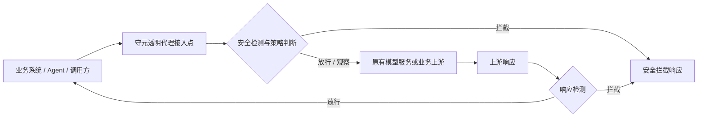
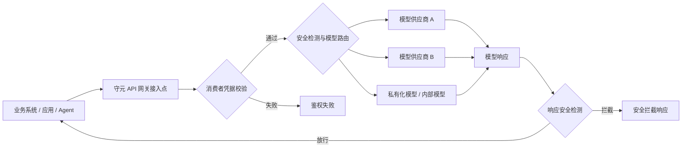
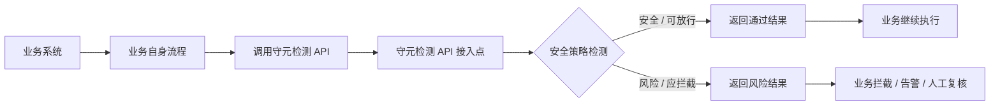
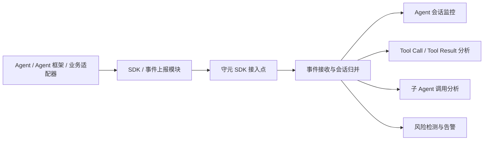

# 守元接入点部署架构与配置说明

> 本文融合守元接入点功能使用说明和部署架构说明，用于完整说明守元“接入点”功能的实现原理、适用场景、部署后的链路形态、页面操作方式和配置建议。本文基于当前 demo 环境与代码实现整理，截图来自 demo 环境，页面中的示例数据仅作说明，实际配置以客户环境为准。

---

## 一、接入点功能概述

“接入点”是守元对外承接流量、检测请求和 Agent 运行事件的统一入口。管理员可以在一个页面中配置不同类型的接入方式，让业务系统、Agent、模型调用方或已有 LLM 流量接入守元，并按策略完成安全检测、流量转发、模型路由或运行事件上报。

从功能上看，接入点解决的是：

> 外部系统如何把流量、检测请求或 Agent 运行事件接入守元。

从部署架构上看，不同接入类型的差异不只是页面配置项不同，更重要的是守元在客户链路中的位置不同。

当前接入点支持 4 种接入类型：

1. **透明代理**
2. **API 网关**
3. **检测 API**
4. **SDK 接入**

这 4 类接入点都可以在 **流量接入 > 接入点** 页面统一查看、筛选、启停、编辑和删除。


---

## 二、四种接入类型总览

### 2.1 功能总览

| 接入类型 | 核心作用 | 典型使用对象 | 主要特点 |
| --- | --- | --- | --- |
| 透明代理 | 接管已有 LLM 或业务流量，在转发过程中完成检测 | 已有模型调用链路、已有业务网关 | 需要配置上游地址、解析器和转发检测策略 |
| API 网关 | 对外提供统一模型调用入口，并按模型路由到上游 | 多模型接入平台、统一模型网关 | 固定暴露 OpenAI / Anthropic 等兼容路径，调用方使用守元入口访问模型 |
| 检测 API | 将守元作为独立安全检测服务调用 | 业务系统、网关、应用后端 | 外部系统主动提交待检测内容，守元返回检测结果 |
| SDK 接入 | 接收 Agent 运行事件，用于会话监控和 Agent 安全分析 | Agent SDK、Agent 框架、业务适配器 | 适合采集 Agent 会话、模型调用、Tool Call、子 Agent 调用等运行过程 |

### 2.2 部署位置总览

| 接入类型 | 部署位置 | 守元承担的角色 | 典型链路 |
| --- | --- | --- | --- |
| 透明代理 | 原有业务 / 模型入口前方 | 流量代理、安全检测、转发控制 | 调用方 → 守元 → 原上游 |
| API 网关 | 模型调用统一入口 | 模型网关、路由、安全检测、鉴权 | 调用方 → 守元网关 → 多个模型供应商 |
| 检测 API | 业务系统旁路调用 | 独立安全检测服务 | 业务系统 → 守元检测 API → 返回检测结果 |
| SDK 接入 | Agent / SDK 事件上报侧 | Agent 运行事件接收、会话监控、安全分析 | Agent → 守元 SDK 接入点 |

新增接入点时，可以在“接入类型”中选择对应类型。


---

## 三、透明代理

### 3.1 功能定位

透明代理用于把守元部署在已有流量链路中间。外部请求先进入守元，守元完成请求解析、安全检测、策略判断后，再根据配置转发到真实上游。

可以理解为：

> 业务方仍然按原来的方式调用模型或业务接口，只是中间多了一层守元进行安全防护和审计。

### 3.2 部署后架构

透明代理部署完成后，守元处在“调用方”和“原有上游”之间，既可以检测请求，也可以检测响应。



透明代理会重点处理：

- 入口监听地址；
- 上游转发地址；
- 请求和响应内容解析；
- 用户识别；
- 源 IP 获取；
- 检测策略；
- 转发绕过和检测绕过；
- TLS 证书；
- 超时和上下文长度等检测参数。

### 3.3 适用场景

透明代理适合以下场景：

- 客户已经有现成的 LLM 调用入口，希望在不大幅改造业务的前提下接入安全检测；
- 需要对请求和响应双向检测；
- 需要将流量转发到指定上游；
- 需要根据请求内容、响应内容和策略执行放行、观察或拦截；
- 需要对已有站点或模型入口做安全加固；
- 需要兼顾转发、检测、绕过控制和 TLS 管理；
- 需要对现有请求做统一接管，但不想重构业务代码。

典型客户场景：

> 企业已有内部大模型网关或业务服务，不希望业务方大规模改代码，只希望把流量先经过守元进行安全检测，再转发到原来的模型服务。

### 3.4 使用说明

透明代理与其他三类接入点相比，配置项更多，因为它不仅要定义入口，还要定义流量如何转发、如何解析、如何检测。

常见配置项包括：

- **监听域名/端口**：守元对外暴露的入口；
- **监听路径**：该接入点接收请求的路径；
- **上游配置**：真实转发目标，包括上游域名、路径和上游凭据；
- **用户识别类型 / 用户识别键**：用于识别请求来源用户；
- **源 IP 获取方式**：用于获取真实客户端 IP；
- **请求内容提取方式**：用于从请求中提取需要检测的内容；
- **响应内容提取方式**：用于从响应中提取需要检测的内容；
- **防护策略**：命中风险后的检测与处置规则；
- **检测上下文长度**：检测时保留的上下文轮次；
- **单次送检长度**：长内容拆分送检的长度；
- **检测超时时间**：检测流程等待结果的最长时间；
- **转发 Bypass / 检测 Bypass / 自动 Bypass**：用于特殊场景下绕过转发或检测；
- **先转发再检测**：用于特定业务链路下调整检测和转发顺序；
- **启用代理 / 代理地址**：用于配置请求转发时的代理能力。

需要注意的是，透明代理虽然在界面上归入“接入点”统一管理，但它更接近传统站点 / 转发配置能力，核心是“接管已有流量并转发到上游”。

### 3.5 操作步骤

1. 进入 **流量接入 > 接入点**。
2. 点击右上角 **新增接入点**。
3. 在 **接入类型** 中选择 **透明代理**。
4. 填写 **名称**。
5. 配置 **监听域名/端口** 和 **监听路径**。
6. 如需 HTTPS 入口，勾选 **设置 TLS 证书** 并上传证书和私钥。
7. 在 **转发与检测** 区域配置：
   - 上游地址；
   - 上游路径；
   - 上游凭据；
   - 用户识别方式；
   - 请求 / 响应解析器；
   - 检测策略。
8. 选择请求 / 响应内容提取方式。
9. 选择防护策略，并按需调整上下文长度、检测超时、Bypass 等参数。
10. 根据需要开启转发绕过、自动绕过或先转发再检测。
11. 点击 **确定** 保存。
12. 保存后，可在接入点列表中启用、禁用、编辑或复制调用命令。
13. 在业务侧将调用入口调整为守元透明代理入口。

### 3.6 配置完成后的调用方式

业务方通常只需要把原来的调用地址替换为守元接入点地址。对于调用方而言，整体使用方式接近原有模型或业务接口。

透明代理列表页中的 **复制 curl 命令** 会按该接入点的监听地址和路径生成示例。典型形式为：

```bash
curl -X POST 'http://<接入点地址>/<监听路径>' \
  -H 'Authorization: Bearer <UPSTREAM_API_KEY>' \
  -H 'Content-Type: application/json' \
  -d '{"model":"gpt-4o","messages":[{"role":"user","content":"你好"}]}'
```

### 3.7 注意事项

- 透明代理需要配置上游，否则流量无法正常转发；
- 请求 / 响应解析方式会影响检测内容提取，应根据实际协议选择；
- Bypass 相关配置会影响检测效果，生产环境需谨慎开启；
- 如果开启 TLS，需要确保证书和私钥匹配；
- 透明代理适合接管已有流量，不适合替代独立检测 API 或 Agent 事件上报入口。

---

## 四、API 网关

### 4.1 功能定位

API 网关类型用于把守元作为统一的大模型访问入口。调用方访问守元提供的模型 API，由守元根据请求中的模型信息路由到对应上游。

可以理解为：

> 调用方不直接面对多个模型供应商，而是统一调用守元；守元负责模型入口、安全检测、鉴权和上游路由。

### 4.2 部署后架构

API 网关部署完成后，守元承担“统一模型网关”的角色，对外提供固定模型 API 路径，并在内部完成消费者鉴权、模型路由、安全检测和访问控制。



API 网关类型会固定暴露一组模型兼容路径，例如：

- `/v1/chat/completions`
- `/v1/messages`
- `/v1/responses`
- `/v1/models`

这些路径不需要用户手动逐个配置，页面中会以只读标签展示。


### 4.3 适用场景

API 网关适合以下场景：

- 企业希望统一模型调用入口；
- 有多个模型供应商或多个内部模型；
- 不希望业务方直接持有真实上游模型 Key；
- 需要统一管理模型供应商、模型路由、消费者和接入凭据；
- 需要对不同业务方的模型调用做安全检测和审计；
- 需要兼容 OpenAI / Anthropic 等主流模型调用格式；
- 需要按消费者、应用或部门管理调用权限。

典型客户场景：

> 企业内部有多个业务团队都要调用模型，希望统一走一个安全网关，由守元统一管理模型、凭据、消费者和安全策略。

### 4.4 使用说明

API 网关接入点的重点不是配置转发路径，而是配置“该网关对外提供哪些模型”。

页面中主要配置项包括：

- **名称**：接入点名称；
- **监听域名/端口**：对外服务地址；
- **暴露路径**：系统固定展示，无需手动填写；
- **提供的模型**：选择该网关对外暴露的模型；
- **防护策略**：绑定模型调用安全检测策略；
- **高级配置**：如超时时间、全站 Bypass 等。

API 网关通常需要和以下能力配合使用：

- **模型供应商 / 上游模型配置**：定义模型实际转发到哪里；
- **消费者**：定义谁可以调用网关；
- **接入凭据**：定义调用方使用的访问 Key；
- **防护策略**：定义请求和响应如何检测与处置。

### 4.5 操作步骤

1. 进入 **流量接入 > 接入点**。
2. 点击 **新增接入点**。
3. 接入类型选择 **API 网关**。
4. 填写接入点名称。
5. 填写监听域名/端口。
6. 如需 HTTPS，配置 TLS 证书。
7. 查看页面展示的固定暴露路径。
8. 在 **网关路由** 中选择对外提供的模型。
9. 在 **安全检测** 中选择防护策略。
10. 如有需要，展开 **高级** 配置超时时间或全站 Bypass。
11. 点击 **确定** 保存。
12. 在消费者或接入凭据中，为调用方分配访问凭据。
13. 保存后，业务方可使用消费者接入凭据调用该网关入口。

### 4.6 调用说明

API 网关类型适合使用消费者凭据调用。列表页提供 **复制 curl 命令** 功能，可生成调用示例。

典型调用方式为：

```bash
curl -X POST 'http://<接入点地址>/v1/chat/completions' \
  -H 'Authorization: Bearer <CONSUMER_ACCESS_KEY>' \
  -H 'Content-Type: application/json' \
  -d '{"model":"gpt-4o","messages":[{"role":"user","content":"你好"}]}'
```

### 4.7 注意事项

- API 网关的对外路径是固定的，不需要手动逐个新增；
- API 网关需要至少选择一个对外提供的模型；
- 建议通过消费者和接入凭据管理调用方身份；
- 不建议让业务方直接持有真实上游模型 Key；
- 开启全站 Bypass 会影响检测效果，生产环境需谨慎。

---

## 五、检测 API

### 5.1 功能定位

检测 API 用于把守元作为独立检测服务调用。业务系统将待检测内容提交给守元，守元根据绑定的防护策略完成检测，并返回检测结果或处置建议。

可以理解为：

> 业务系统自己控制业务流程，只是在关键节点调用守元做安全判断。

### 5.2 部署后架构

检测 API 部署完成后，守元不直接接管完整流量链路，而是作为业务系统可调用的“安全检测能力”。业务系统在自己的流程中主动调用守元检测接口，守元返回检测结果或处置建议，业务系统再决定是否继续后续流程。



检测 API 的默认监听路径为：

```text
/v1/detect
```


### 5.3 适用场景

检测 API 适合以下场景：

- 客户已有自己的网关或业务服务，只希望调用守元检测能力；
- 需要在请求进入模型前做安全检测；
- 需要在模型输出返回用户前做安全检测；
- 需要把守元作为独立安全能力嵌入业务系统；
- 不需要守元负责完整流量转发；
- 希望由业务系统自己控制放行、拦截、告警或人工复核。

典型客户场景：

> 客户已有成熟业务平台，希望在“用户输入进入模型前”或“模型输出返回用户前”调用守元做一次安全检测，但整体业务流程仍由客户系统自己控制。

### 5.4 使用说明

检测 API 类型的配置项相对简单，重点是监听入口和检测策略。

主要配置项包括：

- **监听域名/端口**：检测 API 对外暴露的地址；
- **监听路径**：默认 `/v1/detect`，可在页面中查看；
- **防护策略**：检测 API 使用的安全策略；
- **检测上下文长度**：用于多轮检测场景；
- **检测异常处置**：检测异常时选择放行或拦截；
- **超时时间**：检测请求的处理超时时间；
- **全站 Bypass**：特殊情况下跳过检测，生产环境需谨慎。

检测异常处置包括：

| 选项 | 含义 | 适用情况 |
| --- | --- | --- |
| fail-open（放行） | 检测异常或超时时默认放行 | 更重视业务连续性 |
| fail-close（拦截） | 检测异常或超时时默认拦截 | 更重视安全性 |

### 5.5 操作步骤

1. 进入 **流量接入 > 接入点**。
2. 点击 **新增接入点**。
3. 接入类型选择 **检测 API**。
4. 填写接入点名称。
5. 填写监听域名/端口。
6. 如需 HTTPS，配置 TLS 证书。
7. 确认监听路径为 `/v1/detect`。
8. 选择防护策略。
9. 设置检测上下文长度。
10. 选择检测异常处置方式。
11. 如有需要，配置超时时间或全站 Bypass。
12. 点击 **确定** 保存。
13. 保存后，业务系统即可通过该接口提交待检测内容。

### 5.6 调用说明

列表页中的 **复制 curl 命令** 可生成检测 API 示例。典型调用方式为：

```bash
curl -X POST 'http://<接入点地址>/v1/detect' \
  -H 'Authorization: Bearer <ACCESS_KEY>' \
  -H 'Content-Type: application/json' \
  -d '{"record":true,"body":{"model":"gpt-4o","messages":[{"role":"user","content":"你好"}]}}'
```

### 5.7 注意事项

- 检测 API 不负责完整流量转发，业务系统需要自己处理后续流程；
- fail-open / fail-close 应根据业务连续性和安全要求选择；
- 如果客户希望“业务完全无感接入”，通常更适合透明代理；
- 如果客户希望统一模型调用入口，通常更适合 API 网关。

---

## 六、SDK 接入

### 6.1 功能定位

SDK 接入用于接收 Agent 或业务适配器上报的运行事件。与透明代理和 API 网关不同，SDK 接入更关注 Agent 的运行过程，而不仅是单次模型请求。

它可以用于采集和分析：

- Agent 会话；
- Run / Action 执行过程；
- LLM 调用；
- Tool Call；
- Tool Result；
- 子 Agent 调用；
- 权限请求；
- 风险检测结果。

可以理解为：

> SDK 接入是 Agent 运行过程的事件入口，用于会话监控、安全审计和资产画像。

### 6.2 部署后架构

SDK 接入部署完成后，Agent 或业务适配器把运行事件发送到守元，守元根据事件内容进行会话监控、行为分析和安全审计。



SDK 接入的默认监听路径为：

```text
/v1/sdk/ingest
```


### 6.3 适用场景

SDK 接入适合以下场景：

- 需要监控 Agent 的完整执行过程；
- 需要记录 Tool Call 和子 Agent 调用；
- 需要把 Agent 运行事件纳入守元会话监控；
- 需要对 Agent 执行链路进行审计和风险分析；
- 需要沉淀 Agent 资产画像；
- 需要记录用户输入、模型输出、工具返回和权限请求；
- 需要分析 Agent 的运行风险、工具使用风险和历史行为。

典型客户场景：

> 客户正在使用 Coding Agent、办公 Agent、运维 Agent 或自研 Agent，希望知道 Agent 在一次任务中做了什么、调用了哪些工具、是否访问敏感文件、是否执行高风险命令，以及是否产生了安全告警。

### 6.4 使用说明

SDK 接入类型主要配置入口地址和防护策略。

主要配置项包括：

- **名称**：接入点名称；
- **监听域名/端口**：SDK 事件上报入口；
- **监听路径**：默认 `/v1/sdk/ingest`；
- **防护策略**：用于上报事件触发检测时的安全策略；
- **检测上下文长度**：用于关联多轮或连续事件；
- **高级配置**：超时时间、全站 Bypass 等。

SDK 接入强调的是“运行事件上报”，而不是普通流量转发。它更适合用于 Agent 会话监控、Tool Call 分析、子 Agent 调用追踪和安全审计。

### 6.5 操作步骤

1. 进入 **流量接入 > 接入点**。
2. 点击 **新增接入点**。
3. 接入类型选择 **SDK 接入**。
4. 填写接入点名称。
5. 填写监听域名/端口。
6. 如需 HTTPS，配置 TLS 证书。
7. 确认监听路径为 `/v1/sdk/ingest`。
8. 选择防护策略。
9. 如需，展开 **高级** 配置超时时间。
10. 点击 **确定** 保存。
11. 在业务 Agent、Agent SDK、Agent 框架或业务适配器中，将事件上报地址指向该接入点。
12. Agent 运行后，可在守元中查看会话、工具调用、子 Agent 调用和风险结果。

### 6.6 调用说明

列表页中的 **复制 curl 命令** 可生成 SDK 接入示例。典型请求为一次最小事件上报：

```bash
curl -X POST 'http://<接入点地址>/v1/sdk/ingest' \
  -H 'Authorization: Bearer <ACCESS_KEY>' \
  -H 'Content-Type: application/json' \
  -d '{"protocol_version":"1.0","event_id":"evt-demo-1","event_type":"input.received","agent":{"name":"demo-agent"},"ids":{"session_id":"sess-demo-1"},"input_payload":{"source":"user","args":["你好"]}}'
```

### 6.7 注意事项

- SDK 接入需要 Agent 或适配器主动上报事件；
- 事件字段越完整，会话归并、工具调用展示和风险分析效果越好；
- SDK 接入不等同于透明代理，它关注 Agent 运行过程，而不是普通 HTTP 流量转发；
- 如果客户只是希望统一模型调用入口，应优先考虑 API 网关；
- 如果客户希望捕获 Agent 执行链路、工具调用和子 Agent 调用，应优先考虑 SDK 接入。

---

## 七、列表页通用操作

接入点创建后，会出现在接入点列表中。列表页支持以下操作：

| 操作 | 说明 |
| --- | --- |
| 搜索 | 按名称或监听路径搜索接入点 |
| 接入类型筛选 | 按透明代理、API 网关、检测 API、SDK 接入筛选 |
| 状态筛选 | 按启用 / 禁用筛选 |
| 编辑 | 修改接入点配置 |
| 更多 > 复制 curl 命令 | 复制当前接入点的调用示例 |
| 更多 > 启用 / 禁用 | 调整接入点状态 |
| 更多 > 删除 | 删除非内置接入点 |

需要注意：

- 内置接入点不可删除；
- 删除接入点后，经由该接入点的流量会中断；
- 开启全站 Bypass 后，流量将不经检测直接放行，属于高风险操作；
- 不同接入类型生成的 curl 示例不同，应按对应类型使用。

---

## 八、四种类型如何选择

### 8.1 按客户需求选择

| 客户需求 | 推荐类型 |
| --- | --- |
| 给已有模型调用链路加安全检测 | 透明代理 |
| 统一管理多个模型入口和消费者调用 | API 网关 |
| 只想把守元作为检测服务调用 | 检测 API |
| 需要接入 Agent 会话、Tool Call、子 Agent 运行事件 | SDK 接入 |

简单来说：

- 要接管已有流量，选 **透明代理**；
- 要做统一模型入口，选 **API 网关**；
- 要单独调用检测能力，选 **检测 API**；
- 要监控 Agent 运行过程，选 **SDK 接入**。

### 8.2 按部署目标选择

| 客户现状 / 目标 | 推荐接入类型 | 原因 |
| --- | --- | --- |
| 已有模型调用链路，希望尽量少改造 | 透明代理 | 守元接在原有链路前方，负责检测和转发 |
| 多个业务系统都要统一调用模型 | API 网关 | 守元统一提供模型入口、路由、鉴权和安全检测 |
| 业务系统只想调用安全检测能力 | 检测 API | 守元作为独立检测服务，不接管完整流量 |
| 需要监控 Agent 执行过程和工具调用 | SDK 接入 | 守元接收运行事件，形成会话监控和行为分析 |

### 8.3 按调用方改造量选择

| 接入类型 | 调用方改造量 | 说明 |
| --- | --- | --- |
| 透明代理 | 低到中 | 通常替换访问地址即可，但需确认协议和解析方式 |
| API 网关 | 中 | 调用方需要使用守元网关地址和消费者凭据 |
| 检测 API | 中到高 | 业务系统需要在流程中主动调用检测接口 |
| SDK 接入 | 中到高 | Agent 或适配器需要上报运行事件 |

---

## 九、使用与部署建议

### 9.1 先明确接入目标

实施前建议先回答一个问题：

> 守元是要接管流量、统一模型入口、提供检测接口，还是接收 Agent 事件？

不同答案对应不同接入点类型：

- 接管已有流量：选择 **透明代理**；
- 统一模型入口：选择 **API 网关**；
- 独立安全检测：选择 **检测 API**；
- Agent 运行监控：选择 **SDK 接入**。

### 9.2 再选择接入类型

不同接入类型配置项不同，不建议混用。

- 如果客户强调“尽量不改业务调用方式”，优先考虑透明代理；
- 如果客户强调“统一模型入口和凭据管理”，优先考虑 API 网关；
- 如果客户强调“业务系统自己控制流程，只调用检测结果”，优先考虑检测 API；
- 如果客户强调“看清 Agent 做了什么”，优先考虑 SDK 接入。

### 9.3 绑定合适的防护策略

接入点只是流量入口，真正的检测和处置效果由防护策略决定。配置接入点时，应结合客户的业务场景选择合适策略，例如：

- 输入内容检测；
- 输出内容检测；
- 敏感数据检测；
- Agent 行为检测；
- Tool Call 风险检测；
- 命中风险后的观察、拦截或代答策略。

### 9.4 生产环境谨慎开启 Bypass

Bypass 会影响检测效果，应只在明确场景下使用。尤其是：

- 全站 Bypass；
- 检测 Bypass；
- 自动 Bypass；
- 转发 Bypass。

生产环境开启前应确认业务影响和安全风险。

### 9.5 优先使用接入凭据调用

对 API 网关、检测 API、SDK 接入等场景，建议通过消费者和接入凭据进行调用方身份管理，避免所有业务方共用同一个高权限凭据。

### 9.6 部署注意事项

1. **监听地址和端口要提前规划**，避免与已有服务冲突。
2. **TLS 证书要与域名匹配**，证书和私钥需正确配置。
3. **防护策略决定检测效果**，接入点只是入口，策略才决定如何判断和处置风险。
4. **全站 Bypass 应谨慎使用**，开启后可能导致流量不经过检测直接放行。
5. **检测异常处置要按业务要求选择**：高连续性场景可考虑 fail-open，高安全场景可考虑 fail-close。
6. **API 网关建议配合消费者和接入凭据使用**，避免调用方直接接触上游真实凭据。
7. **SDK 接入需要确保事件字段完整**，否则会影响会话归并、工具调用展示和风险分析效果。

---

## 十、典型接入方案示例

### 10.1 方案一：已有模型入口加安全防护

适合客户：已有模型服务或内部网关，希望尽量少改造。

推荐方式：**透明代理**。

部署链路：

```text
业务系统 → 守元透明代理 → 原有模型服务
```

实施重点：

- 配置监听地址；
- 配置上游地址；
- 配置请求 / 响应解析方式；
- 绑定防护策略；
- 将业务系统调用地址切换到守元入口。

### 10.2 方案二：企业统一模型网关

适合客户：多个业务系统、多个模型供应商、多套模型凭据。

推荐方式：**API 网关**。

部署链路：

```text
业务系统 → 守元 API 网关 → 模型供应商 / 内部模型
```

实施重点：

- 配置 API 网关入口；
- 配置对外提供的模型；
- 配置模型供应商和上游凭据；
- 配置消费者和接入凭据；
- 绑定防护策略。

### 10.3 方案三：业务系统主动调用安全检测

适合客户：已有完整业务流程，只希望嵌入安全检测能力。

推荐方式：**检测 API**。

部署链路：

```text
业务系统 → 守元检测 API → 返回检测结果 → 业务系统自行处置
```

实施重点：

- 配置检测 API 入口；
- 绑定防护策略；
- 选择 fail-open 或 fail-close；
- 在业务流程中增加检测 API 调用。

### 10.4 方案四：Agent 会话与工具调用监控

适合客户：正在使用 Coding Agent、运维 Agent、办公 Agent 或自研 Agent。

推荐方式：**SDK 接入**。

部署链路：

```text
Agent / SDK / 适配器 → 守元 SDK 接入点 → 会话监控 / 工具分析 / 风险告警
```

实施重点：

- 配置 SDK 接入点；
- 在 Agent 或适配器中配置事件上报地址；
- 确保上报会话、模型调用、Tool Call、Tool Result、子 Agent 调用等事件；
- 绑定 Agent 安全相关策略；
- 在守元中查看会话链路和风险结果。

---

## 十一、一句话总结

守元“接入点”提供了四类统一入口和四种典型部署架构：透明代理用于接管已有流量，API 网关用于统一模型访问，检测 API 用于独立安全检测调用，SDK 接入用于 Agent 运行事件上报和会话监控。实施时应先判断守元在客户链路中的位置，再选择对应接入类型并完成配置，从而把不同类型的模型调用、检测请求和 Agent 运行过程统一纳入守元的安全治理体系。
