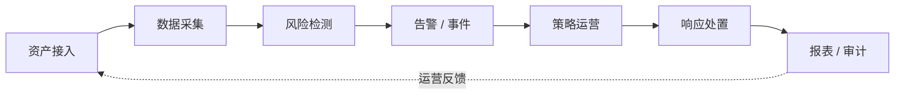

<!-- 骨架页：由官方文档语料摄取生成。待人工策展：capabilities（带置信度）/ limitations / competitors。
     详细文档见本产品子页（memory_get 相关文档导航）。 -->

# 项目概览与核心能力

牧云是长亭面向主机与云工作负载的安全产品，覆盖资产接入、风险发现、告警运营、策略下发、处置响应、报表审计和私有化交付等核心场景。

## 核心业务链路

## 核心能力

| 能力 | 说明 | 业务价值 |
| --- | --- | --- |
| 资产管理 | 主机接入、分组、标签、业务组、Agent 状态、资产详情 | 建立安全运营基础资产面 |
| 风险检测 | 漏洞、基线、恶意文件、异常行为、安全扫描等 | 持续发现主机侧安全风险 |
| 告警与事件 | 告警生成、检索、状态流转、通知、统计 | 支撑安全团队日常运营 |
| 策略配置 | Agent 策略、检测策略、白名单、规则组、联动配置 | 统一控制检测和处置行为 |
| 主机处置 | 文件处置、网络阻断、进程/命令审计和响应动作 | 将发现的问题推进到处置闭环 |
| 报表审计 | 安全报告、操作审计、系统日志、任务记录 | 满足复盘、交付和合规需要 |
| 构建交付 | 安装器、Helm、Kubernetes、单机部署、升级迁移 | 支持多种客户环境部署交付 |
